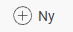
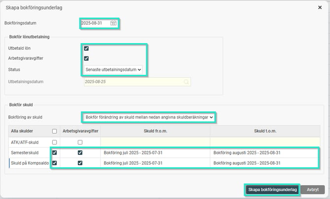
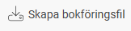
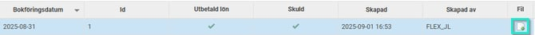

# Hur skapar jag ett bokföringsunderlag i HRM Payroll?

**Datum:** den 7 oktober 2025  
**Kategori:** Payroll  
**Underkategori:** Löneberedning  
**Typ:** howto  
**Svårighetsgrad:** intermediate  
**Tags:** bokföring, lön, semester  
**Bilder:** 4  
**URL:** https://knowledge.flexhrm.com/hur-skapar-jag-ett-bokf%C3%B6ringsunderlag-i-hrm-payroll

---

I den här artikeln beskriver vi stegen för att skapa ett underlag för bokföring.
Steg 1: Förberedelser - Skuldlistor
Innan du kan skapa själva bokföringsfilen måste du gå till
Lön > Skuldhantering.
Där skapar och kontrollmarkerar du de skuldlistor (t.ex. semesterskuld, kompskuld) som ska vara med i bokföringen.
Relaterade artiklar:
Hur skapar du en skuldlista i HRM Payroll?
Steg 2: Skapa Bokföringsunderlaget
Gå till
Lön > Bokföring
och klicka på
Ny
.

Datum:
Fyll i korrekt bokföringsdatum.
Innehåll:
Bocka i vad som ska inkluderas, vanligtvis
Utbetald lön
och
Arbetsgivaravgifter
.
Lönekörning (Status):
Välj vilken lönekörning som ska bokföras.
Preliminär:
För en lönekörning som ännu inte är låst och avräknad.
Senaste utbetalningsdatum:
För den senast avräknade lönekörningen.
Valfritt utbetalningsdatum:
För att välja en specifik, tidigare avräknad lönekörning från en lista.
Inkludera skulder (om relevant):
Välj om du vill bokföra den
totala
skulden eller bara
förändringen
sedan föregående period.
Bocka i de specifika skulder som ska med (för att en skuld ska dyka upp för en i listan måste en skuldlista ha skapats och kontrollmarkerats för perioden under Lön > Skuldhantering).
Välj vilket skuldunderlag (vilken månads skuldlista) som bokföringen ska baseras på.
Klicka på
Skapa bokföringsunderlag
.
I bilden visas exempel på ett bokföringsunderlag på avräknad lönekörning i augusti 2025, med förändring av semester- och kompskuld från juli till augusti (baserat på skuldlistor för juli och augusti).

Detta skapar ett underlag i listan.
För att skapa en bokföringsfil (.csv eller Sie4-format, beroende på företagets inställningar) markerar du raden med bokföringsunderlaget och klickar på
Skapa bokföringsfil
.

Filen skapas längst till höger bredvid bokföringsunderlaget och kan laddas ned till önskad plats.

