# Hur skapar jag ett bokföringsunderlag i HRM Payroll?

**Datum:** den 26 maj 2026  
**Kategori:** Payroll  
**Underkategori:** Löneberedning  
**Typ:** howto  
**Svårighetsgrad:** intermediate  
**Tags:** bokföring, lön, löneart, semester  
**Bilder:** 13  
**URL:** https://knowledge.flexhrm.com/sv/hur-skapar-jag-ett-bokf%C3%B6ringsunderlag-i-hrm-payroll

---

I den här artikeln beskriver vi stegen för att skapa ett underlag för bokföring.
Steg 1: Förberedelser - Skuldlistor
Innan du kan skapa själva bokföringsfilen måste du gå till
Lön > Skuldhantering.
Där skapar och kontrollmarkerar du de skuldlistor (t.ex. semesterskuld, kompskuld) som ska vara med i bokföringen.
Relaterade artiklar:
Hur skapar du en skuldlista i HRM Payroll?
Steg 2: Skapa Bokföringsunderlaget
Gå till
Lön > Bokföring
och klicka på
Ny
.

Datum:
Fyll i korrekt bokföringsdatum.
Innehåll:
Bocka i vad som ska inkluderas, vanligtvis
Utbetald lön
och
Arbetsgivaravgifter
.
Lönekörning (Status):
Välj vilken lönekörning som ska bokföras.
Preliminär:
För en lönekörning som ännu inte är låst och avräknad.
Senaste utbetalningsdatum:
För den senast avräknade lönekörningen.
Valfritt utbetalningsdatum:
För att välja en specifik, tidigare avräknad lönekörning från en lista.
Inkludera skulder (om relevant):
Välj om du vill bokföra den
totala
skulden eller bara
förändringen
sedan föregående period.
Bocka i de specifika skulder som ska med (för att en skuld ska dyka upp för en i listan måste en skuldlista ha skapats och kontrollmarkerats för perioden under Lön > Skuldhantering).
Välj vilket skuldunderlag (vilken månads skuldlista) som bokföringen ska baseras på.
Klicka på
Skapa bokföringsunderlag
.
I bilden visas exempel på ett bokföringsunderlag på avräknad lönekörning i augusti 2025, med förändring av semester- och kompskuld från juli till augusti (baserat på skuldlistor för juli och augusti).
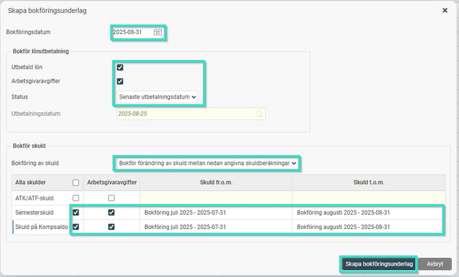
Detta skapar ett underlag i listan.
För att skapa en bokföringsfil (.csv eller Sie4-format, beroende på företagets inställningar) markerar du raden med bokföringsunderlaget och klickar på
Skapa bokföringsfil
.
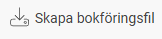
Filen skapas längst till höger bredvid bokföringsunderlaget och kan laddas ned till önskad plats.
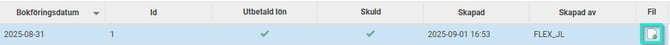
Spara ner och formattera bokföringsordern i excel
För att spara ner bokföringsordern i excel gör följande:
Markera bokföringsordern i vyn Lön > Bokföring och klicka på Skriv ut
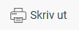
Gör ev urval/justeringar och klicka på Förhandsgranska.

När bokföringsordern öppnas, klicka på symbolen för nedladdning och välj  excel.
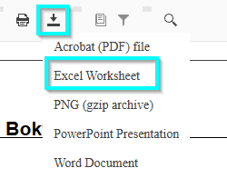
Excelfilen innehåller både sammanslagna kolumner och tomma kolumner/rader. För att få en mer lättarbetad fil behöver du formattera om filen.
Markera samtliga kolumner i bladet (A-Q) och klicka sen på fliken Start > Centrera över kolumner och välj i rullistan alternativet Separera celler. Detta delar upp alla sammanslagna kolumner.
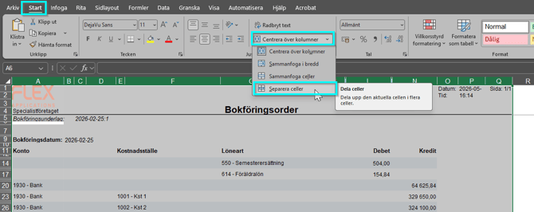
Markera sedan raderna ovanför rubrikraderna för att ta bort dessa (rad 1-10 i exemplet), högerklicka och välj Ta bort.
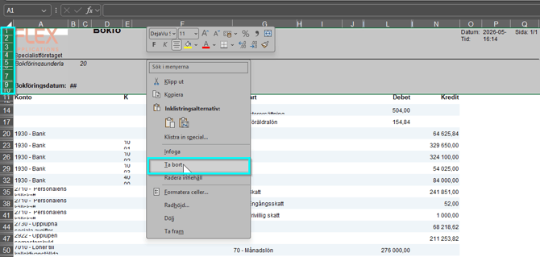
Bredda samtliga kolumner (A-N) så att du ser vilka kolumner som innehåller värden eller är tomma och kan tas bort. Markera tomma kolumner, högerklicka och välj Ta bort för att ta bort dessa.
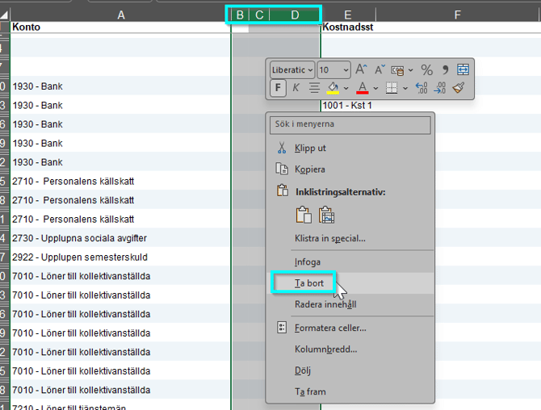
Markera kvarvarande kolumner och klicka på fliken Data > Sortera för att sortera listan i önskad ordning, i exemplet Konto - Kostnadsställe - Löneart, detta för att sortera bort tomma rader i listan.
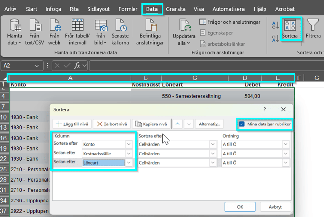
Justera radhöjden på rader med värden genom att markera alla rader och dubblklicka när du får upp plussymbolen, alternativt högerklicka och välj Radhöjd för att ange önskad radhöjd.
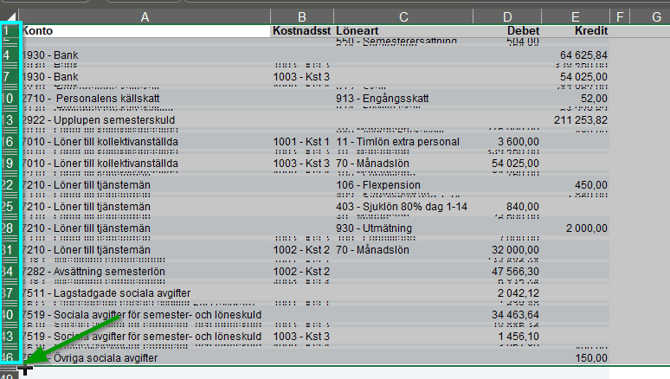
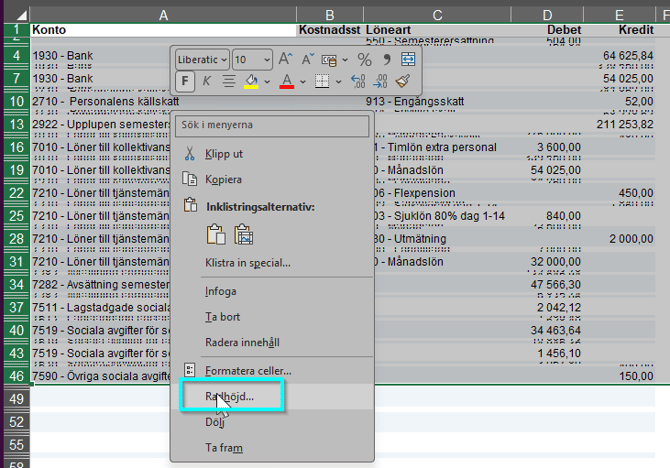
