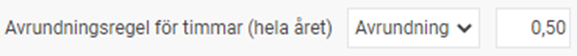
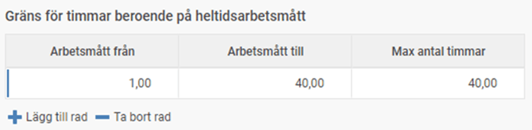
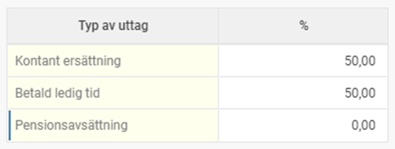
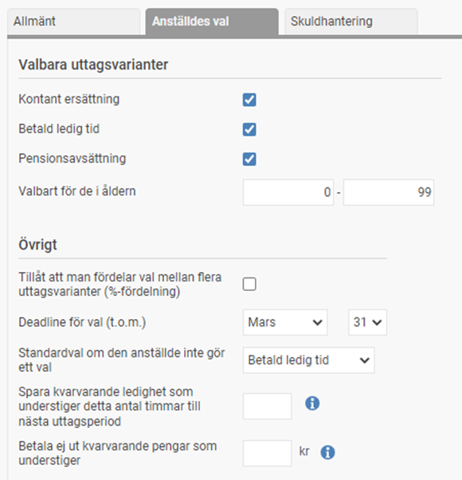
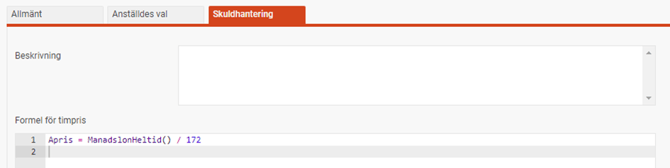
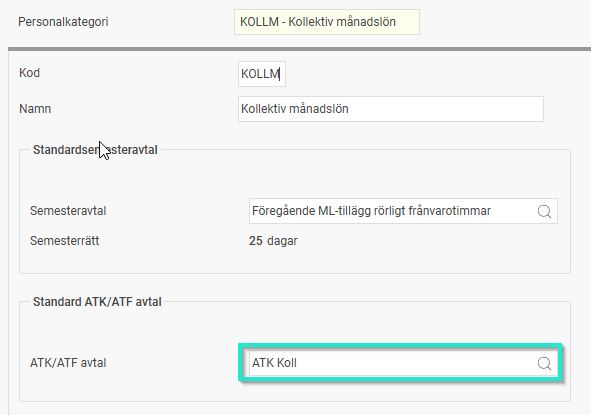
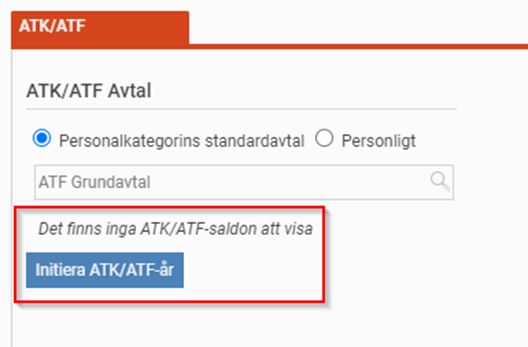
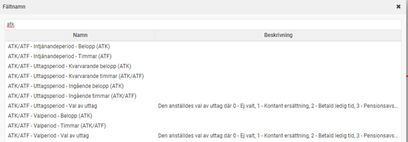
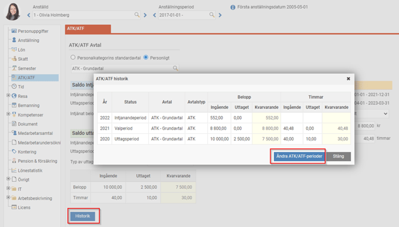
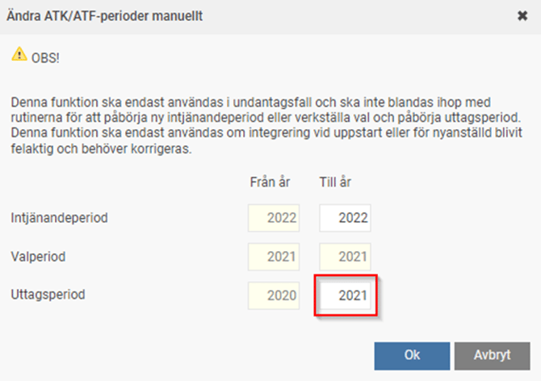

# ⚙️Hur ställer jag in ATK/ATF avtal i HRM Payroll?

**Datum:** den 16 december 2025  
**Kategori:** Payroll  
**Underkategori:** Löneberedning  
**Typ:** config  
**Svårighetsgrad:** advanced  
**Tags:** bokföring, lön, löneart, pension  
**Bilder:** 11  
**URL:** https://knowledge.flexhrm.com/hur-st%C3%A4ller-jag-in-atk/atf-avtal-i-hrm-payroll

---

Denna artikel går igenom de inställningar som ligger till grund för hanteringen av ATK/ATF via funktionen i HRM Payroll.
Relaterade artiklar:
Inställningar av lönearter och bokföring för ATK/ATF avtal
Inställningar av påminnelser för val av intjänad ATF/ATK
ATK/ATF – Avtal
Den första byggstenen för att sätta upp ATK/ATF är att lägga upp ett avtal som håller de grundläggande reglerna enligt ditt kollektivavtal. Du kan skapa fler olika avtal om du har olika grupper av anställda som berörs av olika regler. Inställningarna för avtalen hittar du under
Administration > Inställningar > ATK/ATF-avtal.
Det kan också vara så att du istället behöver en anpassad lösning med hjälp av tidstransaktioner, lönearter och ackumulatorer (för t.ex. avtal som har sammanfallande intjänande/uttag kan
inte
funktionen med ATK/ATF-avtal användas då dessa endast beräknar släpande intjänande.)
OBS!
Om du är osäker på hur du ska konfigurera ditt ATK- eller ATF-avtal så att det stämmer med ert kollektivavtal, rekommenderar vi att du tar hjälp av en konsult från Flex Applications.
Fliken
Allmänt
Namn
Namnge ditt avtal så det är enkelt att förstå vilka det gäller.
Beskrivning
Här kan du ange en utförlig beskrivning för avtalet.
Avtalet är aktivt
Om du inaktiverar ett avtal kommer det inte längre gå att välja detta avtal i anställdaregistret eller på personalkategorier. Om det finns anställda eller personalkategorier som redan använder detta avtal, kommer de fortsätta ha avtalet tills dess att du byter ut det mot ett annat. Du kan alltså inaktivera ett avtal som du inte vill ska användas samt avtal som du vill ska fasas ut.
Avtalstyp
Här anger du om avtalet är av typen
Arbetstidskonto (ATK)
eller
Arbetstidsförkortning (ATF).
Se första avsnittet i denna instruktion för mer info.
Intjänandeår
Det finns i dagsläget endast stöd för att välja föregående år som intjänandeår. Det innebär att de anställda först tjänar in till ATK/ATF under en 12-månadersperiod, och därefter kan börja ta ut sina intjänade pengar/timmar. Om man har ett kollektivavtal med ATF där intjänandet och uttaget ska ske löpande kan man hantera detta i Flex HRM Time. Se första avsnittet i denna instruktion för mer info.
Startdatum för intjänande
Här anger du den månad och dag som intjänandet börjar. Vanligt är 1 januari eller 1 april. Tänk på att det är kontantprincipen som tillämpas för intjänandet. Om avtalet intjänandeperiod t.ex. börjar 1 januari kommer intjänande av ATK/ATF som finns i lönekörningen med utbetalning i januari räknas in även om lön och arbetad tid avser december månad föregående år.
Startdatum för uttag
Här anger du den månad och dag som den anställde med uttag som betald ledig tid kan börja ta ut sin ledighet.
Avsättning i % (ATK)
Om avtalet är av typen ATK anger du här hur många procent av löneunderlaget som ska avsättas till arbetstidskontot.
Avsättning min/vecka
Om avtalet är av typen ATF anger du här hur många minuter per vecka en heltidsanställd tjänar in till saldot för arbetstidsförkortning. I vissa kollektivavtal anges det hur många timmar per år en heltidsanställd ska tjäna in. Då får man omvandla dessa timmar till motsvarande antal minuter per vecka. Fördelen med att arbeta med antal minuter per vecka är att man kan hantera heltidsanställda, deltidsanställda, långtidsfrånvarande och de som inte varit anställda under hela året på samma sätt. Se avsnittet för
Löpande intjänande – ATF
för mer info.
Avrundningsregel för timmar (hela året)
För avtal av typen ATF används denna för att avrunda de intjänade timmarna när ett helt intjänandeår är fullbordat och flyttas till valperiod när man kör rutinen för att påbörja en ny intjänandeperiod. För avtal av typen ATK används denna för att avrunda de beräknade timmarna vid uttag som betald ledig tid.

Du kan välja avrundning, sänkning och höjning. I rutan till höger anger du noggrannheten. Anger du ”1,00” sker avrundning till närmaste hel timme. Anger du ”0,50” sker avrundning till närmaste halvtimme. Samma princip gäller för höjning och sänkning.
Gräns för timmar beroende på heltidsarbetsmått
Här anger du den övre gränsen för antal timmar. För ATF innebär det ett tak för intjänandet som inte kan överskridas. För ATK innebär det ett tak vid beräkning av timmar. Om du tillämpar avtalet för olika grupper av anställda med olika heltidsarbetsmått kan du lägga upp olika tak i listan.

Fliken Anställdes val
Valbara uttagsvarianter
Kryssa för ett eller flera av de typer av uttag som den anställde kan välja enligt ditt kollektivavtal. Om kollektivavtalet inte ger utrymme för valmöjlighet anger du det alternativ som ska tillämpas. Den anställde kommer då automatiskt få detta valt.
För pensionsavsättning kan du också välja för vilket åldersspann detta val ska finnas för. Det är vanligt att anställda över 65 inte får välja extra pensionsavsättning, och i vissa avtal får inte heller unga välja detta.
Tillåt att man fördelar val mellan flera uttagsvarianter (%-fördelning)
Det vanligaste är att anställda får ta ut hela sitt intjänande på samma sätt. Typ av uttag väljs då via en drop-down-lista enligt följande:

I vissa avtal kan dock den anställde välja att fördela sitt uttag. Typ av uttag väljs då genom att man anger hur stor del man vill ta ut per typ. Nedan har man valt att ta ut hälften som kontant ersättning och hälften som betald ledig tid.

Deadline för val
Här anger du när den anställde måste ha gjort sitt val som senast. Detta bör vara ett datum innan starten av uttagsperioden men absolut senast innan man ska köra rutinen för att verkställa val och påbörja ny uttagsperiod.
Standardval om den anställde inte gör ett val
Här kan du ange vad som ska hända om en anställd inte gör ett val i tid. Det kan också användas då man enligt kollektivavtalet inte kan välja, för att på så sätt slippa administrera valet för alla anställda.
Spara kvarvarande ledighet som understiger detta antal timmar till nästa uttagsperiod
I vissa avtal finns det möjlighet att spara outtagen ledighet till nästa uttagsperiod. Oftast handlar det om tid som understiger en arbetsdag. Du anger här det maximala antalet timmar som får sparas till nästkommande år (vanligtvis motsvarande en arbetsdag). Om en anställd vid uttagsperiodens slut har färre ledighetstimmar kvar kommer dessa automatiskt flyttas till den nya uttagsperioden. Om man har fler timmar kvar kommer rest-delen att flyttas till nästkommande uttagsperiod. Exempelvis om man anger ett gränsvärde på 8 timmar, och har 10 timmar kvar kommer 8 timmar betalas ut vid skiftet, och 2 timmar sparas till nästkommande uttagsperiod.
Ett villkor för att timmar får sparas är att man valt ledighet även nästkommande uttagsperiod. Annars betalas alla timmar ut vid skiftet. Vid anställning på deltid räknas gränsvärdet ner enligt sysselsättningsgraden som den anställde har vid uttagsperiodens start.
Betala ej ut kvarvarande pengar/timmar som understiger
I vissa situationer kan det bli en väldigt liten "slatt" kvar i saldot för ATK/ATF som bara känns konstig att betala ut till den anställde vid uttagsperiodens slut. Det kan ofta handla om några få ören som blir kvar då timpriset inte går exakt jämt ut på grund av öresutjämning. Man kan då använda denna nya inställning där man kan lägga in ett gränsvärde för när utbetalning ska ske.

Fliken Skuldhantering
Denna används endast för avtal av typen ATF. Här anger du den formel för beräkning av timpris som ska användas vid skuldberäkning/utbetalning av slutlön av ATF-timmarna.

Koppla standardavtal för ATK/ATF på Personalkategori
Under
Inställningar – Personalkategorier
kan du ange det ATK/ATF-avtal som ska gälla för alla anställda i personalkategorin.

Checklista för uppsättning
Nedan beskriver vi den ordning du bör följa för att sätta upp och komma igång med ATK/ATF för första gången.
Lägg upp avtal
Börja med att lägg upp avtalen i systemet. Se avsnittet
Inställningar – ATK/ATF-avtal
.
Standardavtal på personalkategori
Om de anställda är uppdelade i olika personalkategorier där alla i en viss kategori ska ha ett visst ATK/ATF-avtal bör du lägga in ett standardavtal där. Om du inte kan använda denna metod måste du manuellt lägga in avtalet för varje anställd.
Lönearter för uttag och slutlön
Gå igenom och kontrollera att alla lönearter för ATK/ATF finns. Se avsnittet
Inställningar – Lönearter för ATK/ATF
.
Systemfasta lönearter
Lägg in systemfasta lönearter enligt avsnitt
Inställningar – Systemfasta lönearter.
Lönearter för intjänande
Gå igenom alla lönearter som ska ligga till grund för intjänande av ATK/ATF. Se avsnittet under
Löpande hantering – Löpande intjänande ATK/ATF.
Initiera och importera saldon för de anställda
Det är nu dags att initiera och importera saldon för de anställda. Se avsnittet
Initiera och importera saldon
nedan.
Inställningar för att visa saldon på lönespecifikationen
Om du vill visa saldon på lönespecifikationen följer du inställningarna under avsnittet
Inställningar – Visa ATK/ATF-saldon på lönespecifikationen.
Inställningar för export av saldon till HRM Time
Om du använder HRM Time bör du exportera saldon dit enligt avsnittet
Inställningar – Exportera ATK/ATF-saldon till HRM Time.
Påminnelse för den anställdes val
Om du vill använda påminnelser för den anställdes val gör du nu inställningar för det enligt avsnittet
Inställningar – Påminnelse för den anställdes val.
Bokföring av ATK/ATF-skuld
Börja med att lägga in bokföringskonton för ATK/ATF-skuld enlig avsnittet
Inställningar – Bokföring av ATK/ATF-skuld.
Därefter upprättar du den första skuldberäkningen enligt instruktionen under
Bokföring av ATK/ATF-skuld.
Viktigt är att du gör skulden på en lönekörning med uppdaterade saldon för ATK/ATF.
Aktivera behörigheter för anställda
Om de anställda ska kunna göra sitt val på startsidan i HRM behöver de ha behörigheter till panelen för ATK/ATF.
Initiera och importera saldon
När du för första gången har lagt in ett standardavtal på personalkategorin kommer alla anställda på den kategorin få detta avtal, men utan att saldon blir initierade. På fliken ATK/ATF i anställdaregistret ser man inga saldon, utan i stället en knapp för att Initiera ATK/ATF-år. Klickar du på knappen kommer systemet utifrån dagens datum, den anställdes anställningsperioder och ATK/ATF-avtal skapa relevanta saldon för intjänandeperiod, uttagsperiod och eventuellt valperiod.

Exempel A:
En anställd har ett avtal där intjänandet börjar 1 januari och uttagsperioden 1 april. Dagens datum är 2022-01-26. Vid initiering kommer en ny intjänandeperiod skapas med start för intjänandet 2022-01-01. En uttagsperiod kommer skapas där uttagsperioden är 2021-04-01 till 2022-03-31 (som tjänandes in mellan 2020-01-01 och 2020-12-31). Dessutom kommer en valperiod skapas för intjänandeperioden 2021-01-01 till 2021-12-31.
Exempel B:
En anställd har ett avtal där intjänandet börjar 1 januari och uttagsperioden 1 april. Dagens datum är 2022-05-15. Vid initiering kommer en ny intjänandeperiod skapas med start för intjänandet 2022-01-01. En uttagsperiod kommer skapas där uttagsperioden är 2022-04-01 till 2023-03-31 (som tjänandes in mellan 2021-01-01 och 2021-12-31). Ingen valperiod kommer skapas.
Samma logik för initiering kommer ske då du importerar saldon för de anställda. Vid import av saldon görs först initieringen vid behov, och därefter importeras saldon. Denna logik är tänkt att användas när man startar upp användningen av ATK/ATF.
Importen av saldon gör du med hjälp av importmallar som du skapar under
Administration – Inställningar – Importmallar.
Här använder du importtypen
Anställda/användare
. Här finns ett antal fält som du kan använda för att importera saldon för ATK/ATF.

När du gör importen är det viktigt att tänka på vilken intjänandeperiod, uttagsperiod och eventuell valperiod som kommer initieras beroende på vilket datum du gör importen. Om intjänandeperioden börjar 1 januari blir det olika initiering om du kör importen den 31 december och 1 januari. Det kan därför vara en bra idé att först importera för en anställd och se hur det blir.
Bra att tänka på vid import av saldon.
Saldon för pågående intjänandeår
När du importerar saldon för pågående intjänandeår behöver du tänka olika beroende på om du har en preliminär lönekörning eller inte. Om intjänandeperioden t.ex. börjar 1 januari, och det just nu inte finns någon preliminär lönekörning (det spelar ingen roll om det finns avräknade lönekörningar eller ej). Om den första lönekörningen som ska skapas efter importen avser lönen för utbetalning i maj, då ska man importera intjänat värde under perioden januari – april. Observera att det är intjänat värde och inte underlag för intjänandet.
Saldo för uttagsperioden
Här kan du välja att endast importera kvarvarande saldo, eller att importera både ingående och kvarvarande saldo (om du vill få med all information).
Val av uttag
Du bör alltid importera val av uttag för uttagsperioden. I normala fall är det
Betald ledig tid
för anställda som fortfarande har timmar/pengar kvar att ta ut. I filen ska du lägga siffran 1 för kontant ersättning, 2 för betald ledig tid och 3 för pensionsavsättning. Du kan vid behov också importera val av uttag för valperioden. Detta om de anställda gjort sitt val i det gamla lönesystemet innan man startat med Flex HRM Payroll.
Manuell ändring av ATK/ATF-perioder
Ibland kan det hända att en anställd har hamnat på fel period för intjänande och uttag. Därför har vi byggt in en möjlighet att manuellt ändra perioden för en anställd. Observera att denna funktion inte ska förväxlas med de årliga rutinerna, utan bara ska användas i undantagsfall. Om du är osäker bör du kontrollera vad som gäller i just ditt fall.
Funktionen för att ändra ATK/ATF-period hittar du på fliken ATK/ATF i anställdaregistret. Klicka på knappen
Historik
, och sedan på
Ändra ATK/ATF-period.

Du får då upp en dialog där du i kolumnen
Från år
ser vilket ATK/ATF som just nu är intjänandeperiod, valperiod och uttagsperiod. I kolumnen
Till år
kan du ändra vilket år som är intjänandeperiod och uttagsperiod. I exemplet nedan har vi en anställd som har en intjänandeperiod 2022 och har en aktiv valperiod för intjänande med start 2021. Om vi vill ändra så det blir uttagsperiod kan vi ändra uttagsperioden markerat med rött till 2021. Observera att inga saldon ändras, så dessa måste man manuellt rätta till efter att man ändrat perioderna med denna rutin.

