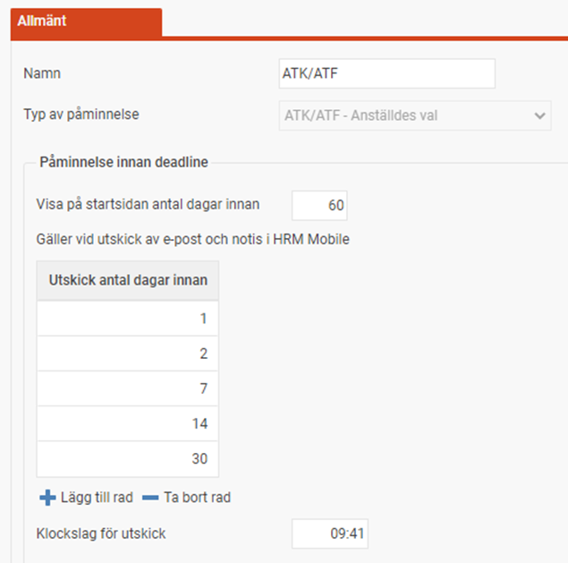
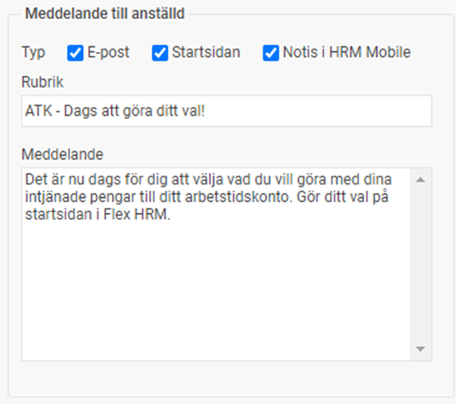

# ⚙️Hur ställer jag in påminnelser för att göra val för intjänad ATK/ATF?

**Datum:** den 16 december 2025  
**Kategori:** Payroll  
**Underkategori:** Inställningar  
**Typ:** config  
**Svårighetsgrad:** intermediate  
**Tags:** bokföring, lön, löneart  
**Bilder:** 2  
**URL:** https://knowledge.flexhrm.com/hur-st%C3%A4ller-jag-in-p%C3%A5minnelser-f%C3%B6r-att-g%C3%B6ra-val-f%C3%B6r-intj%C3%A4nad-atk/atf

---

Om den anställde enligt avtalet får välja vad hen vill göra med de intjänade pengarna/timmarna kan det vara en god idé att använda påminnelsefunktionen. Man kan använda påminnelsefunktionen både för att informera att det är dags att gå in och göra sitt val, men också för att påminna att valet måste göras innan deadline för de som väntar in i det sista med att göra sitt val.
Relaterade artiklar:
Hur ställer jag in ATK/ATF avtal i HRM Payroll?
Inställningar av lönearter och bokföring för ATK/ATF avtal i HRM Payroll
Inställningarna för påminnelsen hittar du under
Administration > Inställningar > Allmänt > Påminnelser.
Under
Typ
av påminnelse
väljer du
ATK/ATF – Anställdes val
.
Påminnelse innan deadline
Här anger du överst hur många dagar innan deadline den anställde ska få påminnelsen på startsidan i Flex HRM. Deadlinen anges i ATK/ATF-avtalet. För utskick via e-post samt notis i HRM Mobile lägger du i listan hur många dagar innan deadline du vill ha påminnelse. Du kan som i exemplet välja påminnelser vid olika tidpunkter, med ökad frekvens ju närmare deadline man närmar sig. Det är bara anställda som ännu inte gjort ett val som kommer få påminnelser. Längst ner anger du också ett klockslag då utskicket ska göras (för att inte få en notis i mobilen vid olämplig tidpunkt).

Urval anställda
Här kan du välja för vilka anställda påminnelsen gäller. På så sätt kan du skräddarsy informationen till olika grupper av anställda genom att lägga in olika påminnelser.
Meddelande till anställd
Här anger du dels vilka typer av påminnelser som ska gå till den anställde som inte gjort sitt val. Du anger också den rubrik och det meddelande som används för påminnelser via e-post och notiser i HRM Mobile.

På motsvarande sätt kan du under rubriken
Meddelande till användare
välja om påminnelse också ska gå till andra användare, såsom chefer eller administratörer. Du väljer då vanligtvis den roll som användaren ska ha till den anställde som påminnelsen gäller. Detta kan vara användbart för att en chef ska se på startsidan vilka anställda som inte gjort sitt val när deadlinen närmar sig.
