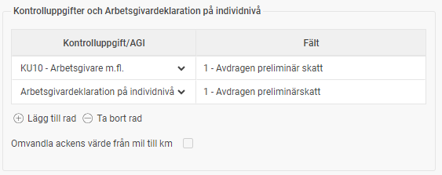

# ⚙️Hur ställer man in ackumulatorerna så att det blir rätt värde i rätt fält i AGIn?

**Datum:** den 16 december 2025  
**Kategori:** Payroll  
**Underkategori:** Skatt & AGI  
**Typ:** config  
**Svårighetsgrad:** intermediate  
**Tags:** agi, lön, skatt  
**Bilder:** 1  
**URL:** https://knowledge.flexhrm.com/hur-fungerar-inst%C3%A4llningar-p%C3%A5-ackumulatorerna

---

Inställningar per ackumulator styr dess värde till rätt fält i arbetsgivardeklarationen.
De flesta belopp och kryssrutor som ska redovisas i Arbetsgivardeklarationen går via ackumulatorerna. För att styra ackumulatorns värde till rätt fält i redovisningen finns det inställningar per ackumulator. Du hittar dessa inställningar under
Administration > Inställningar > Lön > Ackumulatorer
.
För att styra en ackumulator till ett fält i Arbetsgivardeklarationen på individnivå lägger du in en rad med önskat fältnummer för Arbetsgivardeklaration på individnivå. I exemplet nedan är det ackumulatorn för skatt som styrs till fält 1 på samma sätt som de tidigare kontrolluppgifterna.

Relaterade artiklar:
Hur hittar jag orsaken till diffar i arbetsgivaravgifter (AGI) i Flex HRM Payroll?
Hur arbetar jag med arbetsgivardeklaration på individnivå i Flex HRM Payroll?
