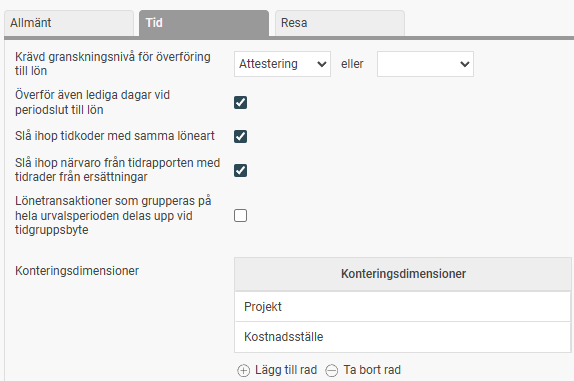
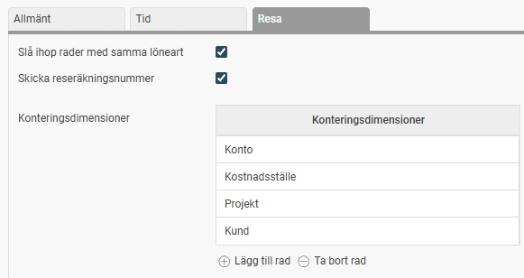

# ⚙️Hur ställer man in Lönekoppling till HRM Payroll?

**Datum:** den 11 november 2025  
**Kategori:** Payroll  
**Underkategori:** Löneberedning  
**Typ:** config  
**Svårighetsgrad:** intermediate  
**Tags:** lön, löneart  
**Bilder:** 2  
**URL:** https://knowledge.flexhrm.com/hur-st%C3%A4ller-man-in-l%C3%B6nekoppling-till-hrm-payroll

---

I denna funktion görs inställningar gällande överföringen av företagets tidstransaktioner från HRM Time/resetransaktioner från HRM Travel till HRM Payroll. Observera att denna funktion endast finns tillgänglig om Flex HRM Time och/eller Flex HRM Travel ingår i aktuell programversion.
Inställningar för lönekoppling
För att se/justera inställningarna för din lönekoppling, gå till
Inställningar > Lön
och välj
Lönekoppling
i menyn.
Du ser då en vy med två flikar:
Tid
och
Resa
.
Fliken Tid

Krävd granskningsnivå för överföring till lön
Här anger du vilken granskningsnivå som krävs för att en tidrapport ska kunna överföras till lön. Du kan även ange två alternativa nivåer, till exempel att tidrapporten behöver vara antingen klarmarkerad eller attesterad.
Följande val finns:
Ingen nivå krävs
Klarmarkering
Godkännande
Attestering
(Namnen på alternativen kan variera, eftersom de beror på hur granskningsnivåerna har ställts in i ditt företag.)
Överför även lediga dagar vid periodslut till lön
Markera den här inställningen om även arbetsfria dagar vid ett periodslut ska föras över till lön.
Exempel:
Om en anställd är sjuk i slutet av en månad och den sista dagen i månaden är en lördag som ej är en arbetsdag i medarbetarens schema, kommer även lördagen att föras över till lön. (Detta förutsätter att tidkoden för sjukfrånvaro också är inställd att lediga dagar inkluderas.)
Slå ihop tidkoder med samma löneart
Markera den här inställningen om du vill att tidkoder med samma löneart ska slås samman i lön.
Lönetransaktioner som grupperas på hela urvalsperioden delas upp vid tidgruppsbyte
Markera den här inställningen om du vill att lönetransaktioner (som grupperas på hela urvalsperioden) ska delas upp i flera transaktioner. Uppdelningen följer datumen för eventuella byten av tidgrupp.
Konteringsdimensioner
Här kan du ange vilka konteringsdimensioner som ska skickas med till lön. Gör så här:
Klicka på
Lägg till
.
Skriv in önskad konteringsdimension i fältet, eller klicka på
förstoringsglaset
för att hämta den från registret. I exemplet ovan skickar vi med projekt och kostnadsställe från tidrapporten till lön.
Fliken Resa

Slå ihop rader med samma löneart
Markera den här rutan om du vill slå ihop rader som har samma löneart. Detta kan minska antalet rader i löneberedningen.
Om inställningen är aktiv kommer rader med samma löneart, kontering, reseräkningsnummer och á-pris att slås ihop. Detta sker endast i lönefilen och påverkar inte andra delar, som till exempel rapporter.
Skicka reseräkningsnummer
Markera den här rutan om du vill att reseräkningens nummer ska skickas med till lönekörningen som en kommentar. Detta syns då på lönespecifikationen.
Om du kombinerar den här inställningen med att (på lönearterna) välja att  slå ihop lönearter med lika kommentar, kan du slå ihop alla lönerader som kommer från samma reseräkning. Det gör det enklare för den anställda att stämma av totalsumman på lönespecifikationen mot sin reseräkning.
Konteringsdimensioner
Här kan du ange vilka konteringsdimensioner som ska skickas med till lön. Gör så här:
Klicka på
Lägg till
.
Skriv in önskad konteringsdimension i fältet, eller klicka på
förstoringsglaset
för att hämta den från registret. I exemplet ovan skickar vi med konteringarna konto, kostnadsställe, projekt och kund.
