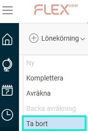
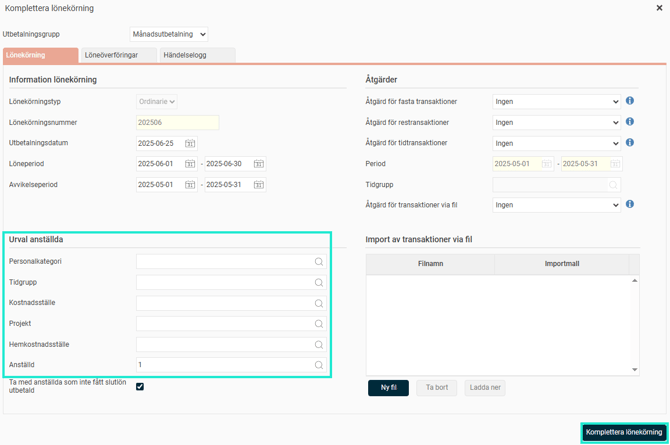

# Hur tar jag bort en anställd från en preliminär lönekörning?

**Datum:** den 20 oktober 2025  
**Kategori:** Payroll  
**Underkategori:** Löneberedning  
**Typ:** howto  
**Svårighetsgrad:** intermediate  
**Tags:** lön  
**Bilder:** 2  
**URL:** https://knowledge.flexhrm.com/hur-tar-jag-bort-en-anst%C3%A4lld-fr%C3%A5n-en-prelimin%C3%A4r-l%C3%B6nek%C3%B6rning

---

Denna artikel beskriver hur du tar bort en eller flera anställda från en preliminär lönekörning.
Ta bort en anställd från en preliminär lönekörning
Här beskriver vi hur du går tillväga för att ta bort en eller flera anställda från en påbörjad, preliminär lönekörning i löneberedningen.
Gör så här
Gå till menyn
Lönekörning > Ta bort
.

En dialogruta öppnas. Ange den eller de anställda som du vill ta bort från lönekörningen under rubriken
Urval anställda
.

Klicka på knappen
Komplettera lönekörning
för att verkställa ändringen.
