# ⚙️Inställningar av lönearter och bokföring för ATK/ATF avtal i HRM Payroll

**Datum:** den 16 december 2025  
**Kategori:** Payroll  
**Underkategori:** Löneberedning  
**Typ:** config  
**Svårighetsgrad:** advanced  
**Tags:** agi, bokföring, lön, löneart, pension  
**Bilder:** 35  
**URL:** https://knowledge.flexhrm.com/inst%C3%A4llningar-av-l%C3%B6nearter-f%C3%B6r-atk/atf-avtal

---

För att hantera uttag av betald ledighet, kontant ersättning, pensionsavsättning samt utbetalning av kvarvarande ledig tid när uttagsåret är slut behöver du ett antal lönearter. Du behöver också lönearter för hantering av slutlön. Nedan beskriver vi hur dessa lönearter kan sättas upp. Observera att dessa kan behöva anpassas till just ditt kollektivavtal.
Relaterade artiklar:
Hur ställer jag in ATK/ATF avtal i HRM Payroll?
Inställningar av påminnelser för val av intjänad ATK/ATF i HRM Payroll
Lönearter för ATK
Lönearter för ATF
Systemfasta lönearter
Bokföring av ATK/ATF skuld
Visa saldon på lönespecifikationen
Exportera saldon till Time
Lönearter för ATK
370 - Arbetstidskonto, kontant ersättning
Lönearten används för anställda som valt att få utbetalt som kontant ersättning.

På fliken
Lön
ställer du in att lönearten ska minska saldo för pengar och timmar. Enheten på lönearten ska vara timmar.
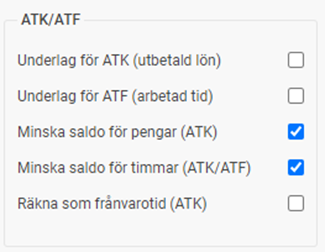
Lönearten ska inte ha någon formel.
371 - Arbetstidskonto, pensionsavsättning
Lönearten används för anställda som valt att få extra avsättning till pension.

På fliken
Lön
ställer du in att lönearten ska minska saldo för pengar och timmar. Enheten på lönearten ska vara timmar.

Lönearten kan behöva en koppling till ytterligare en löneart (se exempel löneart 376) med formel om man enligt avtal ska räkna upp avsättningen till pension och önskar göra denna uppräkning i löneberedningen i samband med verkställandet.
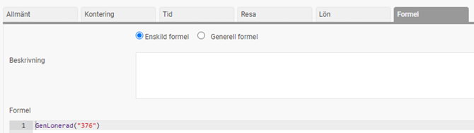
372 - Arbetstidskonto, betald ledighet
Lönearten används för anställda som valt att ta ut som betald ledig tid.
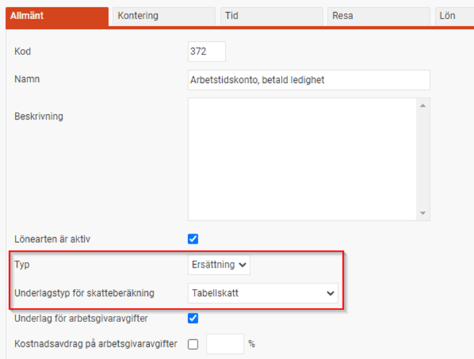
På fliken
Lön
ställer du in att lönearten ska minska saldo för pengar och timmar. Enheten på lönearten ska vara timmar.

Du behöver också lägga in en formel för beräkning av A-pris för en ledig timme. Normalt räknas timpriset som intjänade pengar delat på intjänade timmar.
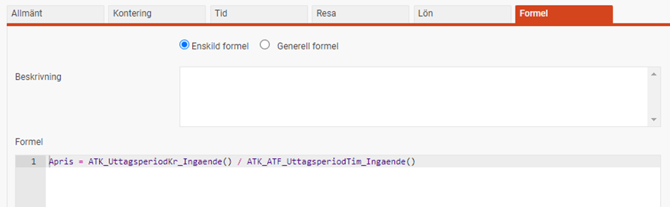
373 - Arbetstidskonto, utbetalning
Lönearten används för anställda som inte tagit ut all betald ledig tid när uttagsperioden är slut. Vid start av ny uttagsperiod används denna löneart för utbetalning av kvarvarande pengar/timmar.

På fliken
Lön
ställer du in att lönearten ska minska saldo för pengar och timmar. Enheten på lönearten ska vara timmar.

Lönearten ska inte ha någon formel.
376 – Arbetstidskonto, ATK pension uppräkning
Lönearten används för anställda som valt att få extra avsättning till pension, för att lägga till en uppräkning på intjänat belopp.
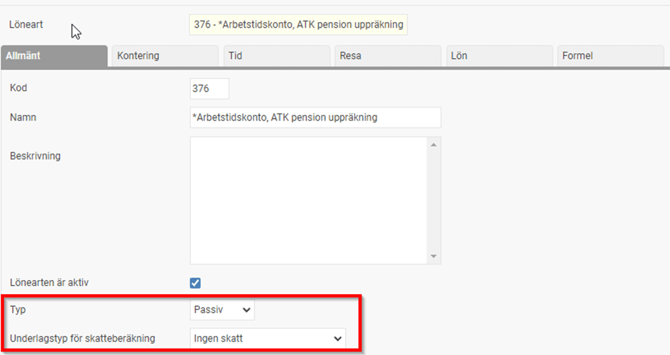
Lönearten behöver inte markeras för att minska saldot för ATK/ATF och behöver inte ha någon enhet under fliken Lön.
Du behöver lägga in en formel för beräkning av uppräkningen (i nedan exempel räknas intjänat belopp från löneart 371 upp med 5,76%).
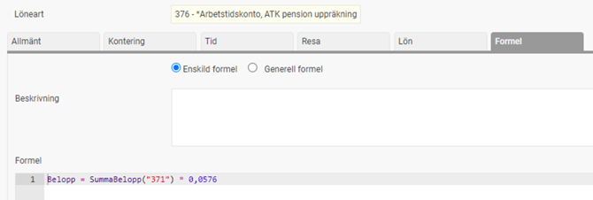
563 - Slutlön arbetstidskonto intjänandeperiod
Lönearten används för utbetalning av intjänandeperiodens intjänade belopp vid slutlön.

Lönearten behöver inte markeras för att minska saldot för ATK/ATF eller ha någon formel.
564 - Slutlön arbetstidskonto uttagsperiod
Lönearten används för utbetalning av uttagsperiodens kvarvarande belopp vid slutlön.

På fliken
Lön
ställer du in att lönearten ska minska saldo för pengar och timmar. Enheten på lönearten ska vara timmar.

Lönearten ska inte ha någon formel.
565 - Slutlön arbetstidskonto valperiod
Lönearten används för utbetalning av valperiodens intjänade belopp vid slutlön.

Lönearten behöver inte markeras för att minska saldot för ATK/ATF eller någon formel.
Lönearter för ATF
350 - Arbetstidsförkortning, kontant ersättning
Lönearten används för anställda som valt att få utbetalt som kontant ersättning.

På fliken
Lön
ställer du in att lönearten ska minska saldo för timmar. Enheten på lönearten ska vara timmar.

Lönearten behöver en formel för uträkning av timpris enligt kollektivavtalets beräkning. I exemplet nedan används månadslön och en divisor.

351 - Arbetstidsförkortning, pensionsavsättning
Lönearten används för anställda som valt att få extra avsättning till pension.
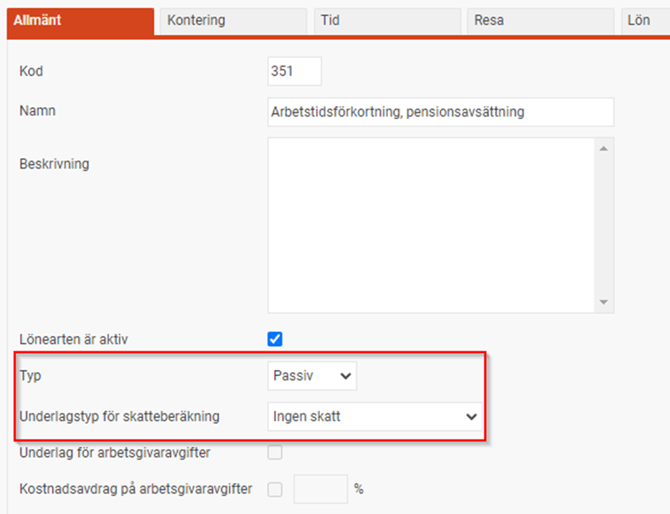
På fliken
Lön
ställer du in att lönearten ska minska saldo för timmar. Enheten på lönearten ska vara timmar.
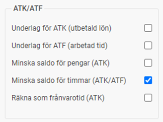
Lönearten behöver en formel som räknar ut hur stor pensionsavsättning som ska göras av de intjänade timmarna enligt kollektivavtalet.
352 - Arbetstidsförkortning, betald ledighet
Lönearten används för anställda som valt att ta ut som betald ledig tid.
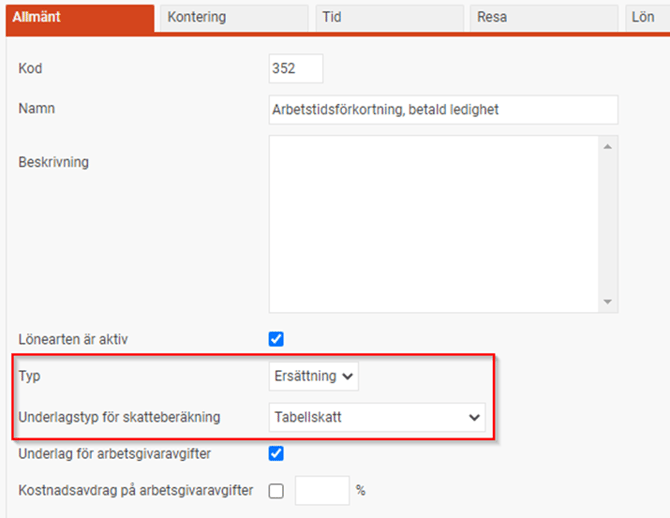
På fliken
Lön
ställer du in att lönearten ska minska saldo för timmar. Enheten på lönearten ska vara timmar.

Lönearten behöver en formel för uträkning av timpris enligt kollektivavtalets beräkning. I exemplet nedan används månadslön och en divisor.
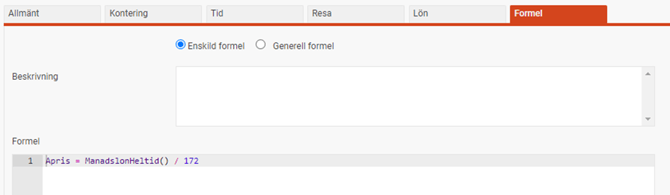
Tänk på att om du har månadsavlönade behöver du också en löneart för avdrag när man tar ut ATF som ledighet enlig samma princip som t.ex. sjukavdrag.
353 - Arbetstidsförkortning, utbetalning
Lönearten används för anställda som inte tagit ut all betald ledig tid när uttagsperioden är slut. Vid start av ny uttagsperiod används denna löneart för utbetalning av kvarvarande timmar.

På fliken
Lön
ställer du in att lönearten ska minska saldo för timmar. Enheten på lönearten ska vara timmar.

Lönearten behöver en formel för uträkning av timpris enligt kollektivavtalets beräkning. I exemplet nedan används månadslön och en divisor.

560 - Slutlön arbetstidsförkortning intjänandeperiod
Lönearten används för utbetalning av intjänandeperiodens intjänade timmar vid slutlön.
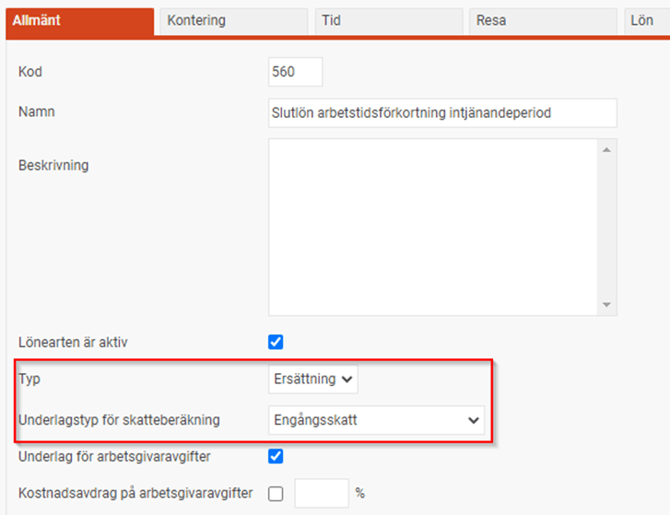
Lönearten behöver inte markeras för att minska saldot för ATK/ATF eller någon formel.
561 - Slutlön arbetstidsförkortning uttagsperiod
Lönearten används för utbetalning av uttagsperiodens kvarvarande timmar vid slutlön.

På fliken
Lön
ställer du in att lönearten ska minska saldo för timmar. Enheten på lönearten ska vara timmar.

Lönearten ska inte ha någon formel.
562 - Slutlön arbetstidsförkortning valperiod
Lönearten används för utbetalning av valperiodens intjänade timmar vid slutlön.

Lönearten behöver inte markeras för att minska saldot för ATK/ATF eller någon formel.
Systemfasta lönearter
För att systemet ska kunna generera lönetransaktioner i samband med årsskiftesrutiner samt vid slutlön behöver man ange vilka lönearter som ska användas till vad under
Administration – Inställningar – Systemfasta lönearter.
De markerade med rött nedan används för ATF, och de markerade med grönt används för ATK. Löneartsnumren i exempelbilden är de som beskrivits i föregående avsnitt.
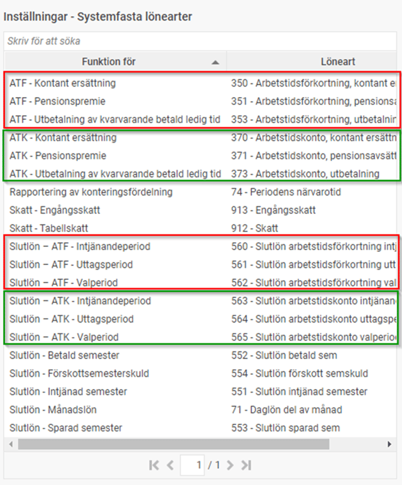
Bokföring av ATK/ATF-skuld
Om du vill bokföra en ATK/ATF-skuld behöver du göra några inställningar under
Administration > Inställningar > Bokföring och skuldhantering.
På fliken
Bokföring
,
under avsnittet
Inställningar för bokföring
av
, finns det två olika delar du behöver ange konteringsinställningar för.
Dels är det
ATK/ATF-skuld
(se bilden nedan), dels är det
Arbetsgivaravgifter på ATK/ATF-skuld
.
Du anger för dessa två vilket konto och motkonto som ska användas, men också om du önskar fördelning av den upplupna skulden på till exempel den anställdes kostnadsställe enligt kostnadsfördelningen i anställdaregistret.
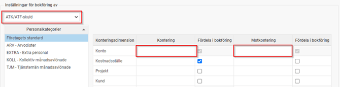
Visa ATK/ATF-saldon på lönespecifikationen
Du kan välja att visa saldon för ATK/ATF på lönespecifikationen för de anställda. Detta ställer du in under
Administration > Lönekörningar
,
fliken
Lönespecifikation.
I listan av saldon finns följande saldotyper för ATK/ATF.
ATF (Timmar) – Intjänandeperiod
För att visa intjänade timmar i aktuell intjänandeperiod för ATF.
ATK (Belopp) – Intjänandeperiod
För att visa intjänat belopp i aktuell intjänandeperiod för ATK.
ATK/ATF (Timmar) – Uttagsperiod
För att visa kvarvarande timmar med betald ledighet i aktuell uttagsperiod. Gäller både ATK och ATF.
ATK (Belopp) – Uttagsperiod
För att visa kvarvarande belopp i aktuell uttagsperiod för ATK.
För samtliga saldotyper kan du välja att på specen visa löneperiodens ingående, utgående eller i periodens intjänade/uttagna saldo.
Ett tips är också att ange en
Alternativ text
som gör det enkelt för de anställda i er organisation att förstå vad som visas på lönespecifikationen.
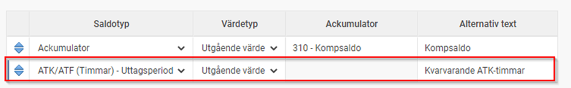
Exportera ATK/ATF-saldon till HRM Time
Om man använder Flex HRM Time är det vanligt att man där har ett saldo för kvarvarande betald ledighet vid ATK/ATF. Det är då rekommenderat att man från Flex HRM Payroll exporterar saldon till Flex HRM Time löpande varje löneperiod för att hålla saldon i Time uppdaterade. På så sätt får man automatiskt saldon i Time när man påbörjat en ny uttagsperiod i HRM Payroll (när lönekörningen avräknas).
Inställningarna för detta gör du under
Administration > Lönekörningar
,
fliken
Saldoexport
.
Under
Saldo i lön
kan du välja någon av dessa två:
ATF (Timmar) – Uttagsperiod
Export av kvarvarande timmar för ATF i uttagsperioden.
ATK (Timmar) – Uttagsperiod
Export av kvarvarande timmar för ATK i uttagsperioden.
I kolumnen
Saldo i tid
väljer du vilket saldo i HRM Time som ska användas.
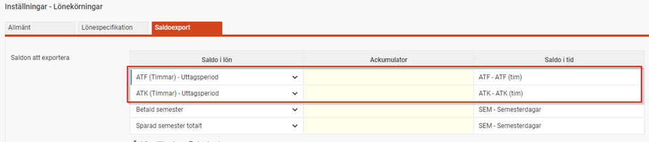
