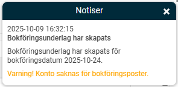
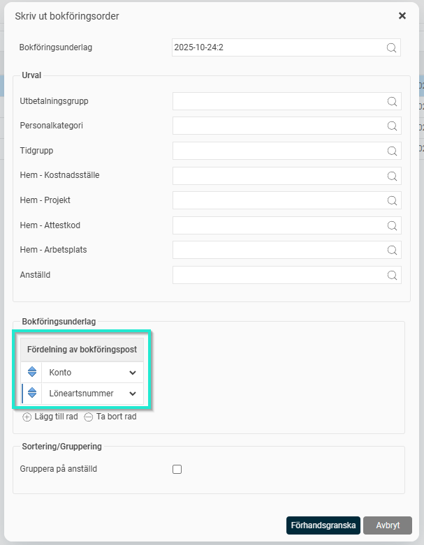
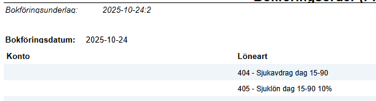
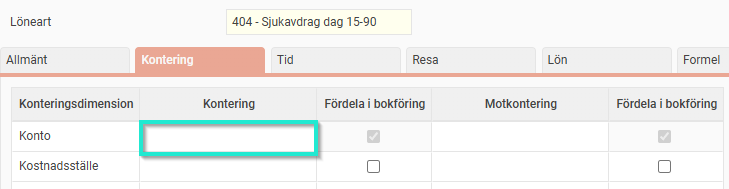

# Jag får en varning att konto saknas för bokföringsposter, hur hittar jag var konto saknas och korrigerar detta?

**Datum:** den 9 oktober 2025  
**Kategori:** Payroll  
**Underkategori:** Löneberedning  
**Typ:** other  
**Svårighetsgrad:** intermediate  
**Tags:** bokföring, lön, löneart  
**Bilder:** 4  
**URL:** https://knowledge.flexhrm.com/jag-f%C3%A5r-en-varning-att-konto-saknas-f%C3%B6r-bokf%C3%B6ringsposter-hur-hittar-jag-var-konto-saknas-och-korrigerar-detta

---

När du skapar ett bokföringsunderlag kan du få en varning i en notis om att ett konto saknas. Här guidar vi dig i hur du hittar vilken löneart det gäller och hur du åtgärdar det.

Hitta lönearten som saknar konto
För att se vilka lönearter som saknar ett konto följer du dessa steg:
Välj det bokföringsunderlag du har skapat och klicka på
Skriv ut
.
I urvalsfönstret som öppnas ändrar du inställningarna för fördelningsposten så att du endast inkluderar konto och löneart. Klicka sen på Förhandsgranska.

När underlaget visas kan du gå igenom det för att se på vilka lönearter det saknas ett konto.

Åtgärda det saknade kontot
När du har identifierat lönearten finns det två sätt att lägga till det konto som saknas.
Lägg till konto direkt på lönearten
Om samma konto ska användas för lönearten oavsett medarbetare, kan du lägga till det direkt i löneartens inställningar under fliken Kontering.

Kontera lönetransaktionen i löneberedningen
Om kontot skiljer sig åt mellan olika medarbetare för samma löneart, behöver du istället hitta dessa medarbetare och kontera lönetransaktionen i löneberedningen. Här kan du t.ex. använda rapporten Fördelning Antal & Belopp med urval på den aktuella lönekörningen och lönearten.
Om du justerar inställningen direkt på lönearten behöver du spara om lönekörningen för alla medarbetare som har denna löneart. Det gör du enklast genom att komplettera lönekörningen för samtliga utan att hämta in några nya transaktioner. Då sparas alla om med befintliga transaktioner.
Kontrollera att allt är korrekt
När du har lagt till kontot och sparat om lönekörningen behöver du skapa ett nytt bokföringsunderlag för att kontrollera att konteringen har blivit korrekt.
