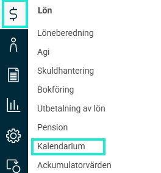
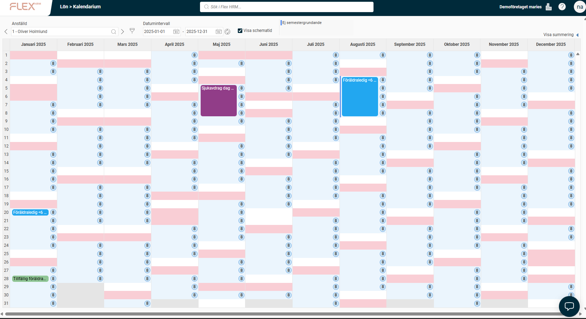
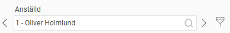
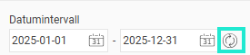
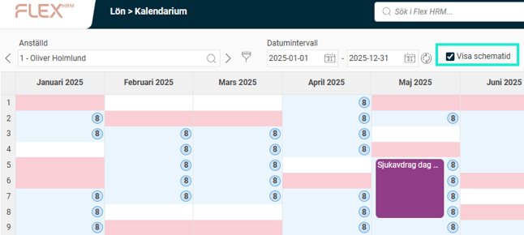
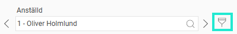
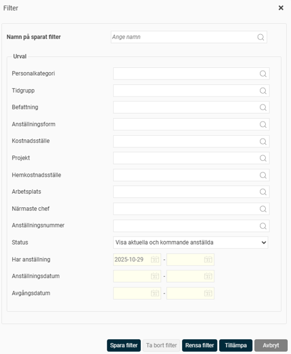
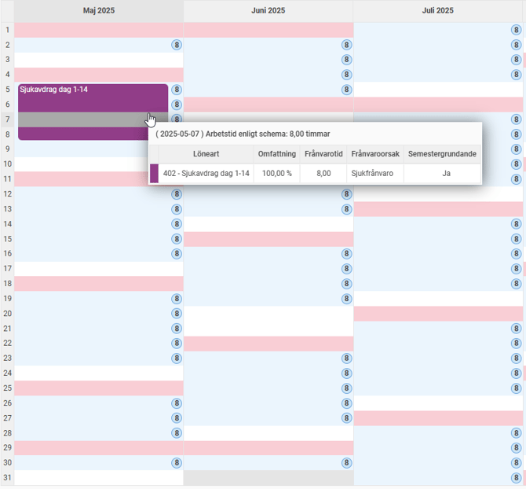
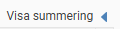

# Kalendarium - Hur kan jag se en sammanställning av frånvaro och schematid för en anställd?

**Datum:** den 29 oktober 2025  
**Kategori:** Payroll  
**Underkategori:** Semesterhantering  
**Typ:** other  
**Svårighetsgrad:** intermediate  
**Tags:** lön, löneart, semester  
**Bilder:** 10  
**URL:** https://knowledge.flexhrm.com/kalendarium-hur-kan-jag-se-en-sammanst%C3%A4llning-av-fr%C3%A5nvaro-och-schematid-f%C3%B6r-en-anst%C3%A4lld

---

Kalendarium i Flex HRM Payroll är en funktion där du ser en enkel översikt över en anställds frånvaro och schematid för en vald period, med möjlighet att filtrera.
Kalendarium
I funktionen Kalendarium ser du en översikt av frånvaro för en vald anställd och period. Du kan följa frånvaroperioder, orsaker och den totala frånvaron för varje anställd. Du kan också enkelt kontrollera exempelvis sjuklöneperioder och dagar för semestergrundande och inte semestergrundande frånvaro, samt jämföra detta mot schemat.
Klicka på
Kalendarium
i sidomenyn.

Du får då upp följande vy:

Inställningar i kalendariet
Anställd
Ange vilken anställd du vill arbeta med genom att skriva in namn och/eller anställningsnummer i fältet eller genom att klicka på
förstoringsglaset
. Med hjälp av
pilarna
kan du bläddra till föregående eller nästa anställd.

Datumintervall
Ange det datumintervall du vill visa kalendern för. Klicka på
uppdateringsikonen
för att uppdatera vyn efter varje ändring av datum.

Visa schematid
Markera rutan
Visa schematid
om du vill ta med uppgift om schematid i kalendariet. Schematiden (i antal timmar) visas då i en ikon på respektive dag i översikten.

Filter
Med funktionen
Filter
kan du ange ett urval av anställda som du vill arbeta med i kalendariet.

Filtret påverkar sökning, listning av anställda och bläddringen till nästa och föregående anställd.
Klicka på
filterikonen
så visas följande fönster:

Om det finns ett eller flera filter sparade sedan tidigare väljer du vilket filter du vill använda i fältet
Namn på sparat filter
. Du kan antingen skriva in namnet på filtret eller hämta det med hjälp av
förstoringsglaset
. Resterande urvalsfält fylls då i automatiskt.
Om det inte finns något sparat filter anger du urvalet manuellt. Fyll i
personalkategori
,
tidgrupp
etc. Du kan spara filtret för framtida bruk genom att klicka på
Spara filter
. Det sparas då och kan väljas i fältet
Namn på sparat filter
nästa gång. Klicka sedan på
Tillämpa
.
Översikt
Huvuddelen av vyn är själva kalendariet. Månaderna visas som kolumner och datumen visas som rader (numrerade från 1 till 31).
De blå bollarna i varje cell visar schematid i timmar. Detta visas bara om du har markerat rutan
Visa schematid
(se ovan).
Söndagar och övriga röda dagar markeras med en ljusröd bakgrundsfärg. Inställningar för röda dagar gör du under
Administration > Inställningar > Tid och Bemanning > Scheman > Avvikelsedagar
.
Varje frånvaropost för den valda anställda visas som en färgad box. Boxen visar namnet på frånvaroorsaken eller lönearten (till exempel för att se om det är sjukfrånvaro dag två till 14 eller sparad semester). Håll muspekaren över boxen eller klicka på den för att se detaljer om frånvaron. Följande ruta visas då:

Summering av frånvaro och val av frånvaroorsak
Du kan också filtrera kalendariet baserat på frånvaroorsak. Det gör att du kan se summeringar per orsak för hela den valda perioden. Det kan vara användbart om du till exempel bara vill se sjukfrånvaro för att kontrollera antalet karensdagar.
Klicka på ikonen
Visa summering
för att fälla ut en tabell från höger i vyn.

Klicka på
Dölj summering
för att dölja tabellen igen.
Välj vilken eller vilka frånvaroorsaker du vill visa genom att markera rutorna för dem. En summering visas för varje frånvaroorsak på respektive rad, samt som en totalsumma på den nedersta raden.
Längst ner ser du även total schematid (i timmar och dagar) för perioden, samt total inte semestergrundande frånvaro.

