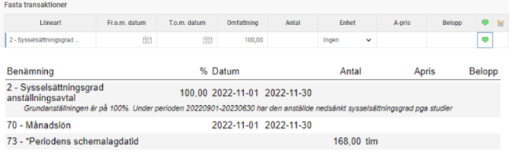

# Kan jag hantera deltidsfrånvaro via sänkt sysselsättningsgrad istället för en frånvaro?

**Datum:** den 22 maj 2026  
**Kategori:** Payroll  
**Underkategori:** Semesterhantering  
**Typ:** faq  
**Svårighetsgrad:** advanced  
**Tags:** lön, löneart, pension, semester  
**Bilder:** 1  
**URL:** https://knowledge.flexhrm.com/sv/kan-jag-hantera-deltidsfr%C3%A5nvaro-via-s%C3%A4nkt-syssels%C3%A4ttningsgrad-ist%C3%A4llet-f%C3%B6r-en-fr%C3%A5nvaro

---

Artikeln beskriver vad du behöver fundera på om du överväger att sänka en medarbetares sysselsättningsgrad istället för att registrera en deltidsfrånvaro.
Det är alltid viktigt att hålla extra bevakning på anställda med deltidsfrånvaro.
Om man under en period går ner i tid och justerar sin tjänst så förändras alla beräkningar och statistik utifrån den ”nya tjänsten”. Detta är viktigt att tänka på om man är deltidsfrånvarande och har rätt till semestergrundande tid och belopp på de delar man är frånvarande. Detta gäller även pension.
Vi rekommenderar
alltid
att inte sänka tjänsten utan att arbeta med vår funktion deltidsfrånvaro.
Om frånvaron är av typen tjänstledighet så kan man välja att dra ner arbetstiden (sänka sysselsättningsgraden) istället för att rapportera deltidsfrånvaro i tidrapporten. Om du väljer detta alternativ rekommenderar vi att du markerar detta på personkortet i ett eget fält så att ni tydligt kan få fram informationen i rapporter.
I Fasta transaktioner lägger man då in en noteringslöneart som informerar den anställde om heltidstjänst enligt anställningsavtalet.

Följande frånvaroorsaker bör man beakta innan man väljer alternativ.
Generellt
Generellt rekommenderar vi att alltid att använda deltidsfrånvaro för att ha rätt uppgift om grundanställningen och kunna ta ut statistik på frånvaro. Man skall också alltid jobba med deltidsfrånvaro då frånvaron är semesterlönegrundande.
Vid frånvaro som är typen tjänstledighet kan man välja att använda sig av deltid eller sänka sysselsättningsgraden. För att ta besluta sig för vad man skall välja har vi nedan några tips att tänka på.
Föräldraledighet
Om man tar ut föräldraledighet på deltid så går det åt semestergrundande kalenderdagar precis som vid en heltidsfrånvaro.
Det är därför inte fördelaktigt att gå ner i tid under denna period, 120 dagar och 180 för ensamstående. Om man ändå gör detta rekommenderar vi att använda deltidsfrånvaro då den hjälper er i beräkningen av semesterlönen/skulden osv.
När personen vill vara ledig under en längre tid dagarna inte är semesterlönegrundande kan man välja att dra ner personen i tid istället för att personen är deltidsfrånvarande. Viktigt att nämna är att vi rekommenderar att då ha en noteringslöneart för detta och även vara medveten om vilka andra delar som påverkas, statistik mm.
Graviditetsledigt
Detta är en frånvaro som är semesterlönegrundande upp till 60 dagar så här skall man alltid använda deltidsfrånvaro.
Militär rep-utb/Civilförsvar
Detta är en frånvaro som är semesterlönegrundande upp till 60 dagar så här skall man alltid använda deltidsfrånvaro upp till 60 dagar.
Sjukfrånvaro
Under perioden man har rätt till ev. sjuk OB så skall man inte använda deltidsfrånvaro utan den ska användas efter de första 14 dagarna och om sjukfrånvaron är långvarig.
Vid sjukfrånvaro skall man alltid använda deltidsfrånvarofunktionen, ej sänka sysselsättningsgrad, då vi i många olika rapporter behöver den statistiken.
Tjänstledighet
Frånvaro av typen tjänstledighet är inte semestergrundande och kan därför vara den frånvaron man i stället för att använda deltidsfrånvaro väljer att sänka sysselsättningsgraden.
Vad bör jag tänka på i lön och rapportering till olika myndigheter/pensionsinstitut
Pension – ITP2
Om man har deltidsanställda skall man ha extra koll på de med ITP2 då frånvaro inte beräknas på samma sätt som ITP1.
Lönestrukturstatistik
Här anger man arbetad tid ”heltid” och arbetad tid ”faktisk” i personkortet. Arbetad tid beräknas på de poster som har den markeringen på lönearten.
Kortperiodisk sysselsättningsstatistik
I denna statistik tar man hänsyn till heldagsfrånvaro och ej deltidsfrånvaro. Man beräknar ej på sysselsättningsgrad.
Konjunkturstatistiken
Om ni väljer att sänka graden på en anställd som är tjänstledig så kommer den att visas som en deltidsanställd. Har man med personen med ett frånvaroavdrag så räknar den på arbetade timmar.
Egna FTE Rapporter
Om du byggt egna rapporter är det viktigt att du tar reda på hur ert företag vill räkna med dessa tjänster som är på deltid. Vill man ha med ursprungstjänster och sedan räkna ut faktiska FTE eller är man inte alls intresserad av grundanställningen.
Dashboard
Vår dashbord tar hänsyn till deltidsfrånvaro.
Nackdelar med att sänka sysselsättningsgraden/fördelar med deltidsfrånvaro:
Om man vill ha statistik på t.ex. tjänstledigheter så finns inte denna information i kalendariet.
Arbetsgivarintyg har inte informationen om heltidstjänst i botten, man får korrigera manuellt
Jämställdhetsplan
Övrig statistik
