# Konjunkturstatistik, löner för privat sektor (KLP) - Hur tar jag fram statistik för KLP i HRM Payroll?

**Datum:** den 7 oktober 2025  
**Kategori:** Payroll  
**Underkategori:** Skatt & AGI  
**Typ:** other  
**Svårighetsgrad:** advanced  
**Tags:** lön, löneart, skatt  
**Bilder:** 11  
**URL:** https://knowledge.flexhrm.com/konjunkturstatistik-l%C3%B6ner-f%C3%B6r-privat-sektor-klp-hur-tar-jag-fram-statistik-f%C3%B6r-klp-i-hrm-payroll

---

Artikeln beskriver hur du tar ut statistiken för Konjunkturstatistik, löner för privat sektor (KLP) till SCB och hur systemet beräknar de olika uppgifterna som rapporteras.
Skapa underlag
Ta bort underlag
Kontrollera underlaget
Fil för redovisning
Fördjupad information om hur underlaget skapas och beräknas
Löpande arbete för rapportering av konjunkturstatistik (KLP)
En gång per månad ska du som blivit utvald rapportera konjunkturstatistik över löner till SCB. Detta gör du i Flex HRM Payroll under
Administration > Bearbetningar > Statistikrapportering > Konjunkturstatistik, löner för privat sektor (KLP).
Skapa underlag
Det första steget i rapporteringen är att skapa ett underlag för månadens rapportering. Detta gör du genom att klicka på knappen Ny i knappraden.
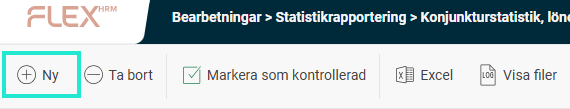
Du väljer här vilken månad du vill skapa rapporteringsunderlag för. Du kan också välja att göra urval på anställda om du skulle vilja.
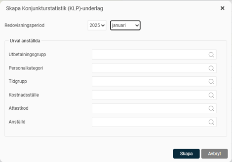
När du klickar på knappen
Skapa
påbörjas arbetet med att skapa underlag samt en fil för redovisning. När underlaget och filen är skapade ser du underlaget med statusen satt som
Preliminär
i vyn.
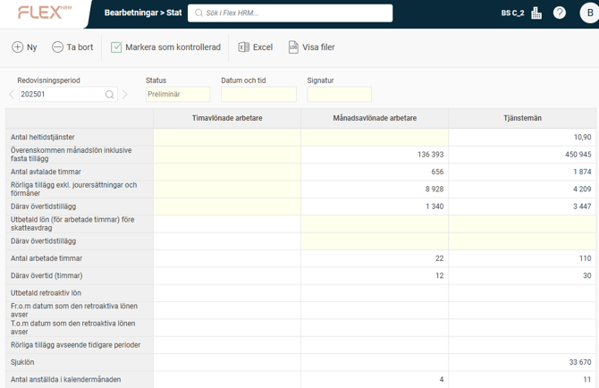
Ta bort underlag
Om du upptäcker ett fel i underlaget kan du enkelt ta bort det genom att klicka på
Ta bort
-knappen och skapa ett nytt underlag från början. Du kan även radera äldre underlag som du inte längre vill ha kvar.
Kontrollera underlaget
Nästa steg är att kontrollera underlaget innan du skickar in uppgifterna till SCB. Detta gör du genom att granska underlaget i vyn.
Överst i vyn väljer du vilken redovisningsperiod du vill titta på. Tidigare redovisningar finns kvar och är enkelt tillgängliga.
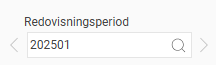
I tabellen visas det underlag som sammanställts och som ska rapporteras till SCB. Tabellen är uppdelad i kolumner för timavlönade arbetare, månadsavlönade arbetare samt tjänstemän.
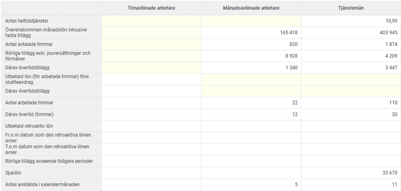
För att se alla detaljer om vilka uppgifter som summerats per anställd kan du exportera underlaget till Excel genom att klicka på knappen i knappraden.
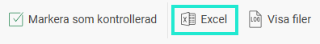
De anställda kommer delas upp i en flik per kategori motsvarande kolumnerna i tabellen. Detta är användbart för att felsöka eller bedöma rimligheten i uppgifterna.
När underlaget är granskat markerar du underlaget som kontrollerat genom att klicka på knappen för
Markera som kontrollerad
i knappraden.
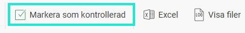
Statusen på underlaget ändras då till
Kontrollerad
. Datum, tid samt signatur för användaren som markerade underlaget som kontrollerat sparas ner på underlaget.
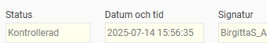
Om du hittar ett fel i ett kontrollerat underlag kan du ta bort kontrollmarkeringen igen, vilket gör att statusen återigen blir preliminär.
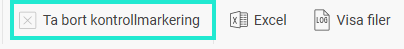
Fil för redovisning
Samtidigt som underlaget sammanställs skapas också en fil för redovisning. Filen kan användas som ett alternativ till att mata in siffrorna manuellt i SCB:s rapporteringstjänst. Du hämtar filen för rapportering genom att klicka på knappen
Visa filer
i knappraden.
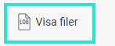
Här finns filen kvar till dess att du väljer att ta bort underlaget.
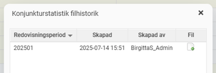
Listan över filer innehåller en fil per redovisningsperiod, där den senaste ligger överst. Ladda ner filen genom att klicka på ikonen och skicka in den till SCB. Detta gör du genom att logga in på SCB:s hemsida och där följa instruktionerna för rapportering via fil.
Fördjupad information om hur underlaget skapas och beräknas
Nedan hittar du detaljerad information om hur underlaget skapas i systemet.
Vilka anställda tas med i underlaget?
Vilka som ska tas med i redovisningen framgår av SCB:s instruktioner. Det gäller i stort sett alla anställda förutom ägare och VD.
Följande anställda tas med i Flex HRM Payroll:
personer i åldern 18 - 66 år (räknat från månaden man fyller)
anställda markerade som arbetare eller tjänsteman
månadsavlönade som haft en anställning under rapporteringsmånaden (inklusive tjänstlediga och föräldralediga)
timavlönade som fått lön för arbetade timmar i redovisningsmånaden
Beräkning för timavlönade arbetare
Nedan följer en detaljerad beskrivning av hur respektive fält beräknas för timavlönade arbetare.
Utbetald lön för arbetade timmar före skatt och andra avdrag
Summerar belopp från lönearter med kryss i fältet ”Konjunkturstatistik (KLP) - Utbetald lön för arbetade timmar före skatt och andra avdrag” som är utbetald under redovisningsmånaden.
Därav övertidstillägg
Summerar belopp från lönearter med kryss i fältet ”Konjunkturstatistik (KLP) - Övertid (tillägg)” som är utbetald under redovisningsmånaden.
Antal arbetade timmar
Summerar fältet ”Antal timmar” från lönearter med kryss i fältet ”Konjunkturstatistik (KLP) – Avser arbetad tid” som är utbetald under redovisningsmånaden.
Därav övertidstimmar
Summerar fältet ”Antal timmar” från lönearter med kryss i fältet ”Konjunkturstatistik (KLP) – Övertid (timmar)” som är utbetald under redovisningsmånaden.
Utbetald retroaktiv lön
Summerar belopp från lönearter med kryss i fältet ”Konjunkturstatistik (KLP) – Utbetald retroaktiv lön” som är utbetald under redovisningsmånaden.
Period som den retroaktiva utbetalningen avser
Hämtar lägsta fr.o.m. - datum och högsta t.o.m. - datum från lönearter med kryss i fältet ”Konjunkturstatistik (KLP) – Utbetald retroaktiv lön” som är utbetald under redovisningsmånaden.
Rörliga tillägg och ersättningar avseende tidigare perioder
Summerar belopp från lönearter med kryss i fältet ”Konjunkturstatistik (KLP) – Rörliga tillägg och ersättningar avseende tidigare perioder” som är utbetald under redovisningsmånaden.
Sjuklön efter karensavdrag
Summerar belopp från lönearter med kryss i fältet ”Konjunkturstatistik (KLP) – Sjuklön efter karensavdrag” som är utbetald under redovisningsmånaden. Om avtalet ger sjuklön dag 1 - 14 och därefter ett karensavdrag ska både lönearterna för sjuklön och karensavdraget kryssas för.
Antal anställda
Antalet timavlönade arbetare med värde i fältet antal arbetade timmar.
Beräkning för månadsavlönade arbetare och tjänstemän
Nedan följer en detaljerad beskrivning av hur respektive fält beräknas för månadsavlönade arbetare och tjänstemän.
Antal heltidstjänster
För månadsavlönade tjänstemän räknas vid månadens utgång gällande sysselsättningsgrad. För timavlönade tjänstemän beräknas detta som antal arbetade timmar dividerat med arbetsmått heltid x 4,3. Detta fält gäller endast för tjänstemän.
Överenskommen månadslön inklusive fasta tillägg
För månadsavlönade redovisas den vid månadens utgång faktiska månadslönen + lönetillägg. Lönetillägg hämtas från egna numeriska fält markerade som lönetillägg. För timavlönade tjänstemän redovisas gällande timlön x antal arbetade timmar.
Antal avtalade timmar
För månadsavlönade redovisas arbetsmått faktiskt x 4,3. För timavlönade tjänstemän redovisas antal arbetade timmar minus övertidstimmar.
Rörliga tillägg
Summerar belopp från lönearter med kryss i fältet ”Konjunkturstatistik (KLP) – Rörliga tillägg” som är utbetald under redovisningsmånaden.
Till summan adderas beloppet från fältet ”Därav övertidstillägg” (se nedan). Detta för att grundlönen ska räknas bort för de med övertidsersättning. Det innebär också att man inte ska markera lönearter som har med övertidsersättning/övertidstillägg som rörliga tillägg.
Därav övertidstillägg
Först summeras belopp från lönearter med kryss i fältet ”Konjunkturstatistik (KLP) - Övertid (tillägg)” som är utbetald under redovisningsmånaden. Detta görs för samtliga anställda.
För månadsavlönade adderas sedan belopp från lönearter med kryss i fältet ”Konjunkturstatistik (KLP) - Övertid (ersättning)” som är utbetald under redovisningsmånaden. Från summan av övertidsersättning drar man sedan bort månadslön faktisk / antal avtalade timmar (se ovan) x antal timmar med övertidsersättning.
Antal arbetade timmar
Summerar fältet ”Antal timmar” från lönearter med kryss i fältet ”Konjunkturstatistik (KLP) – Avser arbetad tid” som är utbetald under redovisningsmånaden.
Därav övertidstimmar
Summerar fältet ”Antal timmar” från lönearter med kryss i fältet ”Konjunkturstatistik (KLP) – Övertid (timmar)” som är utbetald under redovisningsmånaden.
Utbetald retroaktiv lön
Summerar belopp från lönearter med kryss i fältet ”Konjunkturstatistik (KLP) – Utbetald retroaktiv lön” som är utbetald under redovisningsmånaden.
Period som den retroaktiva utbetalningen avser
Hämtar lägsta fr.o.m. - datum och högsta t.o.m. - datum från lönearter med kryss i fältet ”Konjunkturstatistik (KLP) – Utbetald retroaktiv lön” som är utbetald under redovisningsmånaden.
Rörliga tillägg och ersättningar avseende tidigare perioder
Summerar belopp från lönearter med kryss i fältet ”Konjunkturstatistik (KLP) – Rörliga tillägg och ersättningar avseende tidigare perioder” som är utbetald under redovisningsmånaden.
Sjuklön efter karensavdrag
Summerar belopp från lönearter med kryss i fältet ”Konjunkturstatistik (KLP) – Sjuklön efter karensavdrag” som är utbetald under redovisningsmånaden. Om avtalet ger sjuklön dag 1 - 14 och därefter ett karensavdrag ska både lönearterna för sjuklön och karensavdraget kryssas för.
Antal anställda
Antalet månadsavlönade med anställningstid under rapporteringsmånaden samt antal timavlönade tjänstemän med värde i fältet antal arbetade timmar.
Relaterade artiklar:
Konjunkturstatistik, löner för privat sektor (KLP) -Vilka inställningar behöver jag för att kunna ta ut statistiken för KLP i Flex HRM Payroll?
