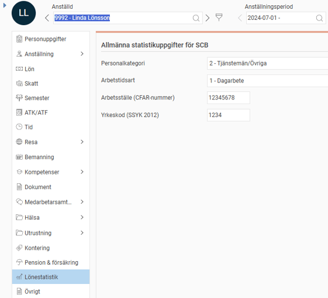
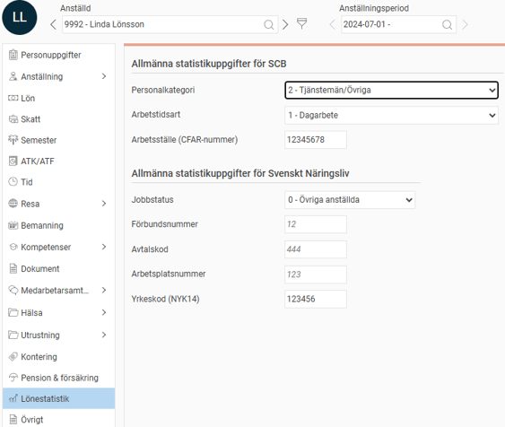
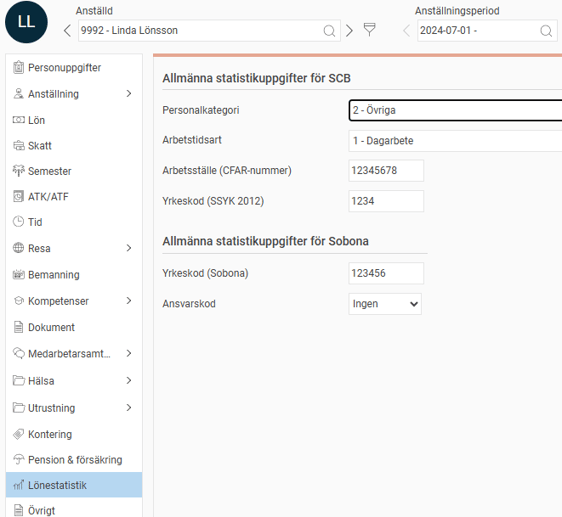
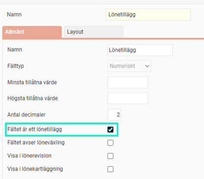
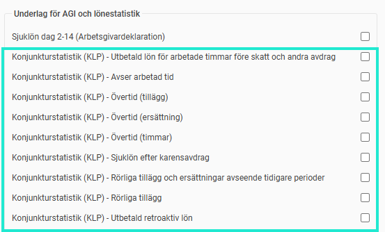

# ⚙️Konjunkturstatistik, löner för privat sektor (KLP) - Vilka inställningar behöver jag för att kunna ta ut statistiken för KLP i Flex HRM Payroll?

**Datum:** den 2 oktober 2025  
**Kategori:** Payroll  
**Underkategori:** Inställningar  
**Typ:** config  
**Svårighetsgrad:** intermediate  
**Tags:** lön, löneart, skatt  
**Bilder:** 5  
**URL:** https://knowledge.flexhrm.com/konjunkturstatistik-l%C3%B6ner-f%C3%B6r-privat-sektor-klp-vilka-inst%C3%A4llningar-beh%C3%B6ver-jag-f%C3%B6r-att-kunna-ta-ut-statistiken-f%C3%B6r-klp-i-flex-hrm-payroll

---

I denna artikel beskrivs de olika inställningar som krävs för att statistiken för KLP ska bli korrekt.
Uppgifter på individnivå
Lönetillägg
Löneartsinställningar
Uppgifter på individnivå
I anställdaregistret, under fliken Lönestatistik, anger du om den anställde ska räknas som Arbetare eller Övriga enligt SCB:s riktlinjer för konjunkturstatistiken. Beroende på dina övergripande inställningar ser du olika alternativ för personalkategori i anställningsregistret.
SCB:

Svenskt Näringsliv:

Sobona:

Lönetillägg
För att kunna redovisa överenskommen månadslön, inklusive fasta tillägg, behöver vi veta vilka fasta lönetillägg som används i företaget. För att göra detta använder vi Egna fält som definieras under
Inställningar > Personal > Anställdaregistret - egna fält.
För alla fält som ska räknas som ett lönetillägg kryssar du i inställningen "Fältet är ett lönetillägg". Om du har flera fält för lönetillägg, sätter du krysset på samtliga fält.

Löneartsinställningar
För att kunna skilja ut olika ersättningar och timmar behöver man ange för olika lönearter hur de ska redovisas i konjunkturstatistiken. Detta styrs med hjälp av en rad kryssrutor som du hittar i
Löneartsregistret >flik Lön

Följande gäller för respektive kryssruta:
Utbetald lön för arbetade timmar före skatt och andra avdrag
Används för summering av lön för arbetad tid gällande timavlönade arbetare. Läs instruktionen från SCB för mer information om vad som ska ingå.
Avser arbetad tid
Används för summering av antal arbetade timmar. Gäller både arbetare och tjänstemän.
Övertid (tillägg)
Gäller timavlönade arbetare för att kunna särredovisa övertidstillägg från lön för arbetad tid.
Övertid (ersättning)
Gäller månadsavlönade arbetare och tjänstemän som får övertidsersättning, inklusive grundlön och övertidstillägg. Grundlönen räknas sedan bort för redovisning av övertidstillägg.
Övertid (timmar)
Används för summering av antal övertidstimmar. Gäller både arbetare och tjänstemän.
Sjuklön efter karensavdrag
Används för summering av sjuklön. Om avtalet ger sjuklön dag 1 - 14 och därefter ett karensavdrag ska både lönearterna för sjuklön och karensavdraget kryssas för. Gäller både arbetare och tjänstemän.
Rörliga tillägg och ersättningar avseende tidigare perioder
Används för att summera rörliga tillägg som på grund av tidsförskjutning inte kan redovisas i samband med intjänandet. Exempel är långa ackord och kvartalsbonus.
Rörliga tillägg
Används för summering av rörliga tillägg för månadsavlönade arbetare och tjänstemän.
Observera att lönearter som avser övertidsersättning eller övertidstillägg inte ska markeras som rörliga tillägg då de tas med ändå. Se avsnittet fördjupad information för alla detaljer.
Utbetald retroaktiv lön
Används för summering av utbetald retroaktiv lön. Datum på transaktionen används för att redovisa vilken period som den retroaktiva lönen avser. Gäller både arbetare och tjänstemän.
Relaterade artiklar:
Konjunkturstatistik, löner för privat sektor (KLP) - Hur tar jag fram statistik för KLP i HRM Payroll?
