# Konteringsflöde i HRM Payroll - Hur hanteras konteringsdimensioner och prioriteringar i HRM Payroll?

**Datum:** den 7 oktober 2025  
**Kategori:** Payroll  
**Underkategori:** Löneberedning  
**Typ:** other  
**Svårighetsgrad:** advanced  
**Tags:** lön, löneart  
**Bilder:** 11  
**URL:** https://knowledge.flexhrm.com/konteringsfl%C3%B6de-i-hrm-payroll-hur-hanteras-konteringsdimensioner-och-prioriteringar-i-hrm-payroll

---

I HRM Payroll styrs konteringen av olika dimensioner genom inställningar på lönearten, anställda, och lönekörningen, med en tydlig prioriteringsordning som säkerställer korrekt kostnadsfördelning.
Konteringsdimensionsregistret
Personlig kontering
Löneartens kontering
Lönekörningens huvudfördelning
Prioritering
Använd föreslagen kontering
Avvikelsemarkering
Flödesschema
Åtgärder vid transaktionskontering
Konteringsbyggnadsmodeller för transaktionskontering
Konteringsdimensionsregistret
För att få tillgång till en konteringsdimension i HRM Payroll måste kryssrutan ”Använd i löneberedningen” vara ikryssad under fliken Lön i konteringsdimensionsregistret som du hittar under
Administration > Inställningar > Allmänt >Konteringsdimensioner
.
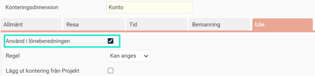
Personlig kontering
I anställdaregistret, under
Kontering
, kan man skapa personliga konteringar. Hemkontering och kostnadsfördelning.
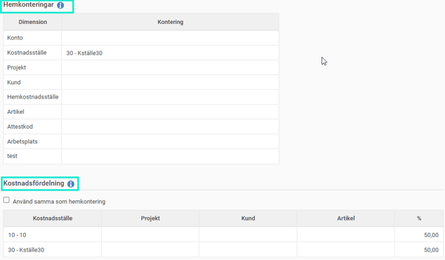
Löneartens kontering
På lönearten kan konteringar skapas vilket då gäller för aktuell löneart.
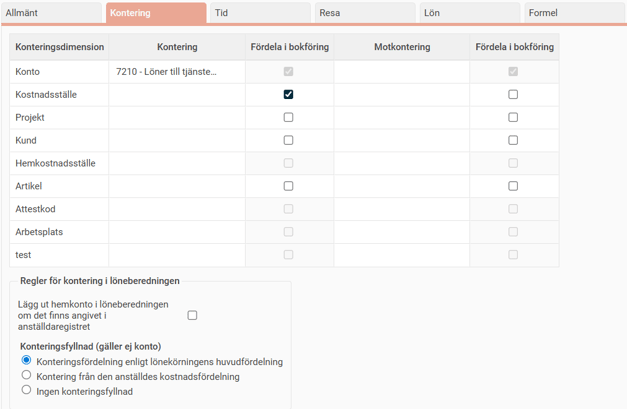
Inställning för ”konteringsfyllnad (gäller ej konto)”
Konteringsfördelning enligt lönekörningens huvudfördelning
Innebär att konteringsfyllnad görs utifrån lönekörningens huvudfördelning. Detta sker enligt en
prioriteringsordning
vilket förklaras längre ned i denna artikel.
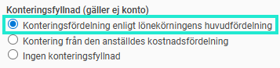
Kontering från den anställdes kostnadsfördelning
Innebär att konteringsfyllnad görs utifrån den anställdes kostnadsfördelning i anställdaregistret, fliken K
ontering
.
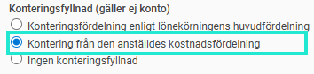
Ingen konteringsfyllnad
Innebär att ingen kontering kommer att läggas på denna löneart då kontering saknas.
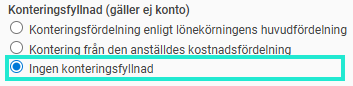
Lönekörningens huvudfördelning
Lönekörningen har en huvudfördelning för varje anställd i löneberedningen. Denna visas om du klickar på knappen
Konteringsfördelning
i löneberedningen.
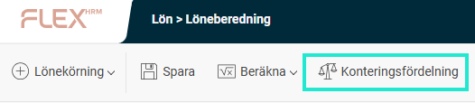
Huvudfördelningen skapas enligt följande:
När lönekörningen skapas kommer kontering från personens kostnadsfördelning läggas ut.
Om en löneart för Rapportering av konteringsfördelning har definierats under
Inställningar > Systemfasta lönearter
och denna löneart används på en eller flera transaktionsrader med ett antal över 0, kommer huvudfördelningen att beräknas utifrån dessa rader. När huvudfördelningen har beräknats på detta sätt är den låst för manuella ändringar.
Manuella förändringar av huvudfördelningen är endast möjliga om beräkningen har gjorts utifrån den anställdes kostnadsfördelning. Om en manuell ändring görs och den skiljer sig från den ursprungliga kostnadsfördelningen vid lönekörningens skapande, markeras ändringen som en avvikelse.
Transaktionens kontering
En transaktions kontering har företräde framför andra konteringar. Om till exempel en transaktion importeras från ett tidsystem och innehåller en kontering med kostnadsställe 1000, gäller denna kontering i första hand framför övriga konteringar i Payroll.
Prioritering
Följande prioritering av konteringar gäller när en transaktion läggs in i löneberedningen.
Konteringar av typen konto
Manuellt ändrat konto på raden
Importerat konto på raden.
Konto från hemkontering om inställningen på lönearten är ikryssad och hemkonto finns.
Löneartens konto, om sådan finns.
Konteringar utöver typen konto
Manuellt ändrad kontering på raden.
Importerad kontering på raden.
Om lönearten har kontering (förutom konto), gäller denna.
Om lönearten är inställd på ”Konteringsfördelning enligt lönekörningens huvudfördelning” sker konteringsfyllnad från huvudfördelningen.
Om lönearten är inställd på ”Kontering från den anställdes kostnadsfördelning” ska konteringsfyllnad ske utifrån den kostnadsfördelning som gäller för transaktionens from-datum när raden skapas. Om transaktionen saknar ett from-datum används istället lönekörningens utbetalningsdatum.
Använd föreslagen kontering
Varje transaktionsrad, förutom de med en löneart som är systemfast och har funktionen
Rapportering av konteringsfördelning
, har en kryssruta i konteringspopupen med alternativet
Använd föreslagen kontering
. Kryssrutan blir automatiskt markerad för nya transaktionsrader.
När kryssrutan är markerad hämtas konteringarna på nytt utifrån den föreslagna konteringen vilket bestäms utifrån inställningen på lönearten.
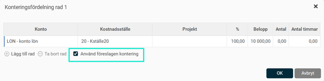
Avvikelsemarkering
Avvikelsemarkeringen finns för att förstå vad som avviker från det normala.
Transaktionsrader
Om en transaktionsrad har en avvikande kontering avvikelsemarkeras radens konteringssymbol.
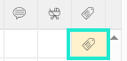
Konteringsfördelningen på raden jämförs med konteringsfördelningen som gäller när raden läggs ut för första gången. Skulle det finnas en avvikelse markeras denna. Avvikelser kan komma av manuellt ändrad kontering eller importerad kontering på transaktioner.
Huvudfördelning
Huvudfördelningen avvikelsemarkeras endast om huvudfördelningens konteringsfyllnad sker utifrån personens kostnadsfördelning. Huvudfördelningen är avvikande om den avviker från
personens kostnadsfördelning
.
Åtgärder vid transaktionskontering:
Skapa transaktionsrad:
Standardkonteringen läggs ut enligt löneartens inställningar och prioriteringar. "Använd föreslagen kontering" är alltid markerad som standard.
Manuell inmatning:
Om "Använd föreslagen kontering" avmarkeras, kan du registrera en egen kontering på raden.
Återaktivera "Använd föreslagen kontering":
Konteringen återställs enligt prioritering och löneartens inställning. Alla manuella ändringar tas bort och ersätts.
Ändrad huvudfördelning:
Om huvudfördelningen ändras, manuellt eller via en systemfast löneart, ska alla transaktionsrader med markerad "Använd föreslagen kontering" konteras om.
Ändra datum eller personalkategori på transaktionsrad:
Om lönearten har konteringsfyllnad från anställds kostnadsfördelning och raden har "Använd föreslagen kontering" markerad, läggs konteringen ut igen enligt samma princip som vid ny rad.
Ändra kontering i anställdaregistret:
Pågående lönekörningar påverkas inte direkt. Sparas ändringar på en anställd i löneberedningen kan dessa dock få genomslag.
Ändra löneartens kontering:
Pågående lönekörningar påverkas inte direkt. Sparas ändringar på en anställd i löneberedningen kan dessa få genomslag på konteringen.
Flödesschema
Konteringsflöde för kontering utöver konto
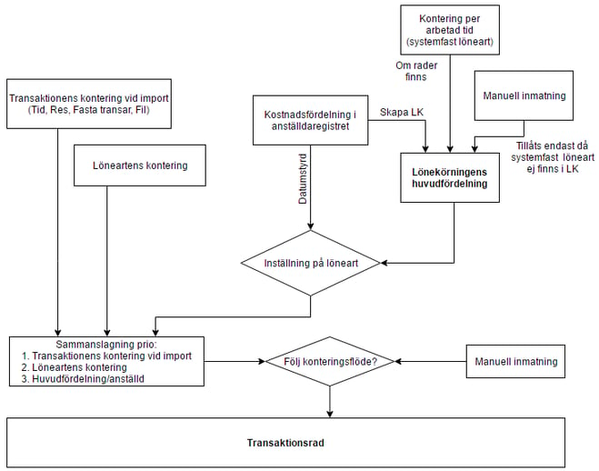
Konteringsflöde för konto
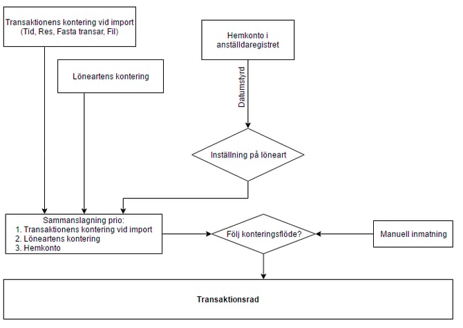
Konteringsbyggnadsmodeller för transaktionskontering
Manuellt angiven
Manuellt angiven kontering
Följ huvudfördelning
Importerad, Löneart, huvudfördelning
Kostnadsfördelning
Importerad, Löneart, anställds kostnadsfördelning
Ingen fyllnad
Importerad, Löneart
