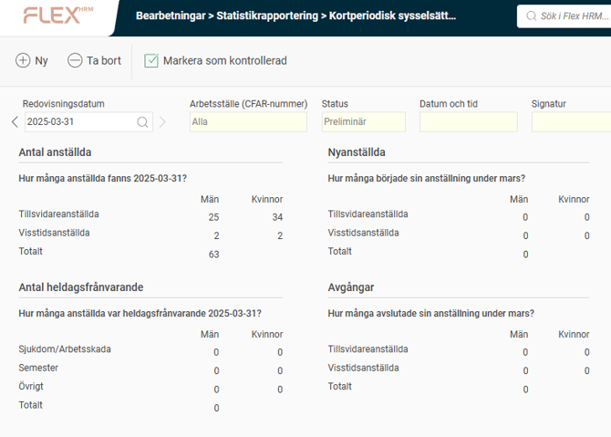
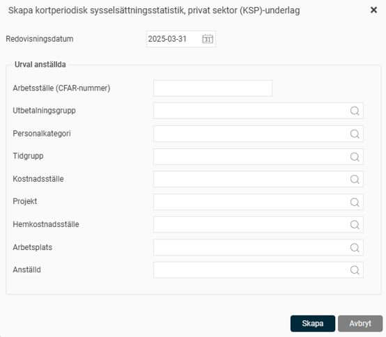
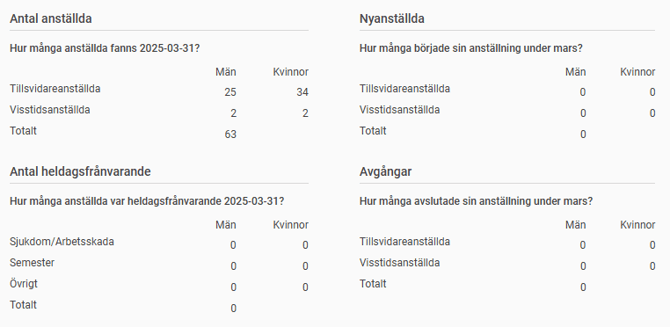
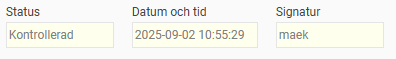
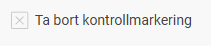

# Kortperiodisk sysselsättningsstatistik, privat sektor (KSP) - Hur tar jag fram statistik för KSP i HRM Payroll?

**Datum:** den 7 oktober 2025  
**Kategori:** Payroll  
**Underkategori:** Semesterhantering  
**Typ:** other  
**Svårighetsgrad:** advanced  
**Tags:** lön, semester  
**Bilder:** 6  
**URL:** https://knowledge.flexhrm.com/kortperiodisk-syssels%C3%A4ttningsstatistik-privat-sektor-ksp-hur-tar-jag-fram-statistik-f%C3%B6r-ksp-i-hrm-payroll-

---

Guide för att ta fram statistiken KSP (Kortperiodisk sysselsättningsstatistik, privat sektor) till SCB, samt hur systemet beräknar underlaget.
Skapa underlag
Ta bort underlag
Kontrollera underlaget
Fördjupad information om hur underlaget skapas och beräknas
Specialhantering för behovsanställda för Nyanställda och Avgångar
Löpande arbete för rapportering av konjunkturstatistik (KSP)
En gång per månad ska du som blivit utvald rapportera konjunkturstatistik över löner till SCB. Detta gör du i Flex HRM Payroll under
Administration > Bearbetningar >Statistikrapportering > Kortperiodisk sysselsättningsstatistik, privat sektor (KSP)
.

Skapa underlag
Det första steget i rapporteringen är att skapa ett underlag för datumets rapportering. Detta gör du genom att klicka på knappen
Ny
i knappraden.
Du väljer här vilket datum du vill skapa rapporteringsunderlag för. Du kan också välja att göra urval på anställda om du skulle vilja, i urvalet kan man även specificera vilket arbetsställe (CFAR-nummer från SCB) man vill göra urval på. Arbetsställe (CFAR-nummer) kan man sätta på en anställd.

När du klickar på knappen
Skapa
påbörjas arbetet med att skapa underlag. När underlaget är skapat ser du underlaget med statusen satt som Preliminär i vyn.
Ta bort underlag
Om du hittat ett fel i underlaget kan du ta bort ett underlag för att börja om från början. Du kan också ta bort gamla underlag som du inte längre vill ha sparade.
Kontrollera underlaget
Nästa steg är att kontrollera underlaget innan du skickar in uppgifterna till SCB. Detta gör du genom att granska underlaget i vyn.
Överst i vyn väljer du vilket redovisningsdatum du vill titta på. Tidigare redovisningar finns kvar och är enkelt tillgängliga.

I tabellen visas det underlag som sammanställts och som ska rapporteras till SCB.

När underlaget är granskat markerar du underlaget som kontrollerat genom att klicka på knappen
Markera som kontrollerad
. Statusen på underlaget ändras då till
Kontrollerad
. Datum, tid samt signatur för användaren som markerade underlaget som kontrollerat sparas ner på underlaget.

Om du hittar ett fel i ett kontrollerat underlag kan du ta bort kontrollmarkeringen igen,  via knappen
Ta bort kontrollmarkering
. Detta gör att statusen återigen blir
Preliminär
.

Fördjupad information om hur underlaget skapas och beräknas
Nedan hittar du detaljerad information om hur underlaget skapas i systemet.
Beräkning för de fyra olika frågorna
Nedan följer en detaljerad beskrivning av hur respektive fråga beräknas i underlaget.
Antal anställda
Hur många tillsvidare- och visstidsanställda det finns i företaget kategoriserat på kön. Provanställningar räknas till visstidsanställda.
Antal heldagsfrånvarande
Här beräknas hur många som var heldagsfrånvarande under ett visst datum under mätmånaden. Med heldagsfrånvarande menas frånvarotid i förhållande till den anställdes schemalagda tid, till exempel för en anställd som jobbar 50% är 4h en heltidsdag. Sedan kategoriseras det in på Sjukdom/arbetsskada, semester och sedan övrigt fördelat på den anställdes kön. Om flera frånvaro orsaker finns, till exempel 75% sjukfrånvaro och 25% tjänstledigt, så ska frånvaroorsaken med mest frånvarotid gälla alltså sjukfrånvaro. Om det är lika mycket frånvarotid till exempel 50% sjukfrånvaro och 50% tjänstledighet så gäller frånvaroorsaken som först finns i ordningen: semester, föräldraledigt, sjukdom, tjänstledighet och arbetsskada.
Nyanställda
Här beräknas hur många nya anställda företaget hade under mätmånaden. Om en anställds anställningsperiod har ett startdatum under mätmånaden så räknas det som nyanställd, med hänsyn till genus och anställningsform under anställningsperioden.
Ett undantag är om den anställdes anställningsperiod börjar mätmånaden men har en föregående sammanhängande anställningsperiod med samma anställningsform, då ska den anställningsperioden inte räknas med som ett avslut eftersom den egentligen fortsätter i sammanhängande anställningsperiod.
Avgångar
Beräknar hur många avgångna anställda företaget hade under mätmånaden. Om anställningsperioden har ett slutdatum under mätmånaden så räknas det som att den anställda har avgått, med hänsyn till genus och anställningsform under anställningsperioden.
Ett undantag är om den anställdes anställningsperiod slutar under mätmånaden men har en sammanhängande anställningsperiod med samma anställningsform direkt efter, då ska den anställningsperioden inte räknas med som ett avslut eftersom den egentligen fortsätter i sammanhängande anställningsperiod.
Specialhantering för behovsanställda för Nyanställda och Avgångar
När man räknar antal nyanställda och antal avgångar blir anställda som är behovsanställda specialhanterade, dessa ska beräknas enligt nedan. En anställd anses ha lön om den anställdes period netto är större än 0.
Behovsanställda nyanställda ska räknas enligt följande:
Om en anställd med anställningsformen behovsanställd saknar startdatum på anställningsperioden under mätmånaden kontrolleras istället löneutbetalningarna – om personen fått lön under aktuell månad räknas den som
nyanställd
.
OBS! För nyanställd tar man inte hänsyn till lön föregående månad som man gör för avgångar.
Behovsanställdas avgångar ska räknas enligt följande:
Om en anställd med anställningsformen behovsanställd saknar slutdatum på anställningsperioden under mätmånaden kontrolleras istället utbetalningarna – om den anställde inte har fått någon lön under mätmånaden men hade lön föregående månad, räknas detta som en
avgång
eftersom löneutbetalningarna har upphört.
