# Lönestrukturstatistik för privat sektor (SLP) - Hur tar jag fram statistik för SLP i HRM Payroll?

**Datum:** den 7 oktober 2025  
**Kategori:** Payroll  
**Underkategori:** Inställningar  
**Typ:** other  
**Svårighetsgrad:** advanced  
**Tags:** lön  
**Bilder:** 13  
**URL:** https://knowledge.flexhrm.com/l%C3%B6nestrukturstatistik-f%C3%B6r-privat-sektor-slp-hur-tar-jag-fram-statistik-f%C3%B6r-slp-i-hrm-payroll

---

Denna artikel beskriver hur du tar ut Lönestrukturstatistik för privat sektor (SLP) till SCB, SN eller Sobona i systemet.
Löpande arbete för rapportering av lönestrukturstatistik (SLP)
En gång per år, vanligtvis för september månad, ska du som blivit utvald rapportera lönestrukturstatistik för privat sektor till SCB, SN eller Sobona. Detta gör du via
Administration > Bearbetningar > Statistikrapportering > Lönestrukturstatistik, privat sektor (SLP)
.
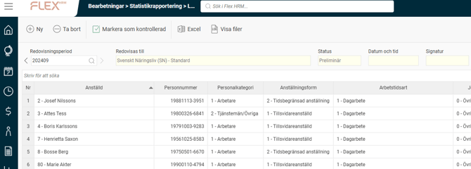
Skapa underlag
Det första steget i rapporteringen är att skapa ett underlag för den månad som rapporteringen avser. Detta gör du genom att klicka på knappen
Ny
i knappraden.
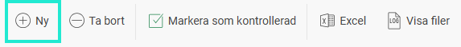
Du väljer här vilken månad du vill skapa rapporteringsunderlag för, normalt september månad. Du kan också välja att göra urval på anställda om du skulle vilja.
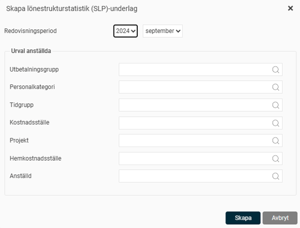
När du klickar på knappen
Skapa
påbörjas arbetet med att skapa underlag samt en fil för redovisning. När und
erlaget och filen är skap
ade ser du underlaget med statusen satt som
Preliminär
i vyn.
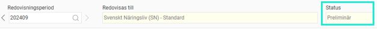
Ta bort underlag
Om du upptäcker ett fel i underlaget kan du använda knappen
Ta bort
för att radera det och börja om. Det går även att ta bort tidigare underlag som du inte längre behöver spara.
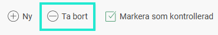
Kontrollera underlaget
Nästa steg är att kontrollera underlaget innan du skickar in uppgifterna till SCB eller SN. Detta gör du genom att granska underlaget i vyn.
Överst i vyn väljer du vilken redovisningsperiod du vill titta på. Tidigare redovisningar finns kvar och är enkelt tillgängliga. Du ser här också om uppgifterna är insamlade för redovisning till SCB eller SN.
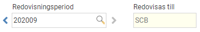
Du kan läsa mer om lönestatistikens inställningar i artikeln
Vilka inställningar krävs för att jag ska kunna rapportera statistik för Lönestrukturstatistik för privat sektor (SLP) i Flex HRM Payroll?
I listan visas det underlag som sammanställts och som kommer med i filen för rapportering. Beroende på om du redovisar till SCB eller SN är det lite olika uppgifter som kommer med. Mer detaljer om detta hittar du i artikeln
Hur beräknas underlaget för lönestrukturstatistik för privat sektor (SLP)?
under rubriken "Beräkning fält för fält".
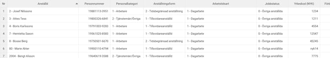
Du kan också exportera underlaget till Excel genom att klicka på knappen
Excel
i knappraden.
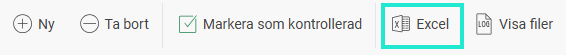
När underlaget är granskat markerar du underlaget som kontrollerat genom att klicka på knappen
Markera som kontrollerad
.
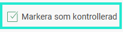
Underlaget får då statusen
Kontrollerad
. Systemet sparar även datum, tid och användarsignatur för den som genomfört kontrollmarkeringen.
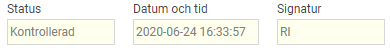
Om du hittar ett fel i ett kontrollerat underlag kan du ta bort kontrollmarkeringen igen, vilket gör att statusen återigen blir preliminär.
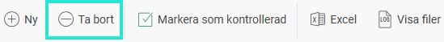
Fil för redovisning
När underlaget har sammanställts genereras automatiskt en rapportfil. Denna fil underlättar rapporteringen till SCB eller SN och kan hämtas via knappen
Visa filer
i knappraden.

Listan över filer innehåller en fil per redovisningsperiod, där den senaste ligger överst. Filen finns tillgänglig tills du väljer att ta bort underlaget i huvudvyn. Ladda ner filen genom att klicka på ikonen och skicka in den till SCB eller SN. Detta gör du genom att logga in på SCB:s eller SN:s hemsida och där följa instruktionerna för rapportering via fil.
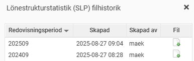
Relaterade artiklar:
Hur beräknas underlaget för lönestrukturstatistik för privat sektor (SLP)?
Vilka inställningar krävs för att jag ska kunna rapportera statistik för
Lönestrukturstatistik för privat sektor (SLP) i Flex HRM Payroll?
