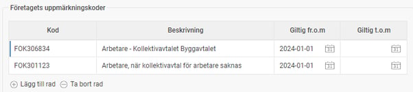
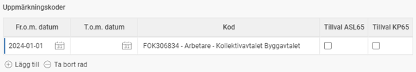

# Månadsrapportering FORA - Hur hanteras FORAs FOK-koder i Flex HRM Payroll?

**Datum:** den 7 oktober 2025  
**Kategori:** Payroll  
**Underkategori:** Pension  
**Typ:** other  
**Svårighetsgrad:** intermediate  
**Tags:** lön, pension  
**Bilder:** 2  
**URL:** https://knowledge.flexhrm.com/m%C3%A5nadsrapportering-fora-hur-hanteras-foras-fok-koder-i-flex-hrm-payroll-och-flex-l%C3%B6n-classic

---

FOK-koderna för Fora är viktiga för rätt försäkringar och pension och hanteras i Flex HRM Payroll individuellt, per personalkategori eller via import.
Bakgrund
Uppmärkning är grunden för att företagets arbetare ska omfattas av rätt försäkringar och få rätt premier inbetalda till sin tjänste­pension. I samband med övergången till månatlig löne­­rapportering till Fora 2024 har alla arbetare tilldelats en ny upp­märkning.
Uppmärkningen består av en FOK-kod och representerar ett kollektivavtal eller en grupp i ett kollektivavtal. De flesta företag har en uppmärkningskod för alla arbetare, men om du tillämpar flera olika kollektivavtal kommer du ha flera olika koder som de anställda ska märkas upp med.
Här kan du läsa mer om hur uppmärkningen fungerar på Foras sida
.
Register med företagets uppmärkningskoder
Först och främst behöver du lägga in de uppmärkningskoder som ska användas i företaget. De koder som gäller ditt företag hittar du på Foras Mina sidor. I Flex HRM Payroll gör du detta under
Inställningar > Lön > Pension och försäkring
. Det kommer se ut ungefär så här:

Uppmärkning per individ
Det kommer finnas flera sätt att göra uppmärkningen på de anställda. I anställdaregistret kan du lägga in för vilken period den anställde omfattas av en viss kod. Om en anställd kommer att  byta anställning och i och med det omfattas av en annan uppmärkning lägger du här in en ny datumperiod med den nya uppmärkningen.
Så här kan det komma att se ut i anställdaregistret:

Uppmärkning per personalkategori
För att slippa lägga in en uppmärkningskod på samtliga anställda finns det också en möjlighet att lägga in en uppmärkningskod per personalkategori. Om du inte lagt in en uppmärkningskod direkt på den anställde, kommer koden från personalkategorin att användas istället.
Möjlighet att importera uppmärkningskoder per individ
Du har även möjlighet att importera uppmärkningskoder för de anställda via en fil. På så sätt kan du enkelt förbereda samtliga uppmärkningar i t.ex. en Excel-lista och därefter importera alla uppgifter för samtliga anställda samtidigt. Du kan läsa mer om hur du gör sen sådan import i artikeln
Vilka inställningar krävs för att rapportera månadsvis till Fora i HRM Payroll?
, under rubriken "Importera uppmärkningskoder till anställdaregistret".
Relaterade artiklar:
Hur rapporterar jag pension till Fora månadsvis i HRM Payroll?
Vilka inställningar krävs för att rapportera månadsvis till Fora i 
HRM Payroll?
