# Semesterårsskifte HRM Payroll: Januari - Vad behöver jag göra inför semesterårsskiftet?

**Datum:** den 25 november 2025  
**Kategori:** Payroll  
**Underkategori:** Löneberedning  
**Typ:** other  
**Svårighetsgrad:** advanced  
**Tags:** lön, löneart, semester  
**Bilder:** 26  
**URL:** https://knowledge.flexhrm.com/semester%C3%A5rsskifte-hrm-payroll-januari-vad-beh%C3%B6ver-jag-g%C3%B6ra-inf%C3%B6r-semester%C3%A5rsskiftet

---

Denna artikel beskriver hur du gör ett semesterskifte när du har semesterår 1 januari - 31 december.
Arbetsgång vid semesterårsbytet 1 januari
Importmall och importfil för utbetalning av överskjutande dagar
Checklista vid semesterårsskifte
Arbetsgång vid semesterårsbytet 1 januari
Följande arbetsgång gäller dig vars semesterår börjar den 1 januari. Det vanliga är då att intjänandeåret är från 1 januari till 31 december innevarande år.
Skapa lönekörningen för januari och hämta in/registrera all frånvaro för december månad. Det är vanligt att man gör semesterårsskiftet i den ordinarie lönekörningen för januari för att få de nya semesterdagarna med på lönespecifikationen, då görs semesterberäkningen som sista steg i lönekörningen för januari.
Alternativt kan semesterårsskiftet göras i en extra lönekörning för alla anställda utan att hämta in några lönetransaktioner, fördelen med detta är att få mer tid för avstämning och kontroller innan semestern verkställs.
I den ordinarie lönekörningen för januari tar du ut en
Ny
semesterskuld under
Lön > Skuldhantering,
med beräkningstypen
Avstämning semesterårsskifte
, för att förbereda och kontrollera semesterårsskiftet.
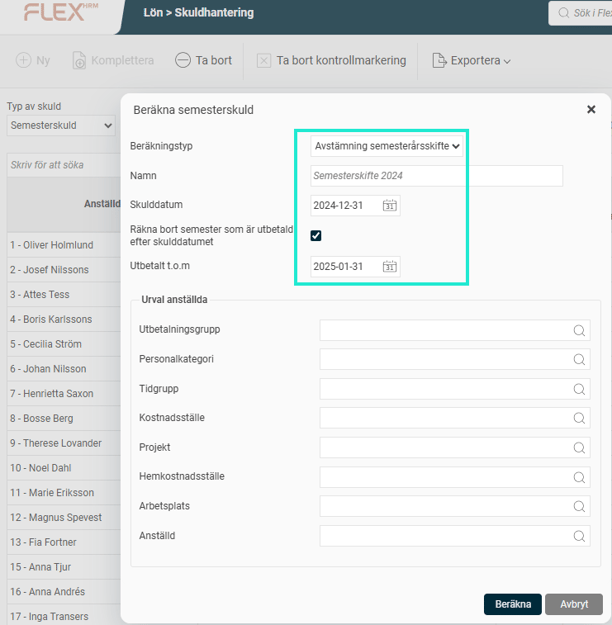
Klicka på
Beräkna
.
Du får då fram ett underlag som du kan kontrollera. Om du klickar i fältet
Värde
eller fältet
Dagar
på respektive anställd får du fram information om hur beräkningen är gjord.
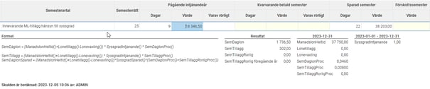
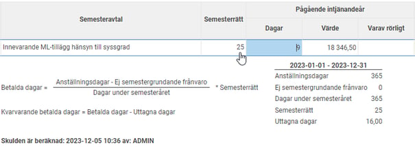
Du kan också ta ut rapporten
Semestersaldon
(via
Rapporter > Lön > Semestersaldon
)
för att få en överblick på de anställdes kvarvarande semesterdagar inför semesterårsskiftet. Ett tips är då att hämta saldon från lönekörningen med utbetalning i januari.
Under
Administration > Bearbetningar > Årsrutiner > Semesterårsskifte
finns funktionen för att göra ett semesterårsskifte. Här skapar du först ett underlag för semesterårsskiftet.
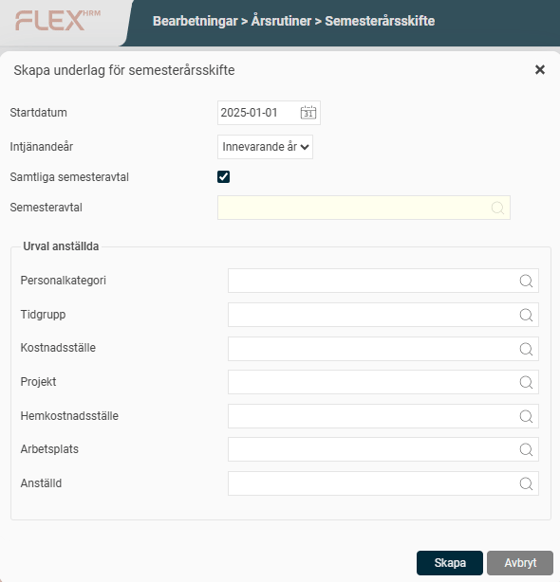
När du klickar på
Skapa
skapas ett underlag som du sedan kan gå igenom och kontrollera.
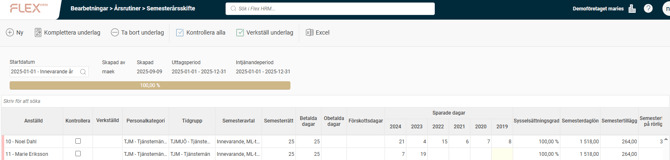
I översikten av underlaget finns alla de parametrar som ligger till grund för semesterberäkningen.
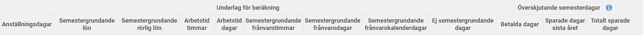
Rödmarkering i vänsterkanten, till vänster om anställd-kolumnen, informerar om den anställde har överskjutande semester enligt semesteravtalet.
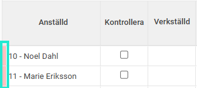
I kolumnerna i den
högra
delen av vyn kan du även se vilka dagar som systemet varnar för.
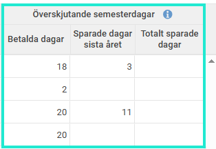
Om det finns kvarvarande betalda semesterdagar/sparade dagar på sista året som inte får sparas längre, är det vanligt att man betalar ut värdet för dessa
före
semesterårsbytet.
Det ska då göras i den ordinarie lönekörningen för januari genom att manuellt lägga in lönearten för utbetalning av semester i löneberedningen alternativt kan du skapa en importfil och läsa in dessa i löneberedningen (se avsnittet om
Importmall och importfil för utbetalning av överskjutande dagar
längre ned i denna artikel).
Om medarbetaren ska få årets betalda dagar utbetalda behövs en separat löneart för att dessa ska avräknas mot rätt saldo, dvs årets betalda dagar istället för sparade dagar.
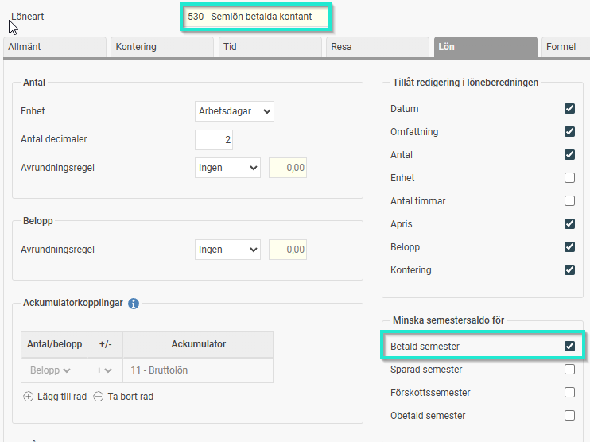
Om utbetalning inte görs i den ordinarie körningen för januari kommer alla dagar att flyttas över till sparade dagar, årets kvarvarande betalda dagar hamnar då på sparår 1 och när utbetalning görs i kommande lönekörning utbetalas sparade dagar från det sista sparåret i första hand, näst sista året i andra hand o.s.v. Detta innebär att du då kan behöva justera saldona för sparade dagar innan eller efter utbetalning gjorts för att få rätt fördelning på de olika sparåren.
Före utbetalning:
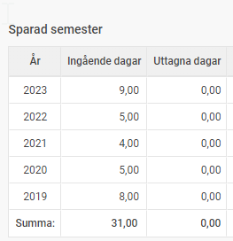
Efter utbetalning av 4 dagar som tillhör sparår 1 (= ej uttagna betalda dagar) + 5 dagar från sparår 2018 (samtliga har avräknats mot sparår 2019 och 2020) om ingen justering av saldon gjorts.

Vår rekommendation är därför att man åtminstone betalar ut överskjutande betalda dagar i den ordinarie lönekörningen men kan avvakta med överskjutande sparade dagar till en senare lönekörning.
OBS!
Om du betalat ut överskjutande semesterdagar är det viktigt att du uppdaterar underlaget för semesterskifte genom att komplettera underlaget. Det är viktigt för att antal semesterdagar som betalats ut ska räknas ner, och den anställde inte ska få för många dagar vid verkställandet. Du kan göra detta på alla anställda eller bara de som du betalat ut för genom att göra urval vid komplettering.
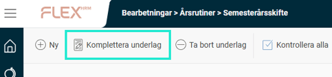
Om semesterårsskiftet ska göras i en extra lönekörning avräknar du nu den ordinarie lönekörningen. Därefter skapar du en extra lönekörning där du tar med samtliga anställda men inga transaktioner. (Om semesterårsskiftet görs i den ordinarie lönekörningen ska lönen ej avräknas, fortsätt enligt steg 7).
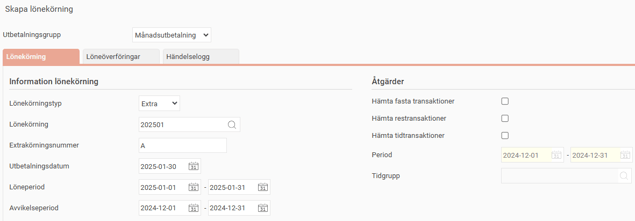
Gå nu tillbaka till
Semesterårsskifte
för att göra den slutgiltiga kontrollen och verkställa semesterårsskiftet.
När du har gått igenom underlaget klickar du på
Kontrollera alla
, eller kryssa i en anställd åt gången som kontrollerad direkt i listan. Kontrollmarkeringen går att ta bort om det är något du vill justera så länge semesterskiftet inte har verkställts.

När allt är klart klickar du på
Verkställ underlag
och semesterårsskiftet är klart.
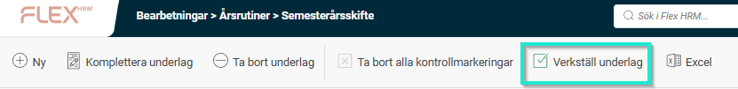
De anställda har nu fått sina nya dagar som du kan se både i anställdaregistret och i löneberedningen.
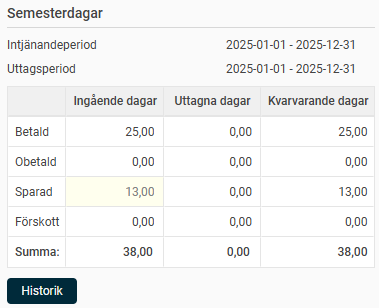
Sista steget är nu att avräkna den preliminära lönekörningen. Om du använder HRM Time rekommenderar vi också att du exporterar semestersaldon dit för att de anställda direkt ska se sina nya semesterdagar i tidrapportens saldon. Detta görs normalt direkt vid avräkning av lönekörningen.
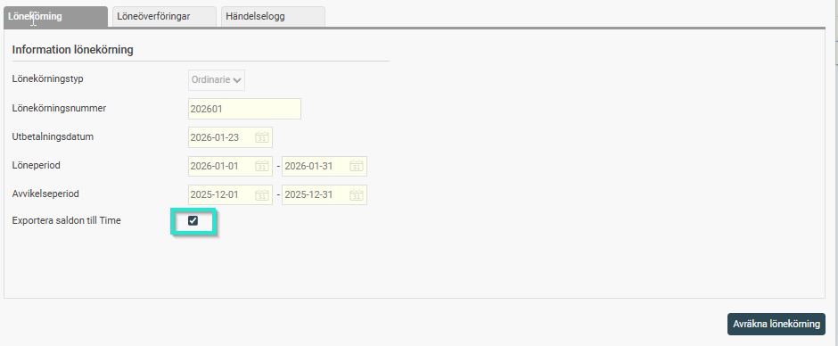
Därefter är semesterskiftet klart!
Importmall och importfil för utbetalning av överskjutande dagar
För att läsa in en fil med de dagar som ska utbetalas pga att de ej får sparas behövs en importmall och en fil med det antal dagar som ska utbetalas.
Importmall
Importmallen sätts upp under
Administration > Inställningar > Import/export >
Importmallar
.
Välj Importtyp:
Lönetransaktioner - löpande import
, fyll i fältavgränsare och ev. antal rader som ska hoppas över (= rubrikrader) samt välj de fält som ska läsas in.
Exempel som visar en importmall för inläsning av en fil av typen kommaavgränsad (csv) där översta två raderna är rubrikrader som ej ska läsas in:

Importfil
Ladda sen ner semesterskifteslistan i Excel för att skapa en importfil.

Du kan nu redigera Excelfilen.
Om det finns dagar för utbetalning i samtliga tre kolumner (Betalda dagar, Sparade dagar sista året, Totalt sparade dagar) kommer du behöver skapa tre importfiler (se nedan) och läsa in i löneberedningen.
Ta bort alla kolumner förutom
Anställd
och de överskjutande semesterdagarna. Låt de två rubrikraderna ligga kvar.
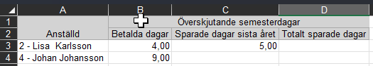
Lägg till en tom kolumn före varje saldo där du ska fylla i lönearten för utbetalning.
OBS!
Olika lönearter för utbetalning av betalda dagar och sparade dagar för avräkning mot rätt saldo om utbetalning görs i den ordinarie lönekörningen
INNAN
semesterskiftet verkställs, lönearten för sparade dagar om utbetalning görs i en senare lönekörning
EFTER
semesterskiftet verkställts.

Du behöver sen ta bort den anställdes namn i kolumn A så att endast anställningsnummer kvarstår.
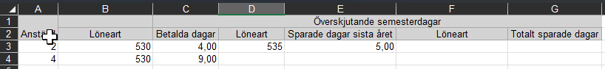
Spara slutligen filen som en kommaavgränsad fil.
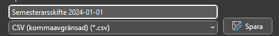
Alternativt kan du skapa en fil där du på nya rader flyttar ner Sparade dagar sista året och Totalt sparade dagar och lägger till anställningsnummer och rätt löneart. Då behöver du bara läsa in filen en gång.
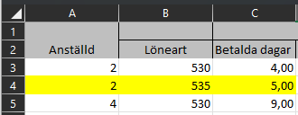
Komplettera lönekörningen där dagarna ska utbetalas, Klicka på
Ny fil
och välj din csv.fil samt importmallen. Klicka sen på
Komplettera lönekörning
. Nu läses de betalda dagarna i kolumn C in i lön.
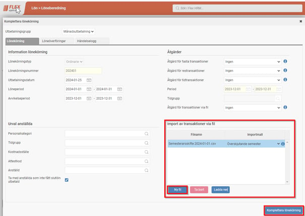
För att läsa in resterande dagar i kolumn D-G behöver du skapa nya versioner av filen.
Öppna din importfil och radera kolumn B & C (Betalda dagar) så att filen nu har lönearten och antal för sparade dagar i kolumn B & C istället. Spara om filen som csv med ett nytt namn (t.ex. Sparade sista året) och läs in den igen. Nu läses de sparade dagarna från sista sparåret in.
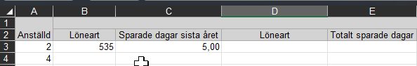
Öppna sen importfilen igen och på nytt, radera kolumn B & C (Sparade dagar sista året) så att filen nu har lönearten och antal för Totalt sparade dagar i kolumn B & C. Spara om filen som csv med nytt namn (t.ex. Totalt sparade) och läs in den igen. Nu läses de sparade dagarna som är över maxtaket för sparade dagar in.
Checklista semesterårsskifte
När skiftet verkställs i ordinarie lönekörning:
Starta ordinarie lönekörning och läs in avvikelser
Skapa semesterskuld "Avstämning semesterårskifte"
Skapa underlag för semesterårsskiftet
Betala ut överskjutande dagar (alt kan dessa utbetalas i en senare lönekörning)
Komplettera. kontrollera och verkställ semesterårsskiftet
Avräkna lönekörningen och exportera saldon till Time
När skiftet verkställs i en extra lönekörning efter ordinarie körning:
Starta ordinarie lönekörning och läs in avvikelser
Skapa semesterskuld "Avstämning semesterårsskifte"
Skapa underlag för semesterårsskifte
Komplettera, kontrollera och verkställ semesterårsskiftet
Avräkna den extra lönekörningen och exportera saldon till TIME
