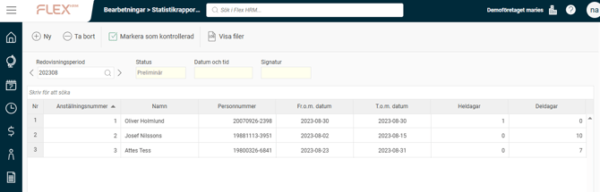
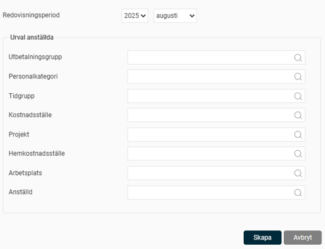
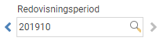
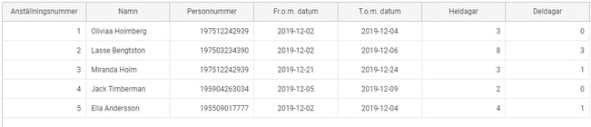
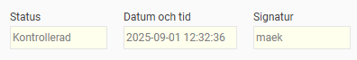
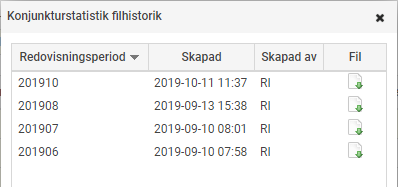

# Sjukfrånvaro under sjuklöneperioden (SUS) - Hur tar jag fram statistik för SUS i Flex HRM Payroll?

**Datum:** den 7 oktober 2025  
**Kategori:** Payroll  
**Underkategori:** Övrigt  
**Typ:** other  
**Svårighetsgrad:** advanced  
**Tags:** lön  
**Bilder:** 6  
**URL:** https://knowledge.flexhrm.com/konjunkturstatistik-%C3%B6ver-sjukl%C3%B6ner-ksju-hur-tar-jag-fram-statistik-f%C3%B6r-ksju-i-hrm-payroll

---

Denna artikel ger beskriver hur du tar ut statistiken Sjukfrånvaro under sjuklöneperioden (SUS) till SCB  i HRM Payroll och hur uppgifterna beräknas.
Skapa underlag
Ta bort underlag
Kontrollera underlaget
Fil för redovisning
Beräkning för heldagar, deldagar och anställningsuppgifter
Löpande arbete för rapportering av Sjukfrånvaro under sjuklöneperioden (SUS)
En gång per månad ska du som blivit utvald rapportera
Sjukfrånvaro under sjuklöneperioden (SUS)
(
tidigare benämnd
Konjunkturstatistik över sjuklöner (KSJU))
till SCB. Detta gör du i Flex HRM Payroll under
Administration > Bearbetningar > Statistikrapportering > Sjukfrånvaro under sjuklöneperioden (SUS)
.

Skapa underlag
Det första steget i rapporteringen är att skapa ett underlag för månadens rapportering. Detta gör du genom att klicka på knappen
Ny
i knappraden.
I dialogrutan som visas väljer du vilken månad rapporteringsunderlaget ska gälla för. Här har du även möjlighet att göra  urval på specifika anställda vid behov.

När du klickar på knappen
Skapa
påbörjas arbetet med att skapa underlag samt en fil för redovisning. När underlaget och filen är skapade ser du underlaget med statusen satt som
Preliminär
i vyn.
Ta bort underlag
Om du upptäcker ett fel i underlaget kan du enkelt ta bort det genom att klicka på
Ta bort
-knappen och skapa ett nytt underlag från början. Du kan även radera äldre underlag som du inte längre vill ha kvar.
Kontrollera underlaget
Nästa steg är att kontrollera underlaget innan du skickar in uppgifterna till SCB. Detta gör du genom att granska underlaget i vyn.
Överst i vyn väljer du vilken redovisningsperiod du vill titta på.

I tabellen under visas det underlag som sammanställts och som ska rapporteras till SCB.

När underlaget är granskat markerar du underlaget som kontrollerat genom att klicka på knappen för
Markera som kontrollerad.
Statusen på underlaget ändras då till
Kontrollerad
. Datum, tid samt signatur för användaren som markerade underlaget som kontrollerat sparas ner på underlaget.

Om du hittar ett fel i ett kontrollerat underlag kan du välja
Ta bort kontrollmarkering
, vilket gör att statusen för underlaget återigen blir
Preliminär
.
Fil för redovisning
Samtidigt som underlaget sammanställs skapas också en fil för redovisning. Filen kan användas som ett alternativ till att mata in siffrorna manuellt i SCB:s rapporteringstjänst. Du hämtar filen för rapportering genom att klicka på knappen
Visa filer
i knappraden. Här finns filen kvar till dess att du väljer att ta bort underlaget från listan.

Listan över filer innehåller en fil per redovisningsperiod, där den senaste ligger överst. Ladda ner filen genom att klicka på ikonen och skicka in den till SCB. Detta gör du genom att logga in på SCB:s hemsida och där följa instruktionerna för rapportering via fil.
Fördjupad information om hur underlaget skapas
Nedan hittar du detaljerad information om hur underlaget skapas i systemet.
Beräkning för heldagar, deldagar och anställningsuppgifter
Nedan följer en detaljerad beskrivning av hur respektive fält beräknas för timavlönade arbetare.
Hela dagar är då personen varit frånvarande en hel arbetsdag sett utifrån personens schemalagda tid, t.ex en person som jobbar 50% räknas 4h som
heldag
.
Del av dag
ska anges om individen gått hem under sin arbetsdag där frånvaro räknas i antal deldagar och inte antal timmar (oavsett tjänstgöringsgrad). En dag med karensavdrag kan bli en deldag om individen gått hem under dagen, men likaväl en heldag om individen anmält sig sjuk på morgonen och inte infunnit sig på arbetet.
Om ett sjukfall inte är avslutat vid månadsskiftet utan fortsätter i påföljande månad så delas sjukfallet upp i två delar var respektive månad. Det ska således alltid finnas uppgifter i fälten Sjuklöneperiodens första dag och Sjuklöneperiodens sista dag
Personnummer anges alltid som 12-siffrigt även om det är sparat som 10-siffrigt i HRM.
