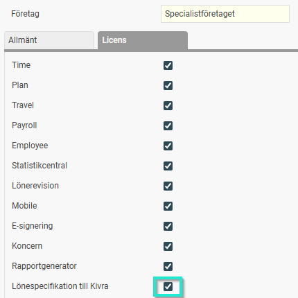
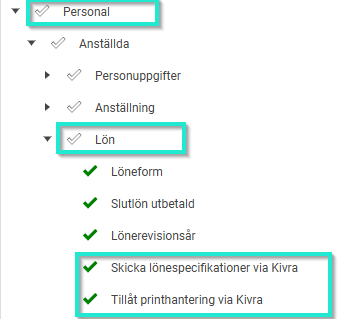
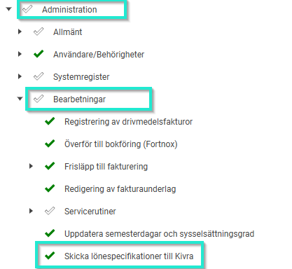
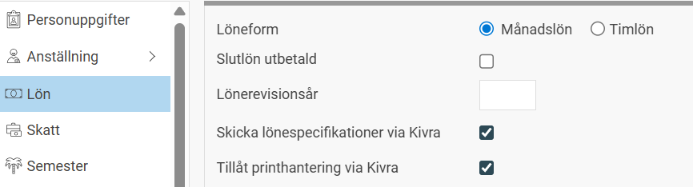
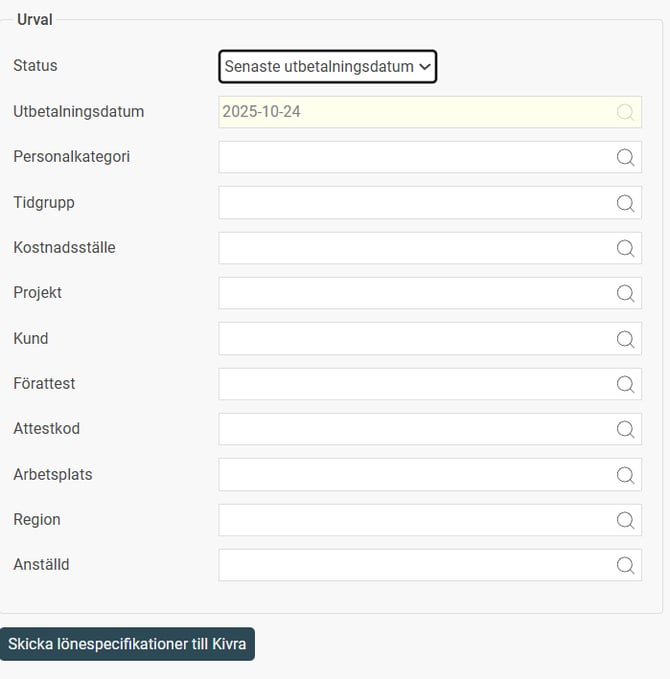
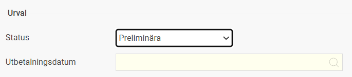
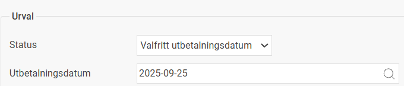

# ⚙️Skicka lönespecifikationer med Kivra i Flex HRM

**Datum:** den 21 november 2025  
**Kategori:** Payroll  
**Underkategori:** Inställningar  
**Typ:** config  
**Svårighetsgrad:** advanced  
**Tags:** lön  
**Bilder:** 7  
**URL:** https://knowledge.flexhrm.com/skicka-l%C3%B6nespecifikationer-med-kivra-i-flex-hrm

---

Denna artikel beskriver hur du ställer in och skickar lönespecifikationer till dina anställda via den digitala brevlådan Kivra.
Förutsättningar för att använda Kivra
För att kunna använda funktionen för att skicka lönespecifikationer till Kivra behöver du:
En
tilläggsmodul
för Kivra-integrationen.
Ett
avtal med Kivra
.
Debiteringen är kopplad till antalet lönespecifikationer du skickar till Kivra.
Tips:
Kontakta våra säljare för mer information och för att beställa tilläggsmodulen.
Att skicka lönespecifikationer till Kivra är både enkelt, säkert och praktiskt. Anställd kommer åt sin lönespecifikation i Kivra genom inloggning via BankID på ett säkert sätt och har där tillgång till alla sina lönespecifikationer även efter det att anställningen upphör och de inte längre har kvar sin inloggning till Flex HRM. På så sätt slipper du som arbetsgivare skicka lönespecifikationer till före detta anställda och alla lönespecifikationer finns samlade i Kivra på ett överskådligt sätt.
Aktivera Kivra-funktionen på företagsnivå
När tilläggsmodulen är aktiverad på systemnivå behöver du aktivera den för de specifika företag du vill använda den för:
Gå till
Administration
>
Allmänt
>
Företag
.
Gå till fliken
Licens
.
Aktivera
Lönespecifikationer till Kivra
för önskat företag.

Programlänk – Aktivering och inställningar
Innan du kan skicka några lönespecifikationer måste du aktivera och konfigurera programlänken till Kivra.
Gå till
Administration
>
Inställningar
>
Allmänt
>
Programlänkar
.
Fyll i följande uppgifter:
Avsändaridentitet (tenant key)
Här anger du den
unika nyckel
du har fått från Kivra när du skapade ditt konto. Denna nyckel säkerställer att lönespecifikationen får rätt avsändare (ditt företag) i Kivra.
Skicka uppgifter till
Välj om lönespecifikationerna ska skickas till Kivras
Produktionsmiljö
eller
Testmiljö
.
Välj
Produktionsmiljö
för att skicka
verkliga
lönespecifikationer till dina anställda.
Testmiljö
kan endast användas om du fått ett testkonto från Kivra.
Retroaktiv leverans
Här väljer du hur många dagar lönespecifikationen ska ligga kvar hos Kivra för anställda som
inte har
en digital brevlåda vid utskickstillfället. Om den anställde skapar ett Kivra-konto inom denna period blir lönespecifikationen tillgänglig.
Skicka lönespecifikationer
Denna inställning
måste vara ikryssad
för att det ska vara möjligt att skicka lönespecifikationer till Kivra.
Obs!
När du aktiverar eller inaktiverar denna får du en fråga om du vill aktivera/inaktivera alla anställda i registret (se avsnittet om inställningar i anställdaregistret nedan).
Aktivera printhantering
Printhantering är en tilläggstjänst hos Kivra som gör att lönespecifikationen
skickas per post
till anställda som inte är anslutna till Kivras digitala brevlåda när utskicket görs. Detta kräver att tjänsten ingår i ert avtal med Kivra.
Obs!
När du aktiverar eller inaktiverar denna får du en fråga om du vill aktivera/inaktivera printhantering för alla anställda i registret (se avsnittet om inställningar i anställdaregistret nedan).
Aktiv
Välj om programlänken till Kivra ska vara
aktiv
eller inte. För att kunna skicka lönespecifikationer måste den vara
aktiv
.
Inställningar på Roller
För att få åtkomst att aktivera inställningen i anställdaregistret  behöver följande behörigheter vara aktiverade på rollen. Under
Personal > Lön
aktiveras
Skicka lönespecifikationer via Kivra
samt
Tillåt printhantering via Kivra
om den tilläggstjänsten är aktuell.

För att få åtkomst till funktionen för att skicka lönespecarna behöver rollen ha följande behörigheter aktiverade. Under
Administration > Bearbetningar
aktiveras
Skicka lönespecifikationer till Kivra.

Inställningar i Anställdaregistret
I anställdaregistret kan du styra vilka anställda som får sina lönespecifikationer via Kivra. Gå till den anställdes registerkort och fliken
Lön
. Där visas en eller två kryssrutor, beroende på vilka funktioner du har aktiverat i programlänken,
Skicka lönespecifikationer via Kivra
och
Tillåt printhantering via Kivra.

Skicka lönespecifikationer via Kivra
Lönespecifikationer kan
endast
skickas till Kivra för anställda som har denna ruta
ikryssad
.
Tillåt printhantering via Kivra
Denna kryssruta visas
endast
om du har aktiverat funktionen för printhantering i programlänken till Kivra.
Om den är
ikryssad
tillåts att lönespecifikationen skickas per post via Kivras printhantering till den anställde om hen inte har en digital brevlåda ansluten.
Lönespecifikationen skickas då till adressen under fliken
Personuppgifter
.
Skicka lönespecifikationer till Kivra
När alla inställningar är gjorda och lönekörningen är klar kan du skicka ut lönespecifikationerna :
Gå till
Administration
>
Bearbetningar
>
Skicka lönespecifikationer till Kivra
.
1. Gör urval (vänster sida)
Till vänster i bilden gör du ditt urval:
Välj
utbetalningsdatum
.
Gör urval på de
anställda
du vill skicka lönespecifikationer till.

Du kan välja att skicka
preliminära
lönespecifikationer genom att välja Status
Preliminära
.

Det finns även möjlighet att skicka lönespecifikationer för
äldre perioder
genom att välja Status
Valfritt utbetalningsdatum
och aktuellt utbetalningsdatum som lönespecifikationer ska skickas för.

2. Skicka ut
När du har gjort ditt urval klickar du på knappen
Skicka lönespecifikationer till Kivra
.
Du får först en bekräftelse på att arbetet har påbörjats och sedan ytterligare en när arbetet är slutfört.
3. Följ status (höger sida)
Till höger i bilden finns en logg över de utskick som bearbetas eller är klara:
Kolumn
Beskrivning
Status
Visar med en grön bock om allt gick bra och en röd bock om något blev fel.
Info
Här ser du detaljer, bland annat hur många lönespecifikationer som lyckades skickas och hur många som misslyckades, samt vilka urval som gjordes.
Logg
Klicka här för att ladda ner en detaljerad logg som visar vilka anställda och lönekörningar specifikationer skickats för. Den innehåller även felmeddelanden om något problem uppstått, till exempel om personnummer saknas eller är felaktigt.
