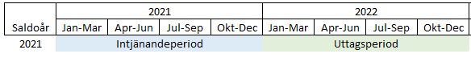
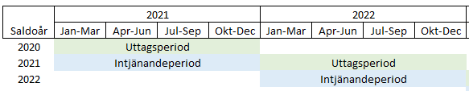
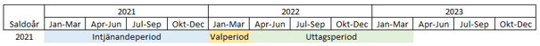
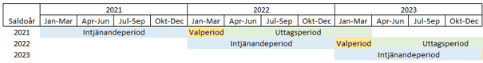

# Vad är arbetstidskonto (ATK) och arbetstidsförkortning (ATF)?

**Datum:** den 5 december 2025  
**Kategori:** Payroll  
**Underkategori:** Pension  
**Typ:** concept  
**Svårighetsgrad:** beginner  
**Tags:** lön, löneart, pension  
**Bilder:** 4  
**URL:** https://knowledge.flexhrm.com/vad-%C3%A4r-arbetstidskonto-atk-och-arbetstidsf%C3%B6rkortning-atf

---

Artikeln beskriver kort vad ATK och ATF är, skillnader mellan dem och olika principer och regler.
I Flex HRM Payroll skiljer vi på Arbetstidskonto (ATK) och Arbetstidsförkortning (ATF) på följande sätt:
Arbetstidskonto (ATK)
Då man enligt kollektivavtalet ska avsätta en viss procent på intjänad lön till ett arbetstidskonto. I vissa kollektivavtal kallas detta för livsarbetstid.
Arbetstidsförkortning (ATF)
Då man enligt kollektivavtalet ska avsätta tid i en tidbank för varje arbetad timme. Vanligtvis avsätter man ett visst antal minuter per arbetad heltidsvecka.
Det finns många olika regler kring AKT/ATF i olika kollektivavtal. Det är därför viktigt att du är insatt i hur just ditt kollektivavtal reglerar detta. För att hantera reglerna för olika avtal skapar du i HRM Payroll olika ATK/ATF-avtal där du gör inställningar. Detta gör du via
Administration > Inställningar > Lön > ATK/ATF-avtal
. Därefter kopplar du ett avtal till den anställde eller till en personalkategori.
Det kan också vara så att du istället har/behöver en anpassad lösning med hjälp av tidstransaktioner, lönearter och ackumulatorer (för t.ex. avtal som har sammanfallande intjänande/uttag kan
inte
funktionen med ATK/ATF-avtal användas då dessa endast beräknar släpande intjänande.)
OBS!
Om du är osäker på hur du ska konfigurera ditt ATK- eller ATF-avtal så att det stämmer med ert kollektivavtal, rekommenderar vi att du tar hjälp av en konsult från Flex Applications.
Varje månad görs en avsättning utifrån den procentsats eller det antal minuter per vecka som angivits i ATK/ATF-avtalet.
Olika principer för intjänande och uttag
Det finns i kollektivavtalen en stor variation gällande intjänandeperioder och uttagsperioder för ATK och ATF.
Arbetstidsförkortning (ATF)
För ATF finns det i huvudsak två olika varianter. Antingen tjänar man in och tar ut tid löpande, ungefär som ett komp- eller flexsaldo. Om man har denna typ av hantering hanterar man detta i Flex HRM Time som ett saldo med händelsefunktioner för intjänande.
Den andra varianten är att man under 12 månader tjänar in ATF-timmar, och de efterföljande 12 månaderna kan ta ut dessa timmar som ledighet. Ibland kan det förekomma att den anställde kan välja att få de intjänade timmarna utbetald som kontant ersättning eller avsättning till pension.
Exempel:
Intjänande sker under 2021 (1 januari – 31 december). Uttagsperioden är under 2022.

När uttagsperioden börjar startar samtidigt en ny intjänandeperiod. Bilden nedan visar de olika åren som hanteras parallellt vid olika tidpunkter.

Arbetstidskonto (ATK)
När det gäller ATK har man alltid en intjänandeperiod på 12 månader då man avställer pengar till ett arbetstidskonto. Därefter har man en uttagsperiod på 12 månader som vanligtvis börjar en tid efter intjänandeperiodens slut. Den perioden mellan slutet av intjänandeperioden och starten av uttagsperioden är till för att hinna administrera den anställdes val, då den anställde oftast kan välja att ta ut pengarna på arbetstidskontot som antingen kontant ersättning, betald ledig tid eller som en extra pensionsavsättning.
Exempel:
Intjänande sker under 2021 (1 januari – 31 december. Därefter har den anställde fram till 31 mars på sig att välja vad denne vill göra med de intjänade pengarna. Om den anställde väljer att ta ut som betald ledig tid är uttagsperioden från 1 april 2022 till 31 mars 2023.

När uttagsperioden börjar startar samtidigt en ny intjänandeperiod. Bilden nedan visar de olika åren som hanteras parallellt vid olika tidpunkter. Under perioden jan-mars 2023 i exemplet har man saldon för tre olika intjänandeperioder samtidigt. Dels har man en uttagsperiod för det man tjänade in under 2021, dels har man en valperiod för de pengar man tjänade in under 2022, samtidigt som man har påbörjat intjänandet under 2023.

Relaterade artiklar:
Hur fungerar den löpande hanteringen av ATK och ATF?
Hur ser de årliga rutinerna för arbetstidskonto (ATK) ut?
