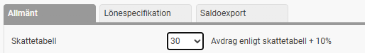
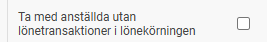
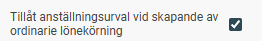
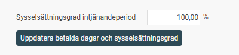
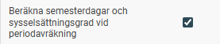

# Vad styrs av inställningarna under Lönekörningar i HRM Payroll?

**Datum:** den 11 november 2025  
**Kategori:** Payroll  
**Underkategori:** Löneberedning  
**Typ:** config  
**Svårighetsgrad:** advanced  
**Tags:** lön, semester, skatt  
**Bilder:** 6  
**URL:** https://knowledge.flexhrm.com/vad-styrs-av-inst%C3%A4llningarna-under-l%C3%B6nek%C3%B6rningar-i-hrm-payroll

---

Här ställer du in de allmänna inställningarna för lönekörningar. Du hittar inställningarna under Inställningar > Lön > Lönekörningar, fliken Allmänt.
Skattetabell
Här anger du företagets generella skattetabell. Den här tabellen används om en anställd saknar en skattetabell under
Personal > Anställda
, fliken
Skatt
. Systemet drar då skatt enligt denna tabell samt ytterligare 10 % skatt, enligt gällande praxis.

Ta inte med anställda utan transaktioner i lönekörningen
I vissa verksamheter görs löneutbetalningar till vissa personer bara ett fåtal gånger per år. Det kan till exempel vara förtroendevalda eller styrelsemedlemmar som får arvode eller ersättning för resor vid enstaka tillfällen.
Om du har många sådana personer kan lönekörningen innehålla många anställda som inte har något att utbetala. Detta gör det svårare att hitta de personer du vill kontrollera och tar även onödig prestanda i systemet.

Om du inte markerar rutan tas endast de anställda med som har transaktioner för löneperioden (t.ex. fasta transaktioner i anställningsregistret , transaktioner från HRM Time, HRM Travel  eller i en fil som importeras in i lönekörningen).
Om du markerar rutan kommer alla anställda med som ej har en markering att slutlön är utbetald. Om inga lönetransaktioner registreras på dessa syns de endast i löneberedningen, ingen lönespecifikation skapas.
Tillåt anställningsurval vid skapande av ordinarie lönekörning
Använd den här inställningen om du vill kunna skapa en ordinarie lönekörning med endast ett visst antal anställda. OBS. Tänk då på att du behöver komplettera lönekörningen för att få in samtliga anställda vid ett senare tillfälle.

För extra lönekörningar behövs inte denna inställning, där kan du alltid skapa lönekörningen med ett urval på anställda.
Beräkna semesterdagar och sysselsättningsgrad vid periodavräkning
I HRM Payroll kan du löpande uppdatera semesterdagar och sysselsättningsgrader för alla anställda med sammanfallande intjänande/uttagsperiod för semestern under aktuellt semesterår med hänsyn till de transaktioner som beräknats i lön.
Du kan göra detta manuellt via
Administration > Bearbetningar > Uppdatera semesterdagar och sysselsättningsgrad
.
Du kan även göra detta på enskilda personer i anställningsregistret under fliken Semester. Detta är att rekommendera om du även önskar justera anställda med hänsyn till framtida frånvaro som ej beräknats i lön ännu. Funktionen beräknar du det som är hanterat i lön och manuella justeringar kan sen göras för framtida frånvaro.

Ett annat alternativ är att låta systemet göra beräkningen automatiskt när du avräknar en lönekörning. Då slipper du göra detta manuellt varje månad.
Ma
rkera den här inställningen för att aktivera automatisk beräkning av semesterdagar vid periodavräkning.

Beräkningen sker då som ett sista steg precis innan avräkningen utförs. Det innebär att semestersaldona uppdateras i lönekörningen innan den avräknas. Du kan vid behov kontrollera beräkningsunderlaget i vyn under
Administration > Bearbetningar > Uppdatera semesterdagar och sysselsättningsgrad
, även när beräkningen har gjorts automatiskt.
Layoutinställningar
I den här funktionen kan du anpassa vilka fält du ser i löneberedningen. Använd de
blå pilarna
för att ändra fältens ordning. Du klickar på symbolen och drar fältet till den rad du vill ha det på.

