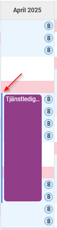
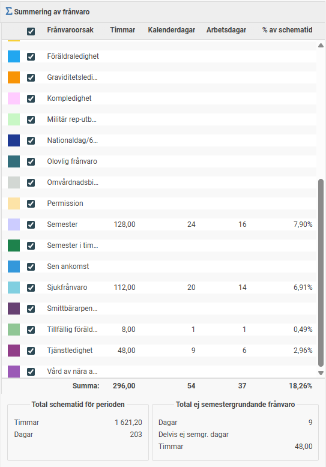

# Var kan jag se en medarbetares frånvaro som beräknats i HRM Payroll?

**Datum:** den 7 oktober 2025  
**Kategori:** Payroll  
**Underkategori:** Semesterhantering  
**Typ:** other  
**Svårighetsgrad:** intermediate  
**Tags:** lön, löneart, semester  
**Bilder:** 4  
**URL:** https://knowledge.flexhrm.com/var-kan-jag-se-en-medarbetares-fr%C3%A5nvaro-som-ber%C3%A4knats-i-hrm-payroll

---

Du kan få en tydlig översikt över en medarbetares frånvaro, både semestergrundande och icke semestergrundande, i kalendariet. All frånvaro som registreras via en löneart kopplad till en frånvaroorsak visas här.
Hitta till kalendariet
Du hittar vyn i menyn under
Lön > Kalendarium
.
I den här vyn kan du välja vilken medarbetare och vilken period du vill titta på, till exempel en specifik semesterintjänandeperiod. Systemet visar då alla registrerade frånvaroorsaker för den medarbetaren under den valda tiden. Du kan även välja om du vill visa medarbetarens schematid eller ej genom att bocka i/bocka ur den.

Detaljerad information per dag
Om du håller muspekaren över en frånvarorad i kalendariet ser du mer detaljerad information för den specifika dagen, såsom omfattning, frånvarotid och om frånvaron är semestergrundande eller ej.
Den lilla blå bollen visar medarbetarens schematid för dagen.

Ej semestergrundande frånvaro
De frånvaroposter som har ett blått streck bredvid sig har systemet beräknat som ej semestergrundande.

Summering av perioden
Längst till höger finns en summeringsvy som visar en sammanställning för hela den valda perioden. Den är uppdelad per frånvaroorsak och visar:
Timmar
Kalenderdagar
Arbetsdagar
Procent av schematiden
Längst ner i summeringsvyn ser du även en total sammanställning av schematid och ej semestergrundande frånvaro i både timmar och dagar.

