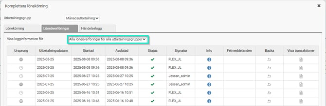
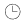
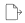
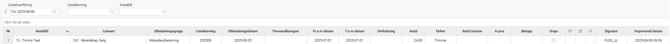

# Var kan jag se vilka poster som var med i överföringen till lönekörningen från HRM Time, HRM Travel eller en importerad fil?

**Datum:** den 7 oktober 2025  
**Kategori:** Payroll  
**Underkategori:** Löneberedning  
**Typ:** other  
**Svårighetsgrad:** intermediate  
**Tags:** hrm-time, lön  
**Bilder:** 5  
**URL:** https://knowledge.flexhrm.com/var-kan-jag-se-vilka-poster-som-var-med-i-%C3%B6verf%C3%B6ringen-till-l%C3%B6nek%C3%B6rningen-fr%C3%A5n-hrm-time-eller-hrm-travel-eller-en-importerad-fil

---

I denna artikel beskriver vi hur du kan se vilka poster som varit med i överföringen till lönekörningen från  Time, Travel eller en importerad fil.
Funktionen hittar du under
Lön > Löneberedning
.
Klicka på
+Lönekörningar > Komplettera
och välj sedan fliken
Löneöverföringar
.
Ett fönster visas där du kan göra urval på aktuell lönekörning eller andra lönekörningar för att vilka transaktioner som lästs in från HRM Time, HRM Travel eller importerade filer.
Du väljer om du vill visa logginformation för alla lönekörningar eller endast aktuell lönekörning.
Aktuell lönekörning
- visar endast information om de transaktioner som är inhämtade till någon anställd i vald lönekörning.
Alla lönekörningar för aktuell utbetalningsgrupp
- visar information för samtliga lönekörningar för utbetalningsgruppen.
Alla löneöverföringar för alla utbetalningsgrupper
- visar information för samtliga löneöverföringar inklusive överföringar som ej genererat några transaktioner i en lönekörning.

Listan visar vilket system transaktionerna har hämtats in från i fältet Ursprung, datum och tidpunkt för överföringen, ansvarig användare samt status för bearbetningen. Klicka på den blå informationssymbolen för att visa ytterligare detaljer, här kan du t.ex. ladda ner den fil som lästs in vid filimport.

Klocka för HRM Time

Jordglob för HRM Travel

Dokument för inläst fil
För att se transaktionerna klickar du på dokumentikonen i kolumnen
Visa transaktioner
för önskad rad. Detta öppnar ett nytt fönster där du ser transaktionerna i listform.
Du når samma vy via
Bearbetningar > Servicerutiner > Inlästa originaltransaktioner till lönekörningar
och kan där göra urval på vilken överföring du önskar se i fältet
Löneöverföringar
.

Relaterade artiklar:
Det visas en varning att det finns transaktioner som inte hämtats in i lönekörningen, hur hittar jag och hanterar dessa?
