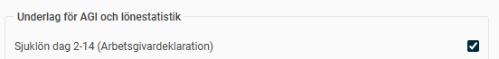

# Varför får jag en varning i arbetsgivaruppgifterna på individnivå (AGI) att det finns ett negativt belopp på fält 499?

**Datum:** den 21 oktober 2025  
**Kategori:** Payroll  
**Underkategori:** Skatt & AGI  
**Typ:** other  
**Svårighetsgrad:** intermediate  
**Tags:** agi, lön, löneart, skatt  
**Bilder:** 1  
**URL:** https://knowledge.flexhrm.com/varf%C3%B6r-f%C3%A5r-jag-en-varning-i-arbetsgivaruppgifterna-p%C3%A5-individniv%C3%A5-agi-att-det-finns-ett-negativt-belopp-p%C3%A5-f%C3%A4lt-499

---

Få svar på varningen om minusbelopp i fält 499 i AGI och undvik fel vid rapportering av sjuklönekostnader till Skatteverket.
Varning för negativt belopp i fält 499 i AGI-underlaget
Om du får en varning om ett negativt belopp i fält 499 i underlaget för arbetsgivardeklaration på individnivå (AGI), beror det på att den totala sjuklönekostnaden för perioden är negativ. Denna summa får inte vara negativ när den rapporteras till Skatteverket.
Vad innebär fält 499?
Fält 499 summerar företagets
totala
kostnad för sjuklön, inklusive sociala avgifter. Uppgiften rapporteras som en totalsumma till Skatteverket varje månad och visas därför inte i detaljvyn för AGIn för varje enskild anställd eller för varje anställd i filen.
Eftersom den totala sjuklönekostnaden inte får vara negativ när du lämnar in den till Skatteverket, får du en varning i Flex HRM om fält 499 visar ett minusbelopp.
Orsaker till ett negativt belopp
Ett negativt belopp i fält 499 kan ha två vanliga orsaker:
Felaktiga inställningar på lönearter.
Det kan handla om att lönearter för
karensavdrag
och
sjuklön för dag 1-14
inte är korrekt inställda för att redovisas som en sjuklönekostnad i AGI-underlaget. De är de enda lönearterna som ska ha inställningen. Om andra lönearter har den bocken bör du ta bort den från dem.

En korrigering av sjuklön.
Du kan ha gjort en korrigering av en sjuklön som gäller för en tidigare månad.
Observera!
Så länge den
totala sjuklönekostnaden
ligger i
plus
kan du skicka in filen till skatteverket, även om en anställd får en röd boll i AGIn med denna varning
Relaterade artiklar:
Hur arbetar jag med arbetsgivardeklaration på individnivå i Flex HRM Payroll?
Hur gör jag en rättelse av ett fel i tidigare arbetsgivardeklarationer (AGI) i HRM Payroll?
