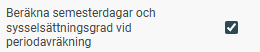
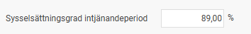
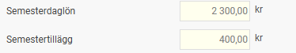

# Varför räknas engångsskatten om vid lönekörningens avräkning?

**Datum:** den 7 oktober 2025  
**Kategori:** Payroll  
**Underkategori:** Semesterhantering  
**Typ:** other  
**Svårighetsgrad:** advanced  
**Tags:** lön, semester, skatt  
**Bilder:** 3  
**URL:** https://knowledge.flexhrm.com/varf%C3%B6r-r%C3%A4knas-eng%C3%A5ngsskatten-om-vid-l%C3%B6nek%C3%B6rningens-avr%C3%A4kning

---

En omräkning av engångsskatten kan ske om en anställds beräknade årsinkomst ändras i samband med att du avräknar en lönekörning. Detta beror oftast på en automatisk omräkning av den anställdas semestervillkor.
Orsaken steg för steg
Händelseförloppet som kan leda till en justerad engångsskatt ser ut så här:
Automatisk semesterberäkning
Om du använder inställningen för att
automatiskt beräkna om semester vid avräkning av lön
(för anställda med sammanfallande semesterintjänandeår), görs en ny beräkning av både antalet semesterdagar och den genomsnittliga sysselsättningsgraden för intjänandeåret. Denna inställning görs under Inställningar > Lön > Lönekörningar.

Värdet på semestern ändras
Den nya beräkningen av sysselsättningsgraden under intjänandeåret kan i sin tur påverka värdet på semesterlön och semestertillägg för uttagen semester i den aktuella lönekörningen. Du hittar dessa uppgifter under fliken Semester i anställningsregistret.

Beräknad årsinkomst justeras
När värdet på semesterersättningen ändras, justeras även den anställdas beräknade totala årsinkomst. Ibland kan denna justering leda till att årsinkomsten passerar en brytpunkt för engångsskatt, vilket innebär att en högre skattesats ska användas.
Engångsskatten räknas om
För att säkerställa att rätt skatt dras och för att undvika restskatt för den anställda, räknar systemet automatiskt om engångsskatten baserat på den nya, uppdaterade årsinkomsten.
