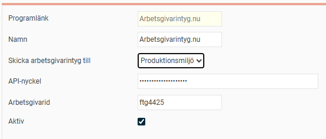
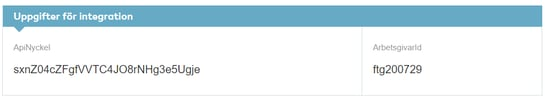
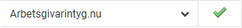
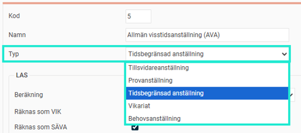
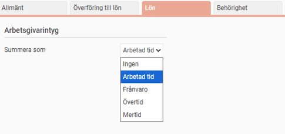
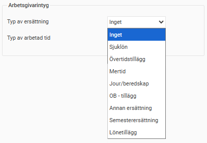
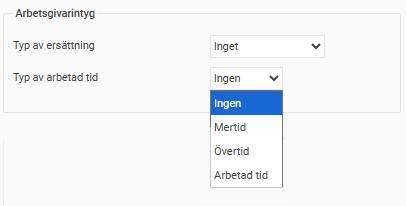
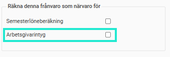
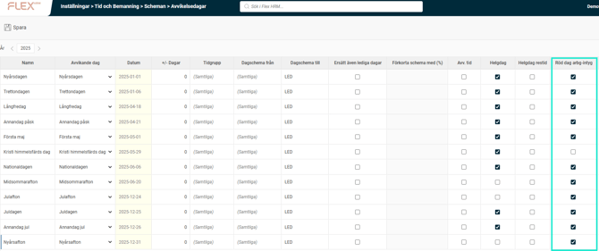

# ⚙️Vilka inställningar behöver jag för att kunna skicka arbetsgivarintyg till Arbetsgivarintyg.nu?

**Datum:** den 2 oktober 2025  
**Kategori:** Payroll  
**Underkategori:** Inställningar  
**Typ:** config  
**Svårighetsgrad:** advanced  
**Tags:** lön, löneart, semester  
**Bilder:** 10  
**URL:** https://knowledge.flexhrm.com/vilka-inst%C3%A4llningar-beh%C3%B6ver-jag-f%C3%B6r-att-kunna-skicka-arbetsgivarintyg-till-arbetsgivarintyg.nu

---

För att skicka korrekta arbetsgivarintyg måste systemet först länkas till tjänsten och därefter måste alla koder för lön, tid och frånvaro mappas korrekt.
Programlänk till Arbetsgivarintyg.nu
Integration
Anställningsformer
Avgångsorsaker
Tidkoder
Löneartsinställningar
Frånvaroorsaker
Avvikelsedagar – röda dagar
Programlänk till Arbetsgivarintyg.nu
Det första som behöver göras är att skapa en programlänk som kopplar företaget i Flex HRM till rätt företag i arbetsgivarintyg.nu. Detta gör du genom att skapa en ny programlänk via
Administration > Inställningar > Import/export > Programlänkar
.

Under valet
Skicka arbetsgivarintyg
till kan du välja om du vill skicka till Testmiljö eller Produktionsmiljö som Arbetsgivarintyg.nu tillhandahåller.
Du behöver också ange API-nyckel samt Arbetsgivarid för att koppla till rätt företag på Arbetsgivarintyg.nu. Du hittar dessa uppgifter under företagsuppgifterna när du är inloggad på Arbetsgivarintyg.nu.

Integration
Du behöver se till att det finns en aktiv integration till Arbetsgivarintyg.nu. Detta gör du via
Administration > Systemregister > Integrationer
.

Anställningsformer
För att arbetsgivarintyg ska kunna sammanställas på ett korrekt sätt måste anställningsformerna vara korrekt typade. Detta gör du under
Administration > Inställningar > Personal > Anställningsformer
.

Har den anställde haft flera anställningsperioder som ligger i direkt följd och har samma typ av anställningsform kommer de slås ihop i arbetsgivarintyget. Provanställning och tillsvidareanställning räknas som samma anställningsform.
Avgångsorsaker
För att uppgifter om anledning till att en anställning har upphört ska kunna tas fram korrekt behöver man lägga in slutdatum och avgångsorsak på anställningsperioden. Avgångsorsaken måste också vara markerad med vilken avgångsorsak denna ska redovisas som i arbetsgivarintyget. Detta gör du via
Administration > Inställningar >Personal > Avgångsorsaker
.

Tidkoder
Om du använder Flex HRM Time och väljer att hämta information om arbetad tid och frånvaro från tidrapporterna måste du ange vilka tidkoder som avser arbetad tid, frånvaro, övertid samt mertid. Detta gör du under
Administration > Inställningar > Tid och bemanning > Tidkoder > fliken Lön
.

Obs!
Tänk på att betald ledighet, såsom semester och permission, ska räknas som arbetad tid.
Observera även att deltidsfrånvaro räknas som frånvaro eller arbetad tid enligt inställning på frånvaroorsaken.
Löneartsinställningar

I arbetsgivarintyget ska man redovisa vissa ersättningar och lönetillägg utöver fast lön. För att göra detta anger du per löneart vilken typ av ersättning denna ska räknas som. Inställningen hittar du på fliken
Lön
i löneartsregistret.
För respektive typ av ersättning gäller följande:
Sjuklön
För sjuklön redovisas antal timmar samt belopp. Tänk på att både lönearten för sjuklön samt karensavdrag ska markeras som sjuklön.
Övertidstillägg
Endast belopp redovisas.
Mertid
Endast belopp redovisas.
Jour/beredskap
Både antal timmar och belopp redovisas.
OB – tillägg
Endast belopp redovisas.
Annan ersättning
Om lönearten har enheten Arbetsdagar eller Kalenderdagar redovisas antal dagar. Om lönearten har enheten Timmar redovisas antal timmar. Belopp redovisas alltid. Löneartens namn redovisas i fältet fritext som ska beskriva typen av ersättning.
Semesterersättning
Endast belopp redovisas.
Lönetillägg
Endast belopp redovisas.
När ersättningar summeras från lönetransaktioner kommer de räknas tillhöra den månad som transaktionens datum gäller. Anger man inget datum på transaktionen räknas den tillhöra lönekörningens avvikelseperiod.
Om du väljer att arbetad tid ska hämtas från schema eller från lönetransaktioner behöver du också ange vilka lönearter som ska räknas som Övertid och Mertid. Hämtar du arbetad tid från lönetransaktioner måste du också ange vilka lönearter som ska räknas som Arbetad tid. Observera att frånvaro som ska räknas som arbetad tid inte ska markeras som arbetad tid på lönearten. Denna tid hämtas via frånvaroorsakens inställning från kalendariet.

När arbetad tid, övertid och mertid summeras från lönetransaktioner kommer de räknas tillhöra den månad som transaktionens datum gäller. Anger man inget datum på transaktionen räknas den tillhöra lönekörningens avvikelseperiod.
Frånvaroorsaker
Vid beräkning av ersättning för a-kassan räknas frånvaro med bibehållen lön, såsom semester och permission, som arbetad tid. För att rapporteringen ska bli korrekt när arbetad tid hämtas från schema, från lönetransaktioner eller från tidrapporten (gäller deltidsfrånvaro) måste man ange vilka frånvaroorsaker som ska räknas som närvaro. Detta gör du på fliken
Lön
via
Administration > Inställningar > Tid och bemanning > Frånvaroorsaker.
.

Avvikelsedagar – röda dagar
För den som har en fastställd arbetstid och har månadslön räknas arbetsfria ”röda dagar” och ”klämdagar” som arbete, om löneavdrag inte görs för ledigheten. För att hantera detta behöver man ange vilka avvikelsedagar som ska räknas som ”röda dagar” i arbetsgivarintyget under
Avvikelsedagar
som du hittar under
Administration > Inställningar > Tid och bemanning > Scheman > Avvikelsedagar
.

Om du har olika grupper av personal och inte alla omfattas av reglerna för röda dagar behöver du ange per tidgrupp vilka som ska räknas som röda dagar genom att lägga upp flera rader med olika inställningar.
En dag som är markerad som röd dag kommer räknas som arbetad tid motsvarande hur schemat skulle se ut om det inte hade varit en avvikelsedag.
Exempel 1: Långfredag
Skulle man ha jobbat 8 timmar enligt ordinarie schema, men är ledig kommer det räknas som 8 timmars arbetad tid.
Exempel 2: Skärtorsdag
Om man skulle ha jobbat 8 timmar enligt ordinarie schema, men istället arbetar 6 timmar räknas fyllnadstiden upp till ordinarie tid (2 timmar) som arbetad tid enligt reglerna för röda dagar. De 6 timmar som man fortfarande ska jobba enligt schema räknas som arbetad tid eller frånvaro, beroende på om man faktiskt arbetat eller varit frånvarnade denna dag enligt de vanliga reglerna.
Relaterade artiklar:
Hur skapar jag ett arbetsgivarintyg i Flex HRM Payroll?
