# ⚙️Vilka inställningar krävs för att jag ska kunna rapportera statistik för Lönestrukturstatistik för privat sektor (SLP) i Flex HRM Payroll?

**Datum:** den 2 oktober 2025  
**Kategori:** Payroll  
**Underkategori:** Inställningar  
**Typ:** config  
**Svårighetsgrad:** intermediate  
**Tags:** agi, lön, löneart  
**Bilder:** 12  
**URL:** https://knowledge.flexhrm.com/vilka-inst%C3%A4llningar-kr%C3%A4vs-f%C3%B6r-att-jag-ska-kunna-rapportera-statistik-f%C3%B6r-l%C3%B6nestrukturstatistik-f%C3%B6r-privat-sektor-slp-i-flex-hrm-payroll

---

För korrekt lönestatistik till SCB, SN eller Sobona krävs inställningar på företags-, individ- och löneartsnivå för att specificera uppgifter.
Inställningar på företagsnivå
Uppgifter på individnivå
Lönetillägg
Speciell hantering för länsmuseer
Löneartsinställningar
Inställningar på företagsnivå
Det första du behöver göra är att välja om redovisning ska göras till SCB, Svenskt Näringsliv (SN) eller Sobona. Detta gör du under
Administration > Inställningar > Lön > Lönestatistik
.
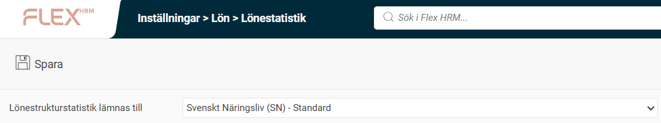
Om du lämnar in statistiken via en arbetsgivarorganisation finns det ofta lite olika avvikelser jämfört med den lagstadgade insamlingen till SCB. Vi har i Flex HRM Payroll stöd för 12 av 13 varianter till Svenskt Näringsliv (SN) samt Sobona enligt listan nedan. Vi har ännu inte stöd för byggbranschen (MO28) till Svenskt Näringsliv.
Statistiska Centralbyrån (SCB)
Svenskt Näringsliv (SN) – Standard
Svenskt Näringsliv (SN) – FAO (MO 48)
Svenskt Näringsliv (SN) – Installatörsföretagen (MO 25)
Svenskt Näringsliv (SN) – Biltrafikens arbetsgivarförbund (MO 31)
Svenskt Näringsliv (SN) – Grafiska Företagens Förbund (MO 38)
Svenskt Näringsliv (SN) – Plåtslageriernas Riksförbund (MO 42)
Svenskt Näringsliv (SN) – Industriarbetsgivarna - sågverksindustrier (MO 56 001)
Svenskt Näringsliv (SN) – Industriarbetsgivarna - massa och pappersindustrier (MO 56 002)
Svenskt Näringsliv (SN) – Industriarbetsgivarna - gruvindustri (MO 56 003)
Svenskt Näringsliv (SN) – Industriarbetsgivarna - svets mekaniska avtalet (MO 56 004)
Svenskt Näringsliv (SN) – Industriarbetsgivarna - stål och metall (MO 56 005006)
Svenskt Näringsliv (SN) – Kompetensföretagen (MO 87)
Sobona (tidigare KFS)
Beroende på om redovisning ska göras till SCB, SN eller Sobona visas ett antal ytterligare fält; "Arbetsställe (CFAR-nummer)" och "Finns avtal om separat helglön".
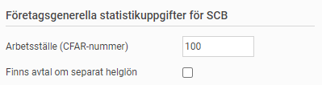
Företagsgenerella uppgifter för SCB:
Arbetsställe (CFAR-nummer)
Här kan du ange ett arbetsställenummer som gäller som standard för alla anställda om man inte lägger in något i anställdaregistret.
Finns avtal om separat helglön
Kryssa i om man till SCB ska redovisa att man har avtal för separat helglön för anställda med timlön.
För Svenskt Näringsliv anger du Medlemsnummer, Förbundsnummer, Avtalskod och Arbetsplatsnummer. I anställdaregistret kan du sedan ange avvikande Förbundnummer, Avtalskod och Arbetsplatsnummer. Arbetsplatsnummer är Svenskt Näringslivs motsvarighet till SCB:s Arbetsställenummer (CFAR). Vid rapportering till SN måsta båda anges.
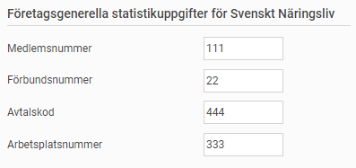
För redovisning till Sobona anger du det medlemsnummer du fått från dem.
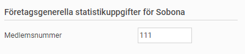
Uppgifter på individnivå
I anställdaregistret, under fliken
Lönestatistik
, lägger du in de uppgifter om den anställde som ska redovisas. Beroende på om du redovisar uppgifterna till SCB eller SN visas olika många fält.
Uppgifter om Personalkategori, Arbetstidsart och Arbetsställe (CFAR-nummer) ska alltid lämnas. För redovisning till SN tillkommer uppgifter om Jobbstatus, Förbundsnummer, Avtalskod och Arbetsplatsnummer.
Arbetsställe (CFAR-nummer), Förbundsnummer, Avtalskod och Arbetsplatsnummer behöver man bara lägga in om den anställde har en avvikande uppgift mot vad som lagts på företagsnivå (se föregående avsnitt). Företagets standarduppgift visas som grå kursiv text om man inte angivit något värde manuellt. På så sätt behöver man inte lägga in dessa uppgifter på samtliga anställda.
När det gäller yrkeskoden är det olika uppgifter som ska rapporteras till SCB respektive SN. Vid rapportering till SCB är det yrkeskoder enligt SSYK 2012 som ska läggas in. Vid redovisning till SN är det istället motsvarigheten NYK14 som ska användas.
SCB och Svenskt Näringsliv har också olika uppmärkning av arbetsställen/arbetsplatser. Därför finns det ett fält för SCB, Arbetsställe (CFAR-nummer), och ett fält för SN, Arbetsplatsnummer. Vid rapportering till SN måste båda uppgifterna anges.
Exempel på redovisning till SCB:
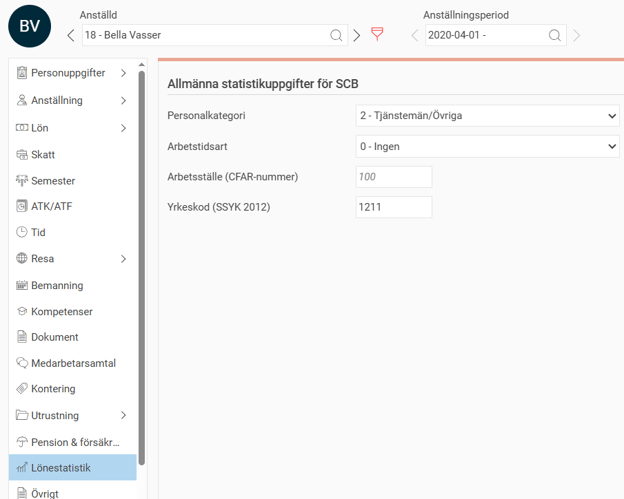
Exempel på redovisning till SN (standard):
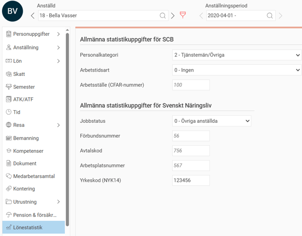
En 6-siffrig yrkeskod specifik för Sobona ska redovisas för varje anställd i anställdaregistret, utöver den vanliga SSYK-koden till SCB. För vissa yrkeskoder ska man också ange en ansvarskod.
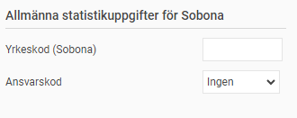
Exempel på redovisning till Sobona:
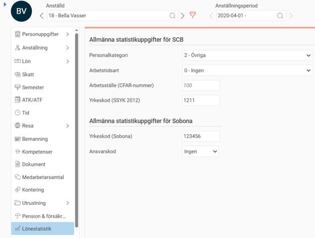
Löneti
llägg
För att kunna redovisa överenskommen fast månadslön, inklusive fasta tillägg, behöver vi veta vilka fasta lönetillägg som används i företaget. För att göra detta använder vi Egna fält som definieras under
Administration > Inställningar > Personal > Anställdaregistret - egna fält
.
För alla fält som ska räknas som ett lönetillägg kryssar du i inställningen "
Fältet är ett lönetillägg
". Om du har flera fält för lönetillägg sätter du krysset på samtliga fält.
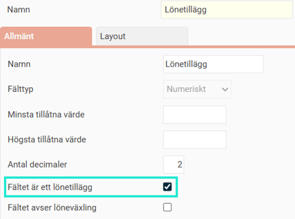
Speciell hantering för länsmuseer
För länsmuseer finns en speciell hantering för löneform för anställda med lönebidrag. För dessa ska man ange löneform 4 och 5 istället för 1 och 3 (månadslön/timlön). För att hantera detta finns en kryssruta på anställningsformen för att tala om att det är lönebidrag för länsmuseum. Du kommer åt inställningen via
Administration > Personal > Anställningsformer
.
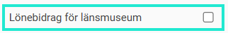
Löneartsinställningar
För att kunna skilja ut olika ersättningar och arbetad tid behöver man ange för olika lönearter hur de ska redovisas i lönestrukturstatistiken. Detta styrs med hjälp av en rad kryssrutor som du hittar på fliken
Lön
i löneartsregistret under rubriken
Underlag för AGI och lönestatistik
. Samtliga inställningar gäller både vid redovisning till SCB, SN och Sobona.
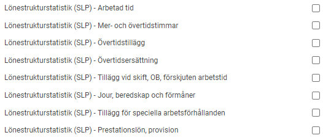
Följande gäller för respektive kryssruta:
Arbetad tid
Används för summering av antal arbetade timmar (styrkod 001).
Mer- och övertidstimmar
Används för summering av antal mer- och övertidstimmar (styrkod 002).
Övertidstillägg
Används för redovisning av övertidstillägg (styrkod 052).
Övertidsersättning
Används för redovisning av övertidsersättning. Ska användas då lönearten innehåller både grundlön och övertidstillägg (styrkod 053).
Tillägg vid skift, OB, förskjuten arbetstid
Används för summering av tillägg vid skift, OB, och förskjuten arbetstid (styrkod 054).
Jour, beredskap och förmåner
Används för summering av jour, beredskap, och förmåner (styrkod 055). Lönearter med denna kryssruta av typen förmåner särredovisas sedan i ett separat fält (styrkod 057).
Tillägg för speciella arbetsförhållanden
Används för summering av tillägg för t.ex. risk, smuts, värme, kyla (styrkod 056).
Prestationslön, provision
Används för summering av utbetald prestationslön och provision (styrkod 058).
För vissa medlemsorganisationer inom SN finns det ytterligare information som ska redovisas vilket kräver ytterligare kryssrutor för att identifiera de olika ersättningarna.
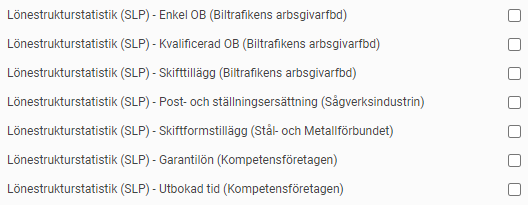
Läs mer om de branschspecifika avvikelserna under rubriken
Avvikelser och tillägg
i rapporten
Hur beräknas underlaget för lönestrukturstatistik för privat sektor (SLP)?
Relaterade artiklar
Lönestrukturstatistik för privat sektor (SLP) -Hur tar jag fram statistik för SLP i H
RM Payroll?
Hur beräknas underlaget för lönestrukturstatistik för 
privat sektor (SLP)?
