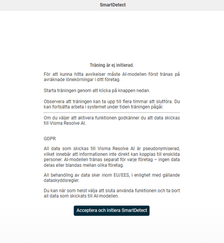
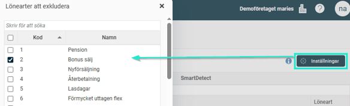

# ⚙️Vilka inställningar krävs för att man ska kunna använda SmartDetect i Flex HRM Payroll?

**Datum:** den 2 oktober 2025  
**Kategori:** Payroll  
**Underkategori:** Löneberedning  
**Typ:** config  
**Svårighetsgrad:** intermediate  
**Tags:** lön, löneart  
**Bilder:** 2  
**URL:** https://knowledge.flexhrm.com/vilka-inst%C3%A4llningar-kr%C3%A4vs-f%C3%B6r-att-man-ska-kunna-anv%C3%A4nda-smartdetect

---

SmartDetects AI är automatisk men måste initieras en gång. Den tränar sen på er lönehistorik för att hitta relevanta avvikelser. I listan med avvikelser kan du själv bestämma vilka lönearter som ska ska visas.
Licenshantering – Alltid aktiv för dig
För att göra det så enkelt som möjligt för dig är licenshanteringen för SmartDetect helt automatisk.
Om ditt företag har en licens för SmartDetect är funktionen
automatiskt aktiv för alla bolag
i er databas som använder Flex HRM Payroll.
Du behöver inte slå på eller av funktionen för enskilda bolag. Den finns där för att hjälpa dig direkt, utan extra administration.
Starta träningen för SmartDetect
Första gången du använder SmartDetect går du via knappen
Avvikelser
längst upp i löneberedningen och då kommer du att få ett meddelande om att träning är ej initierad. Du behöver klicka på knappen
Acceptera och initiera SmartDetect
(detta görs bara en gång per företag). Efter det att träningen är klar är SmartDetect klar att användas i företaget och den kommer att fortsätta att träna sig själv med hjälp av ert företags framtida lönekörningar.

AI-motorns träning – Grunden för träffsäkra varningar
Den smartaste delen av SmartDetect är dess självlärande AI-motor. För att den ska kunna identifiera vad som är en "normal" lönekörning för just ert företag behöver den tränas på er unika lönehistorik.
Historik som "facit":
AI-motorn analyserar era tidigare, attesterade lönekörningar för att förstå era mönster.
O
ptima
l datamängd:
För bästa möjliga resultat rekommenderas cirka 12 månaders lönehistorik. Med denna datamängd har AI:n ett robust underlag för att kunna ge träffsäkra varningar.
Blir smartare över tid:
Har ni mindre historik än 12 månader fungerar funktionen ändå, men den blir mer exakt för varje ny lönekörning som genomförs. AI:n lär sig kontinuerligt och anpassar sig efter er utveckling.
Denna träningsprocess är helt automatisk och inget du behöver hantera manuellt, men den är viktig att känna till för att förstå kvaliteten på de avvikelser som systemet presenterar.
Exkludera lönearter från granskning
Ibland kan det finnas specifika lönearter som naturligt har stora variationer från månad till månad, till exempel en provisions- eller bonuslöneart. För att undvika onödiga varningar och göra avvikelselistan mer relevant kan du välja att exkludera vissa lönearter från SmartDetects AI-analys.
Denna inställning görs via knappen
Inställningar
, som du hittar ovanför avvikelselistan, och den hjälper dig att finjustera systemet så att det fokuserar på de avvikelser som är viktigast för dig.

Relaterade artiklar:
Hur använder man SmartDetect i Flex HRM Payroll?
Vad kan SmartDetect varna för i Flex HRM Payroll?
