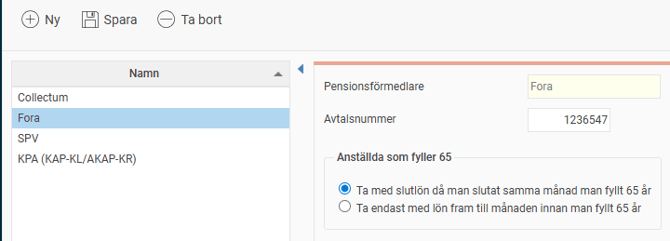
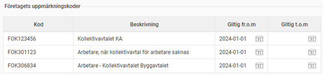
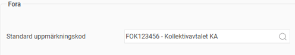
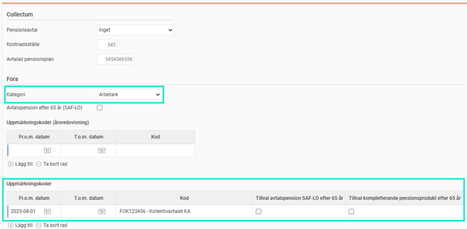
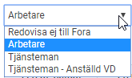
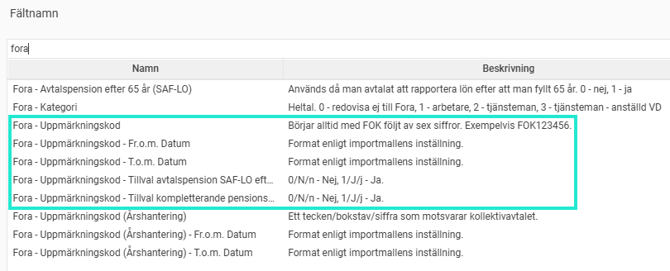
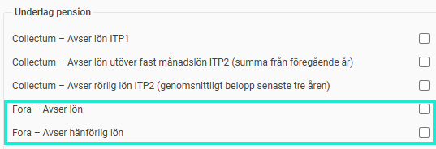

# ⚙️Vilka inställningar krävs för att rapportera månadsvis till Fora i HRM Payroll?

**Datum:** den 2 oktober 2025  
**Kategori:** Payroll  
**Underkategori:** Inställningar  
**Typ:** config  
**Svårighetsgrad:** intermediate  
**Tags:** lön, löneart, pension  
**Bilder:** 7  
**URL:** https://knowledge.flexhrm.com/vilka-inst%C3%A4llningar-kr%C3%A4vs-f%C3%B6r-att-rapportera-m%C3%A5nadsvis-till-fora-i-hrm-payroll

---

Artikeln beskriver de inställningar i HRM Payroll som krävs för att kunna rapportera pensionsunderlag till Fora varje månad.
Uppmärkningskod per personalkategori
Uppgifter på individnivå
Importera uppmärkningskoder till anställdaregistret
Löneartsinställningar
Grundinställningar och register för uppmärkningskoder
Första steget är att aktivera inställningarna för rapportering till Fora i aktuellt företag under
Administration > Inställningar > Lön > Pension och försäkring.
I listan till vänster ser du företagets aktiva rapporteringar till de olika pensionsförmedlarna. Om inte Fora finns i listan klickar du på knappen
Ny
och fyller i uppgifterna i formuläret för att aktivera rapportering till Fora.

Uppgifterna om avtalsnummer, anställda som fyller 65 samt ackumulator för ingående värde används bara till den gamla
årsredovisningen
och påverkar
inte
månadsredovisningen.
I listan med Företagets uppmärkningskoder lägger du in den eller de koder som du fått från Fora. Om ditt företag bara har en kod lägger du in den. Det är koderna i denna lista som du sedan kan använda för uppmärkning av anställda i lönesystemet.

Uppmärkningskod per personalkategori
För att slippa lägga in en uppmärkningskod på samtliga anställda kan du lägga in en uppmärkningskod per personalkategori. Om du inte lagt in en
uppmärkningskod direkt på den anställde kommer koden från personalkategorin att
användas istället.
Detta gör du under
Administration > Inställningar > Lön > Personalkategorier.

Uppgifter på individnivå
I anställdaregistret, under fliken
Pension & försäkring
, anger du de villkor som gäller för den anställde vid rapportering till Fora.

Följande uppgifter behövs för månadsrapportering till Fora:
Kategori
Här anger du om den anställde ska redovisas som
Arbetare
eller
Tjänsteman
enligt Foras instruktioner. Anställda som omfattas av Avtalspension SAF-LO räknas som arbetare. För anställd VD som ska rapporteras som tjänsteman väljer du
Tjänsteman – Anställd VD
.

Uppmärkningskoder och tillval
I listan för uppmärkningskoder anger du för alla arbetare vilken uppmärkningskod som gäller för vilken datumperiod. De uppmärkningskoder du lägger in här kommer gälla i första hand före uppmärkningskoden på personalkategorin.
I listan för uppmärkningskoder finns också två kryssrutor där du kan ange tillval för den anställde.
Tillval avtalspension SAF-LO efter 65 år
Kryssa i om den anställde ska tjäna in avtalspension efter 65 år.
Tillval kompletterande pensionsprodukt efter 65 år
Kryssa i om den anställde ska tjäna in deltidspension /extra pensionsavsättning efter 65 år.
OBS!
Läs gärna på
Foras hemsida
för mer information om dessa tillval.
I
mportera uppmärkningskoder till anställdaregistret
Vår rekommendation är att, om möjligt, använda uppmärkningskoder via personalkategorier för att slippa lägga in uppmärkningskoder på varje anställd för sig i anställdaregistret. Men ibland passar inte personalkategorin som uppdelning, och då finns möjligheten att importera uppmärkning per anställd via fil.
För att importera uppgifterna om uppmärkning via fil använder du importmallen för Anställda/användare. Här finns samtliga fält för uppmärkning som beskrivs i
föregående avsnitt
.

När du skapar din importfil och importmall behöver du tänka på följande saker:
Se till att
registret med företagets uppmärkningskode
r är upplagt. Detta krävs för att kunna importera uppmärkning på anställda.
Importmallen måste som
minst
innehålla fälten för
uppmärkningskod
samt
uppmärkningskodens fr.o.m.-datum
och
t.o.m.-datum
för att du ska kunna importera
uppmärkning på de anställda. Detta gäller även om du bara vill importera tillvalsbockarna. Om du inte vill importera ett slutdatum för uppmärkningen måste du ändå ta med slutdatumet i importmallen, men lämna fältet för slutdatum tomt (blankt) i filen.
Löneartsinställningar
För rapportering av pensionsgrundande lön samt hänförlig lön till Fora behöver underlag hämtas från vissa utvalda lönearter. Detta gör du under fliken
Lön
i löneartsregistret.

Fora – Avser  lön
Anger vilka lönearter som ska vara pensionsgrundande.
Fora – Avser hänförlig lön
Sätt kryss på de lönearter som du vill ska räknas som lön hänförlig till annan månad. Exempel på lönearter som detta kan vara användbart för är prestationslön eller ackordslön.
Observera att lönearter som avser hänförlig lön också ska markeras som avser lön.
Observera att lönetransaktioner måste ha datum som avser hela perioden för de månader lönen ska fördelas på, för att summeras som hänförlig lön.
Du kan läsa mer om hänförlig lön i artikeln
Hur rapporterar jag Pension till Fora månadsvis i HRM Payroll?
och även på
Foras hemsida.
Relaterade artiklar:
Hur rapporterar jag pension till Fora månadsvis i HRM Payroll?
Hur hanteras Foras FOK-koder i Flex HRM Payroll?
