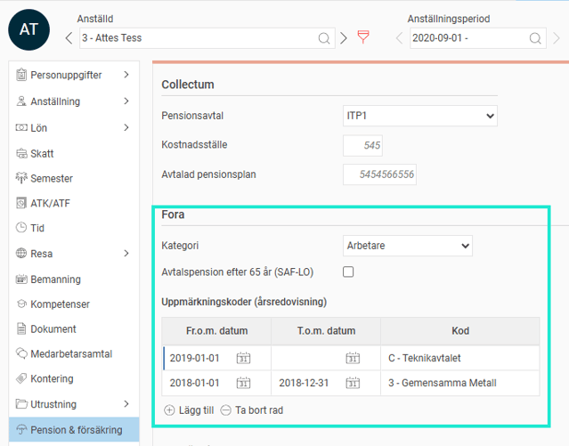
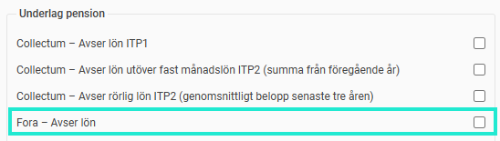

# ⚙️Vilka inställningar krävs för göra årsvis rapportering till Fora i Flex HRM Payroll?

**Datum:** den 7 oktober 2025  
**Kategori:** Payroll  
**Underkategori:** Löneberedning  
**Typ:** config  
**Svårighetsgrad:** intermediate  
**Tags:** lön, löneart, pension  
**Bilder:** 4  
**URL:** https://knowledge.flexhrm.com/vilka-inst%C3%A4llningar-kr%C3%A4vs-f%C3%B6r-g%C3%B6ra-%C3%A5rsvis-rapportering-till-fora-i-flex-hrm-payroll

---

Denna artikel beskriver de inställningar du behöver för att kunna göra årsvis rapporteringar till Fora.
Grundinställningar
Uppgifter på individnivå
Löneartsinställningar
Grundinställningar
Första steget är att aktivera inställningarna för rapportering till Fora i aktuellt företag under
Administration > Inställningar > Lön >
Pension och försäkring
.
I listan till vänster ser du företagets aktiva rapporteringar till de olika pensionsförmedlarna. Om inte Fora finns i listan klickar du på knappen
Ny
och fyller i uppgifterna i formuläret för att aktivera rapportering till Fora.

Du kan här ange följande uppgifter:
Avtalsnummer
För att kunna göra rapportering via fil till Fora behöver du ange det avtalsnummer hos Fora som gäller för ert företag. Avtalsnumret är unikt för varje företag.
Anställda som fyller 65 år
För anställda som går i pension samma månad man fyller 65 år är grundregeln att endast lön fram till månaden innan man fyllt 65 år ska redovisas som pensionsunderlag till Fora. Detta innebär dock att den anställde går miste om pension på lön som betalas ut samma månad samt månaden efter att man slutat. Därför kan man här välja att även slutlön ska tas med då man slutat samma månad som man fyllt 65 år.
Ackumulator för ingående värde
Om man startar upp Flex HRM Payroll under året och inte har historik i form av lönekörningar i systemet måste den pensionsgrundande lönen hämtas in på annat sätt. Då kan man här välja att hämta ingående värde från en angiven ackumulator.
Uppgifter på individnivå
I anställdaregistret, under fliken Pension & försäkring, anger du vilka villkor som gäller för den anställde vid rapportering till Fora.

Du anger här följande uppgifter:
Kategori
Här anger du om den anställde ska redovisas till Fora genom att ange om den anställde ska redovisas som Arbetare eller Tjänsteman enligt Foras instruktioner. För anställd VD som ska rapporteras som tjänsteman väljer du
Tjänsteman > Anställd VD
.

Avtalspension efter 65 år (SAF-LO)
För arbetare som fortsätter att jobba efter 65 år och som ska fortsätta tjäna in avtalspension enligt överenskommelse. Detta innebär att löneunderlag fortsätter redovisas till Fora efter att man fyllt 65 år.
Uppmärkningskod
För anställda som omfattas av ett kollektivavtal där det ingår en kompletterande pensionspremie ska man märka upp dessa med en uppmärkningskod. Du anger här under vilken datumperiod den anställde omfattats av ett givet avtal. I fältet för kod kan du skriva för att söka eller klicka upp listan med alla valbara avtal.
Löneartsinställningar
För rapportering av pensionsgrundande lön för arbetare och tjänstemän till Fora behöver underlag hämtas från vissa utvalda lönearter. Du ange vilka lönearter som ska vara pensionslönegrundande med hjälp av kryssrutan
Fora – Avser lön
under fliken
Lön
i löneartsregistret.

Relaterade artiklar:
Pensionsrapportering (årsvis) till Fora - Hur pensionsrapporterar jag till Fora i Flex HRM Payroll?
