# Vilka uppgifter kommer med i rapporteringen till KPA (KAP-KL/AKAP-KR)?

**Datum:** den 26 september 2025  
**Kategori:** Payroll  
**Underkategori:** Pension  
**Typ:** other  
**Svårighetsgrad:** intermediate  
**Tags:** lön, löneart, pension  
**Bilder:** 13  
**URL:** https://knowledge.flexhrm.com/vilka-uppgifter-kommer-med-i-rapporteringen-till-kpa-kap-kl/akap-kr

---

Denna artikel ger information om vilka sorts uppgifter tas med och hur de beräknas i pensionsrapporteringen till KPA (KAP-KL/AKAP-KR).
Fördjupad information om hur underlaget skapas
Nedan hittar du detaljerad information om hur underlaget skapas i systemet.
Vilka uppgifter kommer med per rapporteringstyp?
I nedan tabell kan du se vilka posttyper samt vilka avtal som kommer med i de olika rapporteringstyperna.
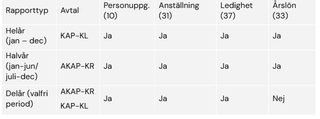
Vilka anställda tas med i underlaget?
En anställd tas med om något av följande villkor uppfylls:
Den anställde har en anställning under perioden 1 januari till rapporteringsperiodens slut, med avtalet KAP-KL eller AKAP-KR samt en anställningsform inställd med KPA anställningskod.
För KAP-KL räknas inte anställningsperioder som påbörjas efter det att man fyllt 69 år.
För timanställda gäller att man också ska ha haft minst en arbetsperiod registrerad.
Pensionsgrundande lön utbetald utanför en anställningsperiod men under redovisningsperioden och man tidigare haft en anställning tillhörande KAP-KL eller AKAP-KR (slutlön). Detta gäller dock inte vid delårsrapportering då lön inte ska redovisas där.
Arbetsperioder för timanställda
För timanställda gäller att man ska rapportera en unik anställningsperiod för varje tillfälle då man är inne och jobbar. Om man arbetar flera dagar i följd räknas det som ett tillfälle. Även dagar då den anställde varit sjuk eller tjänstledig ska räknas in.
Det finns två valbara lösningar för hur arbetsperioder för timanställda ska hämtas. Läs mer om dessa under avsnittet Inställningar – Grundinställningar.
Om du valt att hämta arbetsperioder från HRM Time räknas en dag som arbetsdag om dagen har en tidkod av typen Närvaro eller om det på dagen finns en frånvaro av typen sjukdom eller tjänstledighet. Det blir bryt vid arbetsfri helg.
Om du valt att hämta arbetsperioder via lönearter är det bra att tänka på att även sjukdom och tjänstledighet ska räknas som arbetad tid.
Logik för sammanslagning av parallella anställningsperioder
Anställningsperioder rapporteras med tillhörande lön för respektive period. Finns flera seriella anställningar under året rapporteras de var för sig med respektive lön. Om arbetstagaren har två eller flera aktiva anställningar (parallella anställningar) registrerade i lönesystemet rapporteras de som en anställning och den pensionsgrundande inkomsten slås samman till ett totalt belopp. Om det finns både tillsvidareanställning och timanställning parallellt ska tillsvidareanställningen rapporteras som anställning med lön för båda anställningarna. Se KPA:s instruktion för mer detaljer och exempel på hur sammanslagning ska göras.
Fältbeskrivning
I detta avsnitt beskrivs varifrån uppgifter hämtas för respektive fält i filens olika posttyper.
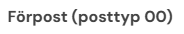
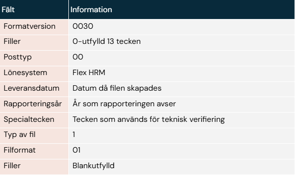
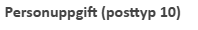
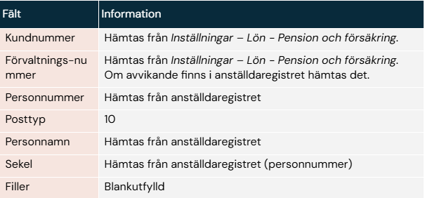
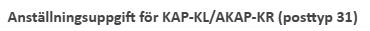

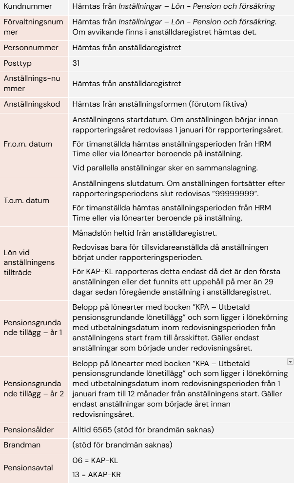
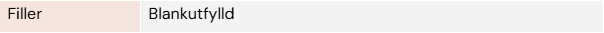
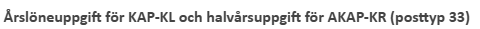
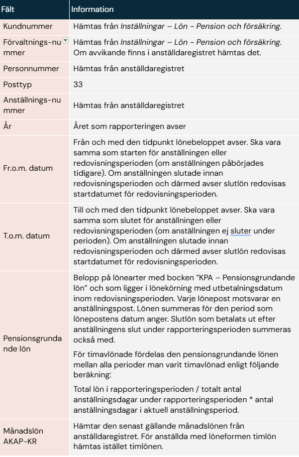
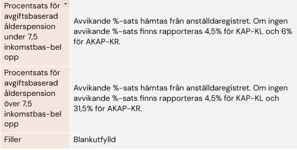
Ledighetsuppgifter för KAP-KL och AKAP-KR (posttyp 37)
Ledighet avser tjänstledighet med omfattning 100%. Uppgifter om ledighet hämtas antingen från HRM Time eller via kalendariet i HRM Payroll, beroende på inställningen under Inställningar – Lön - Pension och försäkring.
Ledigheter från HRM Time
Om man valt att hämta från HRM Time är det granskade frånvaroansökningar av typen tjänstledighet på heltid som hämtas.
Ledigheter från kalendariet i HRM Payroll
Om man valt att hämta från HRM Payroll är det frånvaro av typen tjänstledighet på heltid som hämtas från kalendariet.
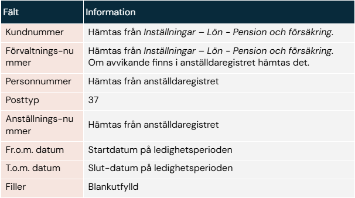
Relaterade artiklar:
Hur gör jag inställningar i HRM Payroll för att kunna rapportera till KPA (KAP-KL/AKAP-KR)?
Hur rapporterar jag pensionsunderlag till KPA (KAP-KL/AKAP-KR) i HRM Payroll?
