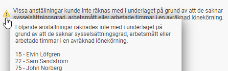

# Vilka uppgifter kommer med i statistiken till Arbetskraftskostnadens nivå och struktur (LCS) och hur beräknas dem?

**Datum:** den 7 oktober 2025  
**Kategori:** Payroll  
**Underkategori:** Löneberedning  
**Typ:** other  
**Svårighetsgrad:** advanced  
**Tags:** lön, löneart  
**Bilder:** 1  
**URL:** https://knowledge.flexhrm.com/vilka-uppgifter-kommer-med-i-statistiken-till-arbetskraftskostnadens-niv%C3%A5-och-struktur-lcs-och-hur-ber%C3%A4knas-dem

---

I denna artikel hittar du detaljerad information om vilka uppgifter tas med i del A och B i statistiken till Arbetskraftskostnadens nivå och struktur (LCS) samt hur de beräknas.
Fördjupad information om hur underlaget skapas
Nedan hittar du detaljerad information om vad som tas med i underlaget för del A och B samt hur det beräknas.
Vilka anställda tas med i underlaget?
För att en anställd ska komma med i underlaget krävs följande:
Den anställde ska ha haft en anställning under redovisningsperioden.
Sysselsättningsgrad och arbetsmått måste finnas inlagda i anställdaregistret.
För anställda som saknar avtalad veckoarbetstid, såsom behovsanställda kan du lägga 0 % sysselsättningsgrad. För dessa anställda måste det i stället finnas en löneart med arbetade timmar (se nedan).
Om nödvändig information saknas på en anställd undantas denne från beräkningen och visas istället i en separat varningslista i vyn enligt nedan.

A – Anställda
Beräkningen av de olika delarna görs för en månad i taget i urvalsperioden. Därefter beräknas ett genomsnitt över hela perioden.
Vi utgår ifrån den anställdes sysselsättningsgrad. Om sysselsättningsgraden är satt till 0 % beräknar vi sysselsättningsgraden varje enskild månad utifrån arbetade timmar och heltidsmåttet enligt följande.
Sysselsättningsgrad= Arbetade timmar1Arbetsmått heltid*(52,292/12)
Antal arbetade timmar summeras per månad från lönearter markerade med kryssrutan Arbetskraftskostnadens nivå och struktur (LCS) – Faktiskt arbetad tid. Summeringen sker per transaktionsdatum. Då datum saknas på transaktionen räknas de tillhöra lönekörningens avvikelseperiod.
Talet 52,29 är genomsnittligt antal veckor på ett år med hänsyn till skottår enligt SCB:s instruktion.
A.1 – Genomsnittligt antal anställda
Summering av A.2 och A.3
A.2 – Genomsnittligt antal heltidsanställda
En anställd räknas som heltidsanställd då man haft en sysselsättningsgrad på 100% under samtliga anställningsdagar i redovisningsperioden. En person som varit anställd på heltid under halva året räknas som 0,5 heltidsanställda.
A.3 – Genomsnittligt antal deltidsanställda
En person som varit anställd hela året och jobbat deltid under någon del av året räknas som 1 deltidsanställd. En person som varit anställd på deltid under halva året räknas som 0,5 deltidsanställda.
A.4 – Antal deltidsanställda omräknade till heltidspersoner
En person som varit anställd på 50 % under hela året räknas som 0,5 heltidspersoner. En person som varit anställd på 50 % under halva året räknas som 0,25 heltidspersoner.
B – Timmar
Uppgifterna under B.1 och B.2 är uppdelade på heltidsanställda och deltidsanställd enligt samma princip som i A-delen enligt ovan.
Även uppgifterna för B-delen beräknas för varje månad för sig och summeras sedan för hela redovisningsperioden.
B.1 – Antal faktiskt arbetade timmar
Antal arbetade timmar summeras från lönearter markerade med kryssrutan Arbetskraftskostnadens nivå och struktur (LCS) – Faktiskt arbetad tid. Summeringen sker per transaktionsdatum. Då datum saknas på transaktionen räknas de tillhöra lönekörningens avvikelseperiod.
Om inga arbetade timmar finns registrerade enligt ovan görs i stället beräkningen av arbetade timmar per månad enligt följande.
Arbetsmått heltid * (A.2 resp. A.4) * 52,29/12 + Övertids-/Jourtidstimmar – Frånvarotimmar
Övertids-/Jourtidstimmar summeras från lönearter markerade med kryssrutan Arbetskraftskostnadens nivå och struktur (LCS) – Övertid/jourtid.
Frånvarotimmar summeras från lönearter markerade med någon av kryssrutorna Arbetskraftskostnadens nivå och struktur (LCS) – Betald frånvaro samt Obetald frånvaro.
B.2 – Antal avlönade timmar
Om arbetade timmar finns registrerat på en löneart summeras avlönade timmar per månad enligt följande:
Arbetade timmar + Betald frånvaro
Om inte görs beräkningen i stället enligt följande:
Arbetsmått heltid * (A.2 resp. A.4) * 52,29/12 + Övertids-/Jourtidstimmar – Obetalda frånvarotimmar
Relaterade artiklar:
Arbetskraftskostnadens nivå och struktur (LCS) - Hur tar jag fram statistiken för LCS i HRM Payroll?
Arbetskraftskostnadens nivå och struktur (LCS) - Vilka inställningar behöver jag för att kunna ta ut statistiken för LCS i HRM Payroll?
