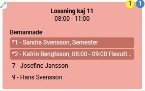
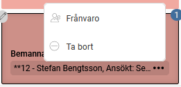
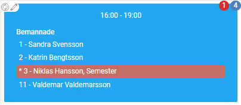
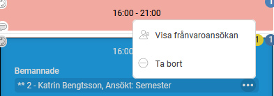
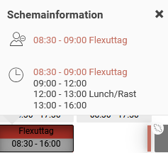
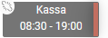
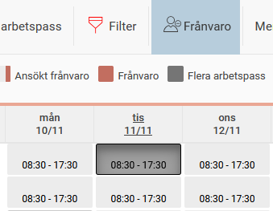

# Går det att hantera frånvaro i schemavyerna?

**Datum:** den 13 november 2025  
**Kategori:** Plan  
**Underkategori:** Schemaläggning  
**Typ:** faq  
**Svårighetsgrad:** intermediate  
**Tags:** schema  
**Bilder:** 8  
**URL:** https://knowledge.flexhrm.com/sv/g%C3%A5r-det-att-hantera-fr%C3%A5nvaro-i-schemavyerna

---

Du som arbetar i schemavyerna kan hantera frånvaro där istället för att öppna tidrapporten.
Observera
Möjligheterna för att hantera frånvaro styrs av behörigheter.
Frånvaro i Bemanningsplan
I vyn
Översikt visas
frånvaro om du har valt att visa bemannade anställda (ställs in
Mer > Inställningar
).
Frånvaro
visas i rött.
Gäller den endast en del av passet visas klockslag.

Ansökt frånvaro
som ännu inte har behandlats markeras med
två asterisker (**)
. Du kan klicka på
de tre prickarna
för att öppna frånvarohanteraren och behandla ansökan.
Du kan också klicka på de tre prickarna för en bemannad anställd för att öppna frånvarohanteraren och
registrera en ny frånvaro
.

Frånvaro i Arbetspass
I vyn
Arbetspass
visas frånvaro med rött, under förutsättning att du har valt att visa bemannade anställda via
Mer > Inställningar
.

Du kan se och hantera
ansökt frånvaro
i denna vy. Ansökt frånvaro markeras med
två asterisker (**)
. Du klickar på
de tre prickarna
för att öppna frånvarohanteraren.

Frånvaro i Schema
I vyn
Schema
markerar systemet frånvaro med rött.
Heldagsfrånvaro
ger en röd markering för hela dagen.
Del av dag-frånvaro
markerar dagen delvis röd.
Ansökt frånvaro
som väntar på behandling markeras med en röd list i högerkanten av dagen.

Du kan klicka på en dag för att
se detaljerad information
om frånvaron.

Behandla ansökt frånvaro:
Klicka på
den röda listen
för att öppna frånvarohanteraren.

Öppna frånvarohanteraren eller registrera ny frånvaro:
Markera en dag och klicka på ikonen för
Frånvaro
.

