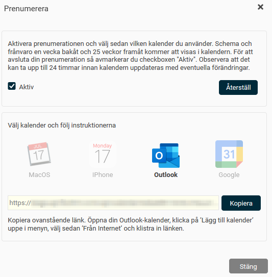
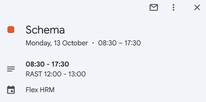
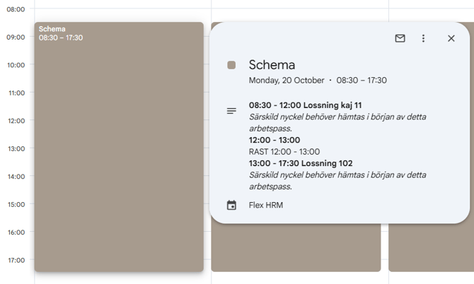
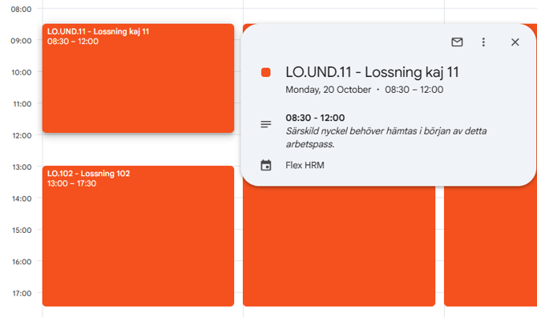

# Hur kan jag prenumerera på mitt schema till min kalender ?

**Datum:** den 17 oktober 2025  
**Kategori:** Plan  
**Underkategori:** Kalender  
**Typ:** howto  
**Svårighetsgrad:** intermediate  
**Tags:** kalender, prenumeration, schema  
**Bilder:** 4  
**URL:** https://knowledge.flexhrm.com/sv/hur-kan-jag-prenumerera-p%C3%A5-mitt-schema-till-min-kalender-

---

Ditt schema i Flex HRM kan visas i din kalender (Google, Outlook, MacOS eller iPhone).
Här kan du prenumerera på schemat
Så visas schemat i din kalender
Visa varje arbetspass som ett separat kalenderobjekt
Avsluta eller återställ din prenumeration
Du kan prenumerera på ditt schema i Flex HRM och få det som en kalender i din kalenderapplikation.
Här kan du prenumerera på schemat
Du hittar alternativet att prenumerera på schemat på följande tre ställen i Flex HRM:
I
HRM Mobile
går du till
Mitt schema
och väljer
Prenumerera
i sidomenyn.
På startsidan i Flex HRM hittar du panelen
Min kalender
. Klicka på knappen
Prenumerera
längst ner till höger.
I schemavyn kan du klicka på namnet på en anställd. I fönstret som öppnas med kontaktuppgifter finns knappen
Prenumerera
. Du som chef kan till exempel använda den här funktionen för att prenumerera på dina medarbetares schema.
När du klickar på
Prenumerera
på något av dessa ställen får du upp ett fönster. Där kan du aktivera prenumerationen och får instruktioner för hur du går tillväga i de fyra olika kalenderapplikationer som stöder detta (MacOS, iPhone, Outlook och Google).

Så visas schemat i din kalender
I din kalenderapplikation kommer det att skapas en ny kalender som heter
Flex HRM
. Den innehåller kalenderobjekt för alla dina schemalagda dagar.
I de schemalagda kalenderobjekten kommer det som standard att stå
Schema
i rubriken. Om du har frånvaro hela dagen kommer frånvaroorsaken att visas i rubriken istället för
Schema
. Om du har frånvaro under delar av dagen kommer det att framgå av detaljinformationen i kalenderobjektet.

Schemat hämtas in och visas för en vecka bakåt och tjugofem veckor framåt, räknat från dagens datum.
Visa varje arbetspass som ett separat kalenderobjekt
Som standard visas hela dagen som ett enda kalenderobjekt. Om du vill se varje
arbetspass
som ett eget kalenderobjekt kan du aktivera en detaljerad vy. Det kan vara användbart om du är schemalagd på olika platser eller projekt under en och samma dag.
För att aktivera detta lägger du till
&showDetailedDay=true
sist i länken som du klistrar in i din kalender när du startar prenumerationen.
Exempel
En anställd arbetar 20 oktober kl 08:30-17:30 med rast 12:00-13:00. Förmiddagspasset och eftermiddagspasset är planerade på två olika projekt.
Den vanliga prenumerationen visar en post i kalendern, 08:30-17:30. För att se detaljer om klockslag, projekt och rast klickar du på kalenderposten.

I prenumerationen nedan har vi lagt till
&showDetailedDay=true
sist i länken. Kalenderposterna visar 08.30-12:00 samt 13:00-17:30. En lucka lämnas för rasten. Även i detta fall kan du klicka på en kalenderpost för att se detaljer som kommentar på arbetspasset.

Avsluta eller återställ din prenumeration
Du kan enkelt avsluta din schemaprenumeration eller återställa prenumerationslänken.
Avsluta prenumerationen
F
ör att a
vsluta din prenumeration avmarkerar du kryssrutan
Aktiv
i fönstret för schemaprenumeration.
Återställ prenumerationslänken
Om du klickar på knappen
Återställ
slutar dina befintliga prenumerationer att fungera. En ny länk genereras då, och du måste använda den nya länken för att prenumerationen ska fungera igen.
Observera
Det kan ta upp till 24 timmar innan kalendern uppdateras med förändringar.
