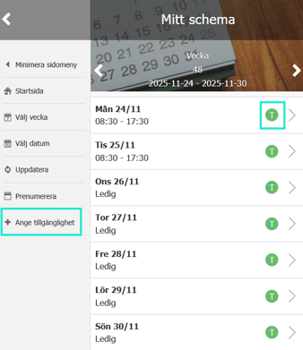
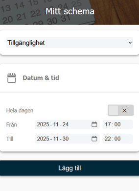
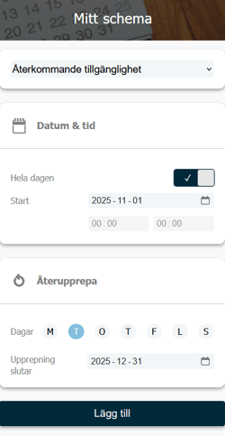
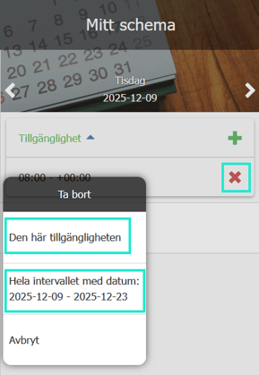

# Kan jag ange när jag är tillgänglig för arbetspass?

**Datum:** den 26 november 2025  
**Kategori:** Plan  
**Underkategori:** Schemaläggning  
**Typ:** faq  
**Svårighetsgrad:** intermediate  
**Tags:** schema  
**Bilder:** 4  
**URL:** https://knowledge.flexhrm.com/sv/kan-jag-ange-n%C3%A4r-jag-%C3%A4r-tillg%C3%A4nglig-f%C3%B6r-arbetspass

---

Information om att ange tillgänglighet i Mitt schema i HRM Mobile.
Om ditt företag använder funktionen
Ange tillgänglighet
kan du
i
Mitt schema
i
HRM Mobile
ange när du är tillgänglig för att arbeta. Det underlättar för schemaläggaren, som då snabbt kan se vem som kan bemannas på ett pass.
Dagar där du angett tillgänglighet markeras med ett
T
i
Mitt schema.
Så här anger du tillgänglighet för en hel vecka
Öppna
Mitt schema
i
HRM Mobile
.
Klicka på
Ange tillgänglighet
i sidomenyn.
Här kan du nu ange din tillgänglighet för hela eller delar av veckan. Du kan välja att vara tillgänglig hela dygnet eller under valda tider.

Så här anger du tillgänglighet för en specifik dag
Klicka på en enskild dag i
Mitt schema
.
Här kan du ange tillgänglighet för dagen, antingen hela dagen eller mellan vissa klockslag.
Återkommande tillgänglighet
Du kan ange en återkommande tillgänglighet, till exempel att du kan arbeta varje tisdag fram till årsskiftet.
Öppna vyn för att ange tillgänglighet.
Ändra till
Återkommande tillgänglighet
.
Ange start och slut för tillgängligheten, samt vilka dagar och tider den ska gälla.

Redigera eller ta bort tillgänglighet
Behöver du ändra din tillgänglighet gör du det genom att öppna den i
Mitt schema
.
Klicka på det
röda krysset
för att ta bort en tillgänglighet.
Du kan inte ändra på en inlagd tillgänglighet. Du behöver ta bort den och lägga in en ny.
Om du angav tillgänglighet för flera dagar via sidomenyn, och sedan väljer att ta bort för en specifik dag, får du frågan om du vill ta bort den för
den specifika dagen
eller för
hela intervallet
.

Observera
Tillgänglighet påverkar inte redan inlagda arbetspass, det visar bara när du är tillgänglig för arbete.
Om du redan har ett arbetspass inlagt i schemat påverkas det inte av att du tar bort din tillgänglighet. Du är fortfarande bemannad på passet.
Tillgänglighet spärrar dig inte från att bli bemannad på tider då du inte angett att du är tillgänglig.
