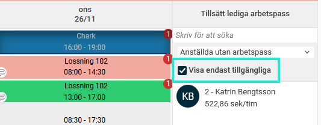
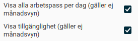
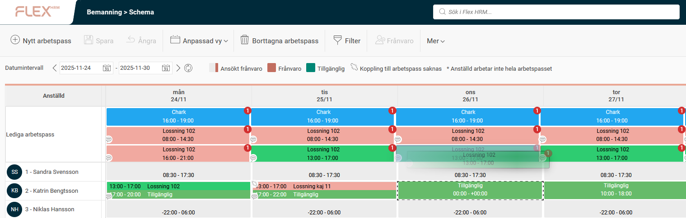

# Kan jag se i schemavyn när en anställd är tillgänglig för arbetspass?

**Datum:** den 26 november 2025  
**Kategori:** Plan  
**Underkategori:** Schemaläggning  
**Typ:** faq  
**Svårighetsgrad:** intermediate  
**Tags:** schema  
**Bilder:** 3  
**URL:** https://knowledge.flexhrm.com/sv/kan-jag-se-i-schemavyn-n%C3%A4r-en-anst%C3%A4lld-%C3%A4r-tillg%C3%A4nglig-f%C3%B6r-arbetspass

---

En artikel för schemaläggare som arbetar med tillgänglighet i HRM Plan.
Den här artikeln beskriver hur du som schemaläggare enkelt kan se vilka anställda som har angett att de är tillgängliga för arbetspass. Detta är särskilt användbart för att snabbt tillsätta lediga pass, till exempel med vikarier, utan att behöva ringa runt.
Så anger anställda sin tillgänglighet
Anställda kan smidigt ange i
HRM Mobile
när de är tillgängliga för att jobba. Denna information blir sedan synlig för dig som schemaläggare. Läs mer om att ange tillgänglighet i mitt schema i HRM Mobile i denna artikel:
Kan jag ange när jag är tillgänglig för arbetspass?
Visa anställda som är tillgängliga
När du ska tillsätta ett ledigt arbetspass i vyerna
Bemanningsplan
,
Arbetspass
och
Schema
kan du välja att
endast visa anställda som angett sig som tillgängliga.

Visa tillgänglighet i schemavyn
I Schemavyn kan du också välja att under
Mer > Inställningar
bocka i
Visa tillgänglighet (gäller ej månadsvyn).
Observera att eftersom anställda kan ange tillgänglighet på delar av en dag så krävs det att inställningen ovanför (
Visa alla arbetspass per dag
) är markerad för att du ska kunna visa tillgänglighet.

När du markerar ett ledigt arbetspass kommer de anställda som har angivit att de är tillgängliga under passets tider att markeras med en streckad linje.
Du kan också se tillgänglighet markerad med grön färg.
På bilden nedan har anställd 2 angett sig som tillgänglig 24 och 25 november kl 17:00-20:00, hela 26 november, 27 november kl 10:00-18:00.
När vi drar ett pass för 26 november kl 13:00-17:00 markeras anställd 2 med streckad linje, eftersom hon är tillgänglig och inte bemannad på något annat arbetspass.

Relaterade artiklar
Kan jag ange när jag är tillgänglig för arbetspass?
