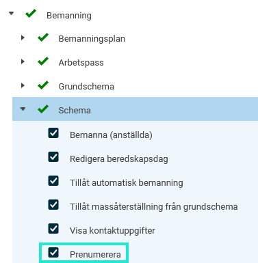

# ⚙️Vad behöver jag som administratör ställa in i HRM för att vi ska kunna använda oss av funktionen Prenumerera på schema som kalender?

**Datum:** den 17 oktober 2025  
**Kategori:** Plan  
**Underkategori:** Kalender  
**Typ:** config  
**Svårighetsgrad:** advanced  
**Tags:** kalender, prenumeration, schema  
**Bilder:** 1  
**URL:** https://knowledge.flexhrm.com/sv/vad-beh%C3%B6ver-jag-som-administrat%C3%B6r-st%C3%A4lla-in-i-hrm-f%C3%B6r-att-vi-ska-kunna-anv%C3%A4nda-oss-av-funktionen-prenumerera-p%C3%A5-schema-som-kalender

---

Du kan prenumerera på ditt schema i Flex HRM och få det som en kalender i din kalenderapplikation (Google, Outlook, MacOS, iPhone). Här beskrivs de inställningar som behöver göras i Flex HRM för att prenumeration ska vara möjlig.
Aktivera kalenderintegration i säkerhetsinställningarna
Gör så här för att tillåta att kalendrar anropar Flex HRM API:
Gå till
Allmänt > Säkerhet
.
Bocka i
Kalenderintegration aktiv.
Styr behörigheten för schemaprenumerationer
Du styr vem som ska kunna prenumerera på vems schema via behörigheter.
Gå till
Användare/Behörigheter > Roller > Fliken Menyer
för att aktivera detta.
Beroende på dina licenser kan benämningen skilja sig åt i menyn. Om du inte har licens för HRM Plan heter modulen
Schema
. Om du har licens för HRM Plan heter modulen
Bemanning
. Under noden
Schema
finns behörigheten för att
Prenumerera
.

Relaterad artikel
Hur kan jag prenumerera på mitt schema till min kalender?
