# Administrativa funktioner - Vilka administrativa funktioner kan jag styra direkt i mobilen?

**Datum:** den 30 september 2025  
**Kategori:** Systemgemensamt  
**Underkategori:** Mobil  
**Typ:** other  
**Svårighetsgrad:** intermediate  
**Tags:** behörighet, mobil  
**Bilder:** 28  
**URL:** https://knowledge.flexhrm.com/sv/administrativa-funktioner-vilka-administrativa-funktioner-kan-jag-styra-direkt-i-mobilen

---

Flex HRM Mobile  ger dig möjlighet att attestera tidrapporter, reseräkningar och frånvaroansökningar, samt utföra delattestering av tid- och reseräknings transaktioner.
Attestering av tidrapporter
Attestering av reseräkningar
Delattestering av tidrapportstransaktioner
Delattestering av reseräkningstransaktioner
Beviljande av frånvaro
Registrera frånvaro på en annan anställd
Administrativa funktioner
För dig som har attestansvar för tidrapporter, reseräkningar eller frånvaro finns det egna funktioner för detta.
Attestering av tidrapporter
Om det finns tidrapporter att attestera indikeras detta med en siffra på ikonen.
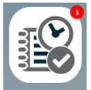
Du får en översikt över de anställda som har en tidrapport som ska attesteras och dess status.
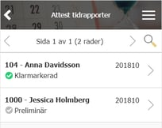
Klicka på en rad för att se detaljposter om tidrapporten och för att attestera eller avslå.
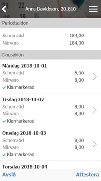
Attestering av reseräkningar
På samma sätt som för tidrapporten indikerar ikonen med en siffra om det finns några reseräkningar att attestera.
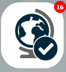
En lista med reseräkningar som ska attesteras och deras status visas när du öppnar funktionen.
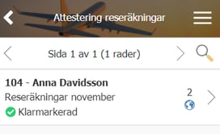
Klicka på en av raderna för att se alla detaljer kring reseräkningen, inklusive kopplade bilagor och för att attestera eller avslå.
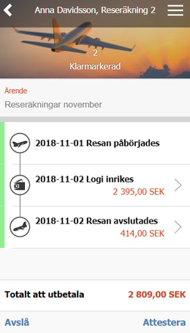
Delattestering av tidrapportstransaktioner
För att granska tidrader utifrån deras rapporterade kontering, s.k. delgranskning, används samma funktionsknapp som för attestering av tidrapport.
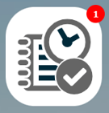
En siffra i den röda cirkeln i övre högra hörnet indikerar antalet tidrapporter eller tidrader att granska.
Har du mer än en granskningsbehörighet visas ett val när du klickar på ikonen.
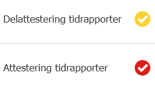
Klickar du på
Delattestering tidrapporter
kommer du till en översiktsvy där varje projekts timmar visas summerat per projekt. Endast klarmarkerade tider inom det valda datumintervallet kommer att visas.
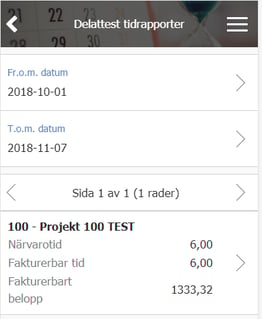
I detta läge kan du under meny-knappen filtrera de poster du vill se och/eller gruppera vyn per anställd istället för per projekt.

Klickar du på en av raderna i sammanställningen listas nästa nivå, i exemplet de anställda som arbetat på ditt projekt. Högst upp ser du fortfarande totalsummeringen för det valda projektet.
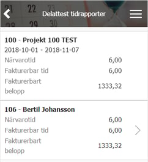
Nu kan du klicka dig ytterligare vidare för detaljer kring varje anställd. Vi klickar på Bertil i exemplet och får fram vilka dagar som han har rapporterat tid i projektet. Överst gäller summeringen nu för den anställde vi valde, Bertil i detta fall.
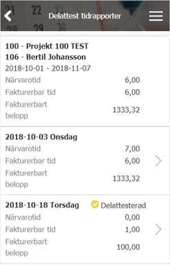
Så länge det finns en pil på raden kan vi klicka oss vidare ytterligare en nivå för mer detaljer. I detta steg kan vi nu titta på vilka tidrader varje dag har. I exemplet 2018-10-03.
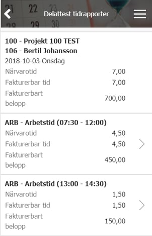
Behöver vi se samtliga detaljer från tidraden kan vi nu ta respektive tidrad att klicka vidare på. Vi tar tiden 07:30-12:00 i förra bilden och kommer till denna bild.
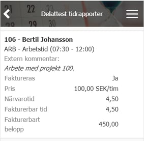
I varje steg kan du välja att delattestera allt underliggande. Är du på nedersta nivån, tidraden, kommer endast den enskilda raden delattesteras. Är den anställde vald kommer samtliga tidrader på samtliga dagar som visas att delattesteras. Vill du delattestera alla poster samtidigt gör du det från högsta nivån, där hela projektets timmar är summerade och du ser de anställda som har rapporterat tid.
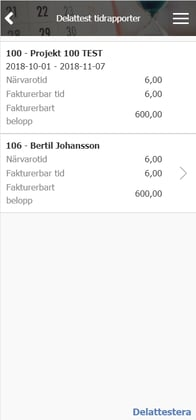
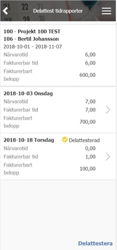
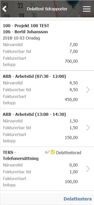
En informationsruta visas när delattesten är klar.
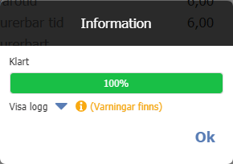
Delattestering av reseräkningstransaktioner
För att granska reseräkningstransaktioner utifrån deras rapporterade kontering, s.k. delgranskning, används samma funktionsknapp som för granskning av reseräkningar.
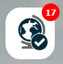
En siffra i den röda cirkeln i övre högra hörnet indikerar antalet reseräkningar och/eller transaktioner att granska.
Har du mer än en granskningsbehörighet visas ett val när du klickar på ikonen.
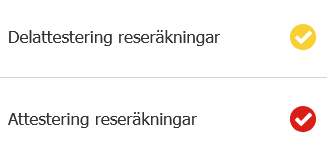
Klickar du på
Delattestering reseräkningar
kommer du till en översiktsvy där varje projekts timmar visas summerat per projekt. Endast klarmarkerade tider inom det valda datumintervallet kommer att visas.
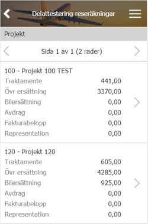
De anställda som har rapporterat resetransaktioner mot ditt projekt listas när du klickar på en projektrad.
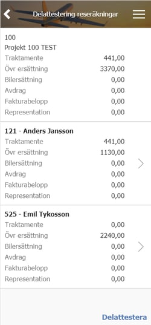
Beviljande av frånvaro
När dina medarbetare gör frånvaroansökningar får du pushnotiser om detta direkt i Mobile och du kan se det genom att det finns en siffra på ikonen.
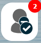
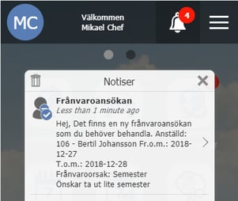
En lista över alla frånvaroansökningar visas, klicka på den du vill behandla.
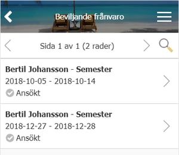
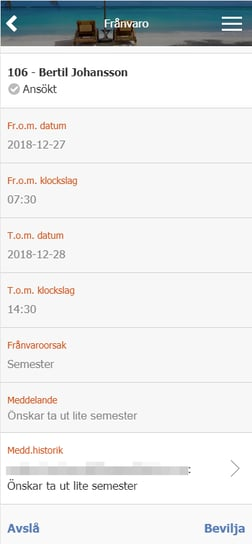
Registrera frånvaro på en annan anställd
Du kan även registrera frånvaro på en annan anställd via Flex Mobile.
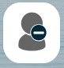
Under meny-knappen kan du välja anställd.
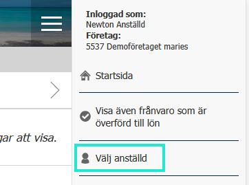
Sedan är det bara lägga in frånvaron som vanligt.
