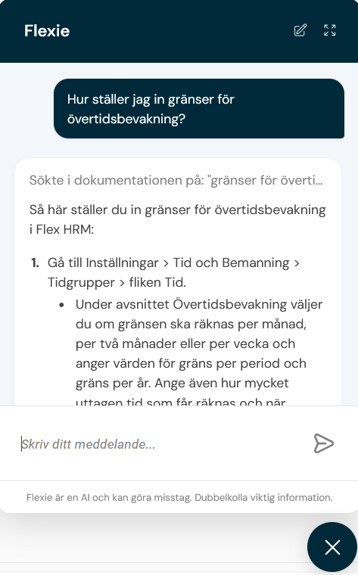
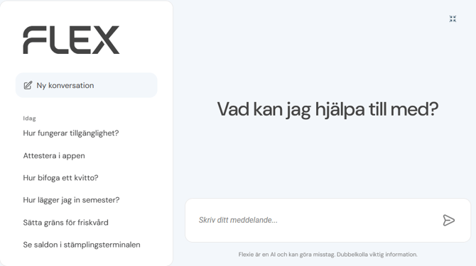

# AI-chatbot i Flex HRM - Vem är Flexie?

**Datum:** den 19 december 2025  
**Kategori:** Systemgemensamt  
**Underkategori:** Användare & Behörighet  
**Typ:** other  
**Svårighetsgrad:** intermediate  
**Tags:** användare, roll  
**Bilder:** 3  
**URL:** https://knowledge.flexhrm.com/sv/ai-chatbot-i-flex-hrm-vem-%C3%A4r-flexie

---

Flexie är Flex HRMs AI-chatbot som ger dig snabba svar på dina frågor och guidar dig rätt i systemet.
U
n
d
r
a
r
d
u hur du registrerar ett utlägg eller var du attesterar dina medarbetares tidrapporter? Skriv in din fråga, så analyserar Flexie den och ger dig ett svar direkt.
Snabb hjälp dygnet runt, för alla
Flexie är tillgänglig
dygnet runt
och är skapad för att hjälpa alla användare, oavsett roll – från anställda och chefer till systemadministratörer.
Istället för att leta i en manual kan du ställa din fråga direkt. En nyanställd kan till exempel snabbt få veta hur man ansöker om semester, medan en administratör kan få hjälp med att hitta en specifik inställning.
Flexie ger dig också länkar till specifika artiklar i vår kunskapsdatabas, där du kan fördjupa dig mer i ämnet.
Så här fungerar Flexie

Du öppnar Flexie via en
ikon
i Flex HRM, som ser ut som en
pratbubbla
. Den visas som default nere till höger, men du kan flytta den.
När du klickar på ikonen öppnas ett chattfönster där du kan skriva din fråga.

Helskärmsläge och navigering
Du kan klicka på pilikonen
uppe till höger
för att förstora fönstret till
helskärmsläge
. Du ser då tidigare konversationer och kan välja att starta en ny.

Avsluta helskärmsläget genom att klicka på ikonen i det
övre högra hörnet
igen.
Du stänger ner Flexie genom att klicka på
krysset i cirkeln
under chattfönstret.
Om du har Flexie öppen och byter vy i systemet, följer fönstret med och är öppet även när nästa vy laddas in.
Ser du inte Flexie i ditt Flex HRM?
Flexie rullas ut successivt till alla kunder. Har du inte pratbubblan nu så kommer den att dyka upp i framtiden.
Du behöver inte göra några inställningar för att öppna upp tillgången till Flexie.
Observera
Flexie är en AI och kan göra misstag. Dubbelkolla alltid viktig information.
