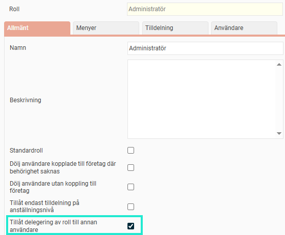
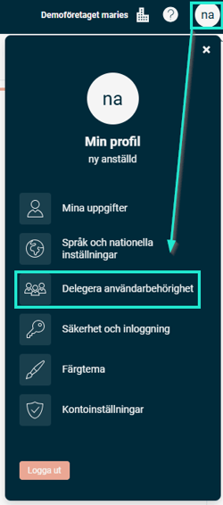
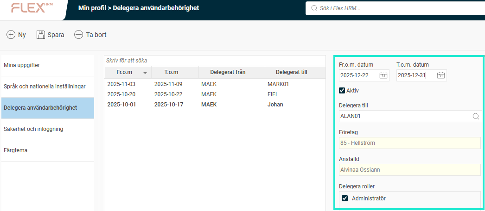
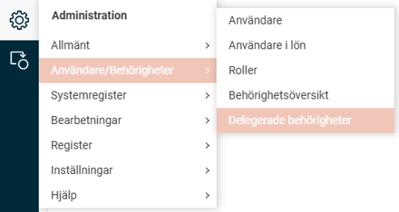
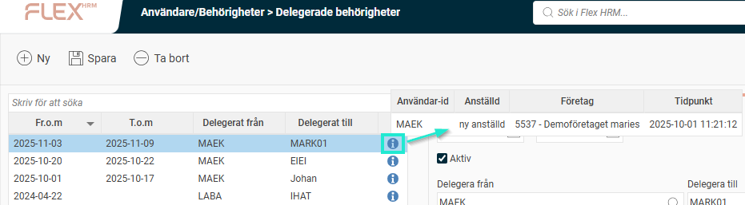
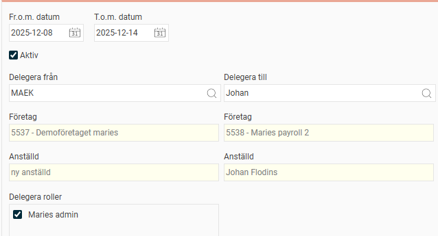
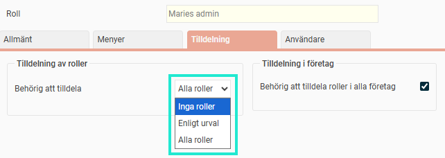

# ⚙️Allmänna tips och förberedelser inför semester

**Datum:** den 1 oktober 2025  
**Kategori:** Systemgemensamt  
**Underkategori:** Användare & Behörighet  
**Typ:** config  
**Svårighetsgrad:** intermediate  
**Tags:** användare, behörighet, roll  
**Bilder:** 7  
**URL:** https://knowledge.flexhrm.com/sv/tips-inf%C3%B6r-semester

---

Här har vi samlat praktiska tips på vad som är bra att tänka på i Flex HRM inför och under semesterperioden. I HRM kan du förbereda rapportering, frånvaro och delegera behörigheter när ordinarie personal är ledig.
Checklista inför semestern
Guide till delegering av behörigheter i Flex HRM
Inställningar för delegering (för administratörer)
Så här delegerar du som användare
Så här delegerar du som administratör
Checklista inför semestern
Lämna in tidrapporter och reseräkningar i tid.
Det kan vara en bra idé att tidigarelägga deadline för tidrapporter och reseräkningar. På så sätt hin
ner lönavdelningen hantera allt innan de själva går på semester.
Säkerställ att frånvaro är genererad.
För att frånvaro ska kunna skapas automatiskt i tidrapporten behöver frånvaroansökan vara granskad. Tidrapporten måste också vara öppen och det får inte finnas någon manuellt registrerad tid på de dagar frånvaron gäller.
Granska innan du går.
Uppmuntra alla anställda att granska och klarmarkera sina tidrapporter och reseräkningar innan de påbörjar sin semester.
Skaffa en överblick.
Använd rapporterna och kalendern i systemet för att se vilka som är på plats och vilka som har semester.
Förbered för vikarier.
Om ordinarie administratörer inte är på plats under semestern, se till att eventuella vikarier har rätt behörigheter i systemet. Förbered dem också med kundnummer som behövs vid kontakt med supporten.
Uppdatera kontaktpersoner.
Se över och uppdatera listan med era utsedda kontaktpersoner mot supporten. Om en vikarie behöver kunna kontakta oss, se till att hen har en egen inloggning till serviceportalen.
Delegera behörigheter.
Om en kollega tillfälligt ska ta över dina arbetsuppgifter kan du enkelt delegera dina behörigheter i Flex HRM. Läs mer i vår guide nedan.
Guide till delegering av behörigheter i Flex HRM
Inför en semester eller annan frånvaro kan du behöva ge en kollega tillgång till dina arbetsuppgifter i Flex HRM. Med funktionen för delegering kan du tillfälligt ge en annan användare en eller flera av dina roller under en bestämd tidsperiod.
Inställningar för delegering (för administratörer)
Som administratör kan du ställa in vilka roller som ska vara möjliga att delegera.
Gå till
Administration > Användare/Behörigheter > Roller
.
Välj en roll i listan.
Bocka i rutan
Tillåt delegering av roll till annan användare
.

Endast de roller där inställningen "Tillåt delegering av roll till annan användare" är aktiv kan delegeras av användarna.
Så här delegerar du som användare
Gå till dina
Min profil > Delegera användarbehörighet
.

I listan till vänster ser du aktiva delegeringar i fet stil och kommande med normal stil. Bocka i
Visa även historik
för att se tidigare delegeringar.
För att skapa en ny delegering, ange ett
Fr.o.m. datum
och ett
T.o.m. datum
. Om du lämnar
T.o.m. datum
tomt fortsätter delegeringen tills den tas bort manuellt.
Välj vem du vill delegera till och vilken eller vilka roller det gäller.

Så här delegerar du som administratör
Som administratör kan du se, skapa och redigera delegeringar för de användare du har behörighet över.
Gå till
Administration > Användare/Behörigheter > Delegerade behörigheter
.

I listan ser du aktuella delegeringar, vem som delegerat, vem som fått delegeringen och under vilken period. Håll muspekaren över
i
-symbolen för att se vem som skapade eller senast ändrade delegeringen.

För att skapa en ny delegering, välj vilken användare som ska delegera
från
, vilken som ska ta emot delegeringen (
till
) och vilka roller som ska ingå.

Observera!
Du kan endast delegera de roller som du själv har behörighet att tilldela.
Kontrollera vilka roller du kan tilldela
Gå till
Administration > Användare/Behörigheter > Roller
.
Välj den roll din egen användare har.
Gå till fliken
Tilldelning
. Här ser du om du kan tilldela
Inga roller
,
Alla roller
eller ett specifikt urval av roller.

