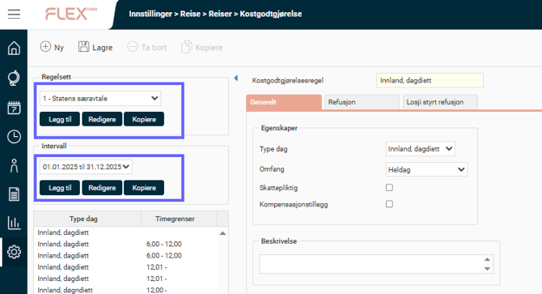
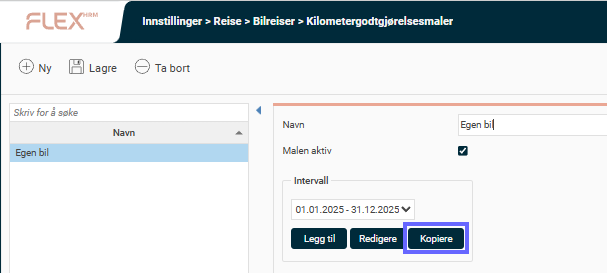
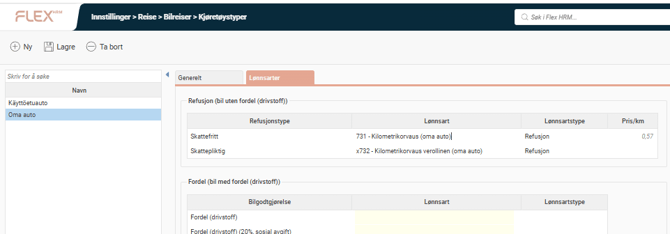
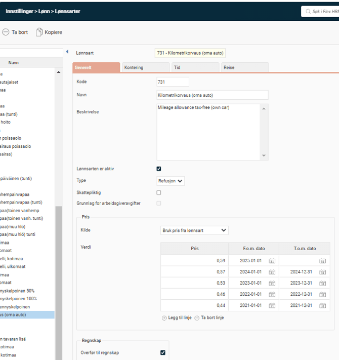
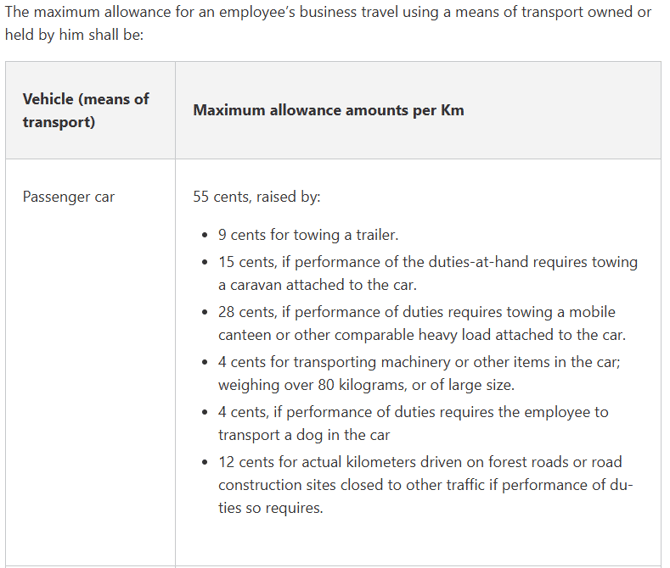

# ⚙️Alt du må tenke på før årsskiftet i HRM Travel? (no)

**Datum:** den 12 januari 2026  
**Kategori:** Systemgemensamt  
**Underkategori:** Användare & Behörighet  
**Typ:** config  
**Svårighetsgrad:** advanced  
**Tags:** roll  
**Bilder:** 6  
**URL:** https://knowledge.flexhrm.com/sv/%C3%A5rsskifte-hrm-travel-no

---

I denne artikkelen beskrives samtlige steg du skal følge for å forberede systemet for det nye året. Husk å gjøre innstillinger for årsskifte.
Før du kan registrere reiser for det nye året må du kontrollere at det finnes regelverk for diett for det nye året. I Flex HRM lastes nye beløp ned automatisk. Vennligst kontroller at beløpene for det nye året er lastet ned. Hvis de ikke er lastet ned, kan de også lastes ned manuelt. For å laste ned nye beløp for det kommende året kreves pålogging som administrator med tilgang til Systemregister-menyen.

Kostgodtgjørelsesregler
Kontroller under
Administrasjon > Innstillinger > Reise > Reiser >  Kostgodtgjørelse
at det er opplagt intervall for det nye året. Dette må kontrolleres for eventuelle regeloppsett.
Under Intervall kan du se hvilke tidsintervall som det finnes regler opplagt for. Hvis intervallet for 2026 mangler, kan du normalt velge intervallet for inneværende år og trykke på
kopiere
. Flex HRM vil da foreslå at neste års intervall blir kopiert.  Når du trykker
OK
, kopieres alle regler i regeloppsettet til det nye intervallet, samtidig som de oppdateres med beløpene for det aktuelle intervallet, altså i dette tilfellet for 2026.

Kilometergodtgjørelse
Kontroller kilometergodtgjørelsen
Administrasjon > Innstillinger > Reise >  Bilreiser > Kilometergodtgjørelsesmale
r.
Hvis man bruker kilometergodtgjørelsesmaler og regler for 2026 mangler, kan man velge intervallet for nåværende år og trykk deretter på
kopiere.
Flex HRM vil da foreslå at neste års intervall blir kopiert.
Når du trykker på
OK
kopieres samtlige regler i regeloppsettet til det nye intervallet samtidig som de oppdateres med beløpene for det aktuelle intervallet, altså i dette tilfellet for 2026.

Norsk kilometergodtgjørelse 2026
(Bare norske bedrifter)
Det må legges inn nye satser på kilometergodtgjørelse når de nye satsene er kommet. Les mer hos
Skatteetaten
.
NB!
Skatteetatens side er ikke oppdatert og gjeldene satser er 5,3 og 1,8.
Statens sats for kjøregodtgjørelse som du finner
i Statens reiseregulativ
er 5,30 kroner per kilometer. Differansen mellom de to satsene betyr i praksis at
du skatter av de siste 1,80 kronene
du får betalt per kilometer.
Hvis satsen blir hentet fra lønnsarten trengs det ikke å gjøre noe, men dobbeltsjekk gjerne og oppdater satsen manuelt hvis dere ikke ligger inne med sats for 2026.
Ingen nye skattesatser fra norske skattemyndigheter når utsendelsen er oppdatert.
Det gjør du ved å gå til
Innstillinger > Reise > Bilreiser > Kilometergodtgjørelsesmaler
. Velg kjøretøy og endre skattepliktig sats.
Finsk kilometergodtgjørelse 2026
(Bare finske bedrifter)
Husk å kontrollere at de nye satsene har blitt lagt til. Satsene ligger på lønnsartene og må justeres manuelt. For å se hvilke lønnsarter som må justeres må det først velges kjøretøy. Det finner du ved å gå til
Administrasjon > Innstillinger > Reiser >Bilreiser
. Velg
kjøretøy
og sjekk hvilke lønnsarter de er knyttet til.

Legg deretter til nye satser på
lønnsartene
:

Dette er de nye satsene for
finske bedrifter

Husk!
Fra 1. januar 2026 senker Finland den lave mva-satsen fra 14 % til 13,5 %. Endringen omfatter blant annet mat, servering, transport og hotellovernattinger, mens standardsatsen på 25,5 % forblir uendret.
Initiering av reiseregningsnummer
Hvis du bruker en nummerserie for reiseregninger som skal initieres ved årsskifte gjør du dette under
Administrasjon > Innstillinger > Reise > Reiseregninger.
Observer at dette påvirker alle nye reiseregninger som opprettes i HRM og at det bare får gjennomslag hvis initieringsnummeret er større enn nåværende reiseregningsnummer.
