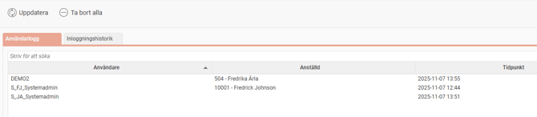
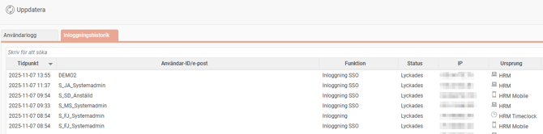
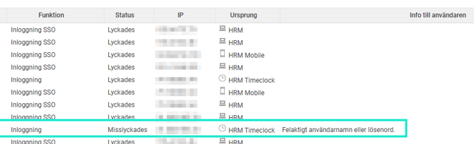

# Användarlogg - Kan jag se vem som har loggat in i Flex HRM?

**Datum:** den 7 november 2025  
**Kategori:** Systemgemensamt  
**Underkategori:** Användare & Behörighet  
**Typ:** other  
**Svårighetsgrad:** intermediate  
**Tags:** användare  
**Bilder:** 3  
**URL:** https://knowledge.flexhrm.com/sv/anv%C3%A4ndarlogg-flex-hrm-0

---

Användarlogg
Allmänt > Loggning > Användarlogg
Användarloggen kan användas för att se om någon användare är inloggad när ett större arbete ska göras, underlättar felsökning och ger dig möjlighet att upptäcka eventuella intrångsförsök.
Under fliken
Användarlogg
kan du se vilka användare som just nu är inloggade i Flex HRM.
Om du letar efter en specifik användare kan du använda sökfältet
Skriv för att söka
högst upp.

Inloggningshistorik
Under fliken
Inloggningshistorik
ser du alla inloggningsförsök, både lyckade och misslyckade.

I exemplet nedan ser du att en användare har försökt logga in i HRM Timeclock men angett antingen fel användarnamn eller lösenord.

Hur länge sparas loggen?
Historiken sparas i 90 dagar och raderas därefter automatiskt.
