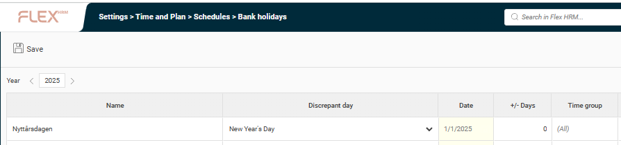
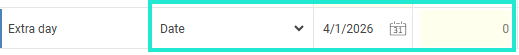
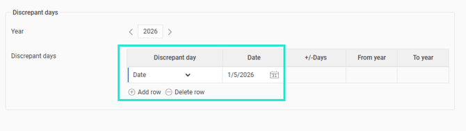

# ⚙️Control discrepancy days at year end/new year (en)

**Datum:** den 18 november 2025  
**Kategori:** Systemgemensamt  
**Underkategori:** Inställningar  
**Typ:** config  
**Svårighetsgrad:** intermediate  
**Tags:** Ingen  
**Bilder:** 3  
**URL:** https://knowledge.flexhrm.com/sv/kontrollera-avvikelsedagar-vid-%C3%A5rsskifte-0

---

This article describes how to proceed now that we are entering a new year. In Flex HRM Time, the program organizes most things related to the new year without you having to do anything. The only thing we recommend you to do is to look over the discrepant days. Read about how to proceed in this article.
Control discrepant days by going to
Administration > Settings > Time and plan > Schedules > Bank holidays
.
Remember to
select the year,
for exemple
2026.
If you have used some of the fixed days under the deviation day column, these will be automatically updated for all upcoming years and no manual change is required.

However, the days that have been set with a fixed date must be entered for the new year if they are to remain relevant for the coming year.

Please note that these discrepancy days can also be set in the regulations for overtime, unsocial working hours and standby regulations. If you are using any of these regulations, we ask you to review them as well. You can find them under
Administration > Settings > Time and Plan > Time rules.
Example Overtime rules

