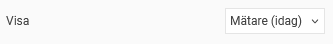
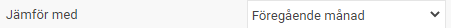
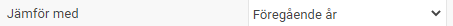
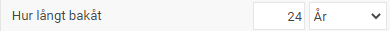
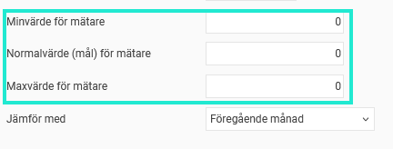
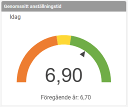
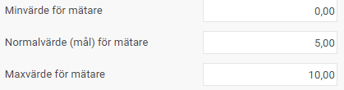
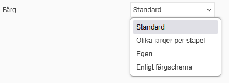

# Dashboard - Mätare/Värde - Hur mäter och visualiserar jag mina värden?

**Datum:** den 17 oktober 2025  
**Kategori:** Systemgemensamt  
**Underkategori:** Inställningar  
**Typ:** other  
**Svårighetsgrad:** intermediate  
**Tags:** Ingen  
**Bilder:** 11  
**URL:** https://knowledge.flexhrm.com/sv/m%C3%A4tare/v%C3%A4rde-hur-m%C3%A4ter-och-visualiserar-jag-mina-v%C3%A4rden

---

Artikeln ger information om och exempel av visningen av Mätare/Värde, idag, aktuell period och valfri period. Dessutom beskrivs färginställningarna som är möjliga för vissa paneler.
Mätare/Värde (idag)

Används för typerna
Antal anställda, Genomsnittlig anställningstid
och
Medelålder
.
Utgår från dagens datum.
Väljer du att jämföra med föregående
månad
skapas en period, den aktuella, med alla dagar i aktuell månad fram till dagens datum. Den aktuella perioden jämförs sedan med perioden för hela föregående månad.
Ett exempel där vi jämför med föregående
månad
där dagens datum är 2023-02-10 är:
Aktuell period: 2023-02-01 - 2023-02-10
Föregående period: 2023-01-01-2023-01-31

Väljer du att jämföra med föregående
år
skapas en period, den aktuella, med alla månader i aktuellt år fram till månaden som dagens datum tillhör. Den aktuella perioden jämförs sedan med perioden för hela föregående år.
Ett exempel där vi jämför med föregående
år
där dagens datum är 2023-02-10 är:
Aktuell period: 2023-01-01 - 2023-02-10
Föregående period: 2022-01-01 - 2022-12-31

Mätare/Värde (aktuell period)
Används för typerna
Antal heltidstjänster (FTE), Frisläppt belopp till fakturering, Personalomsättning
och
Sjukfrånvaro.
Utgår från dagens datum.
Väljer du att jämföra med föregående
månad
skapas en period, den aktuella, med alla dagar i aktuell månad. Den aktuella perioden jämförs sedan med perioden för hela föregående månad.
Ett exempel där vi jämför med föregående
månad
där dagens datum är 2023-02-10 är:
Aktuell period: 2023-02-01 - 2023-02-28
Föregående period: 2023-01-01-2023-01-31

Väljer du att jämföra med föregående
år
skapas en period, den aktuella, med hela året i aktuellt år som dagens datum tillhör. Den aktuella perioden jämförs sedan med perioden för hela föregående år.
Ett exempel där vi jämför med föregående
månad
där dagens datum är 2023-02-10 är:
Aktuell period: 2023-01-01 - 2023-12-31
Föregående period: 2022-01-01 - 2022-12-31

Mätare/Värde (valfri period)
Används för typerna
Frisläppt belopp till fakturering, Personalomsättning
och
Sjukfrånvaro.
Utgår från dagens datum och tittar på alla hela perioder bakåt.
Ett exempel med
24 år bakåt
där dagens datum är lika med 2023-02-10 är:
Period: 1999-01-01 → 2022-12-31

Ett exempel med
24 månader bakåt
där dagens datum är 2023-02-10är:
Period: 2021-02-01 - 2023-01-31

Mätare
Du kan också ställa in min-, max- och normalvärde för mätaren. Det innebär att färgerna justeras utifrån din inställning.

I nedanstående exempel, där vi har satt minvärde till 0, normalvärde till 5 och maxvärde till 10,  är alltså målet att den genomsnittliga anställningstiden minst bör vara 5 år vilket visas som det gula området.

Färg
Vissa paneler som visar grafer med linjer eller staplar har inställningar för färgval.

Standard
- ger blå färg.
Olika färger per stapel
- ger olika, av HRM valda, färger per visad stapel.
Egen färg
- tillåter eget val av färg i en färgväljare
Enligt färgschema
- ger färg på linjen eller stapeln enligt Systemfärg för Sidomeny under inställningarna
Färgschema
.
Relaterade artiklar:
Dashboard - Vad är en Dashboard?
Hur går jag tillväga för att presentera Dashboards på Startsidan (Hem)?
Paneler i Dashboard- Hur fungerar de gemensamma inställningarna för paneler i Dashboard?
