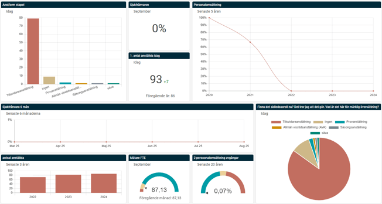
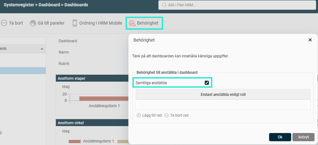
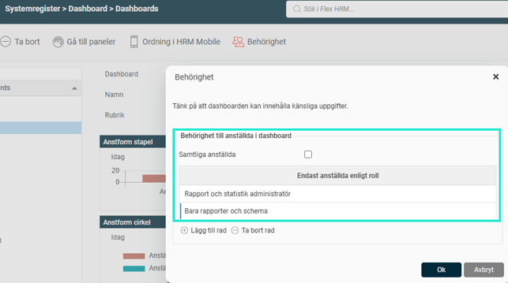
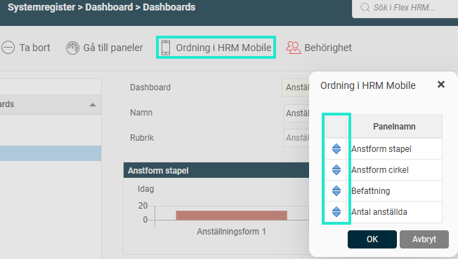

# ⚙️Dashboard - Vad är en Dashboard?

**Datum:** den 17 oktober 2025  
**Kategori:** Systemgemensamt  
**Underkategori:** Användare & Behörighet  
**Typ:** concept  
**Svårighetsgrad:** beginner  
**Tags:** användare, behörighet, mobil, roll  
**Bilder:** 5  
**URL:** https://knowledge.flexhrm.com/sv/dashboard-vad-%C3%A4r-en-dashboard

---

Dashboarden i Flex HRM ger en översikt av HR-nyckeltal som bl. a. sjukfrånvaro och personalomsättning, presenterade med diagram och mätare. Du kan bygga flera dashboards med olika paneler och styra behörigheter för specifika roller.
Dashboard i Flex HRM
Som administratör kan du skapa flera dashboards anpassade för olika syften och roller inom företaget. Du styr vem som ska se vad, så att företagsledningen, HR och chefer alltid har tillgång till relevant och uppdaterad information.
Vilka nyckeltal du kan visa i en dashboard beror på vilka moduler av Flex HRM som ingår i er licens.

Så fungerar dashboards och paneler
En dashboard fungerar som en samlingsyta där du presenterar information. Själva informationen, till exempel ett cirkeldiagram som visar sjukfrånvaro eller en mätare för personalomsättning, lägger du in i så kallade paneler.
Du skapar alltså först de paneler du vill använda och lägger sedan till dem i en dashboard. Du kan återanvända samma panel i flera olika dashboards.
Skapa och konfigurera en dashboard
Här beskriver vi hur du som administratör sätter upp en helt ny dashboard.
Steg 1: Skapa paneler
Börja med att skapa de paneler som ska visa data i din dashboard.
Gå till
Administration > Systemregister > Dashboard > Paneler
. Du ser då en lista över befintliga paneler.
Klicka på
Ny
för att skapa en ny panel.
Fyll i fälten:
Namn:
Ett internt namn för panelen.
Rubrik:
Den rubrik som kommer att synas på panelen i dashboarden. Om du lämnar fältet tomt används namnet.
Beskrivning:
En valfri intern beskrivning.
Under
Typ
väljer du vilken sorts data panelen ska hämta.
Under
Visa
väljer du hur datan ska presenteras, till exempel som ett linjediagram, en mätare eller ett enkelt värde.
Beroende på dina val behöver du göra ytterligare inställningar för panelen.
Du kan skapa flera paneler av samma typ. Du kan till exempel ha en panel som visar antalet anställda idag som ett värde, och en annan som visar den historiska utvecklingen i ett linjediagram.
I artikeln "
Paneler i Dashboard - Hur fungerar de gemensamma inställningarna?
" kan du läsa mer om de olika inställningarna.
Steg 2: Skapa en dashboard och lägg till paneler
När du har skapat dina paneler är det dags att skapa själva dashboarden.
Gå till
Administration >Systemregister > Dashboard > Dashboards
.
Markera en panel i listan till höger och klicka på knappen
Lägg till panel
för att lägga in den i din dashboard.
Du kan flytta runt panelerna och ändra deras storlek genom att dra i dem, så att du får den layout du önskar.
Steg 3: Ställ in behörighet för roller
För att användarna ska kunna se den nya dashboarden behöver du ge deras roller behörighet till den.
Gå till
Administration > Användare /Behörigheter > Roller
.
Välj den roll som ska få tillgång till dashboarden.
Under noden
Hem
ser du en lista över tillgängliga dashboards. Bocka i den eller de dashboards som rollen ska ha behörighet till.

Behörighetsstyrning i dashboards
Du kan styra vilken data en användare ser i en dashboard baserat på sin roll. Detta är användbart om du till exempel vill att en avdelningschef endast ska se nyckeltal för sin egen avdelning.
Välj den dashboard du vill behörighetsstyra.
Klicka på ikonen för
Behörighet
.
En dialogruta visas:
Om du bockar i rutan
Samtliga anställda
sker ingen behörighetsstyrning, och alla som ser dashboarden ser data för samtliga anställda.

Om rutan
inte
är ibockad kommer användaren endast att se data för de anställda som matchar dennes roll.

Observera!
Om en dashboard saknar en kopplad roll och rutan "Samtliga anställda"
inte
är ibockad, kommer diagrammen inte att visa någon data.
Fler inställningar
Se detaljer om anställda
I behörighetsinställningarna för en roll (
Administration > Användare /Behörigheter > Roller
) finns alternativet
Behörighet att se detaljer om anställda
. Om du bockar i denna ruta kan användaren klicka på en del av ett diagram, till exempel en stapel, för att se en lista över de anställda som datan baseras på.
Anpassa för HRM Mobile
Du kan bestämma i vilken ordning panelerna ska visas i mobilappen HRM Mobile. I vyn där du konfigurerar din dashboard, dra och släpp panelerna med de blå pilarna för att ändra ordningen

Relaterade artiklar:
Hur går jag tillväga för att presentera Dashboards på Startsidan (Hem)?
Paneler i Dashboard- Hur fungerar de gemensamma inställningarna för paneler i Dashboard?
Dashboard - Mätare/Värde - Hur mäter och visualiserar jag mina värden?
