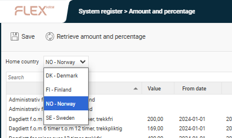
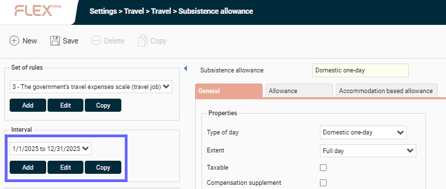
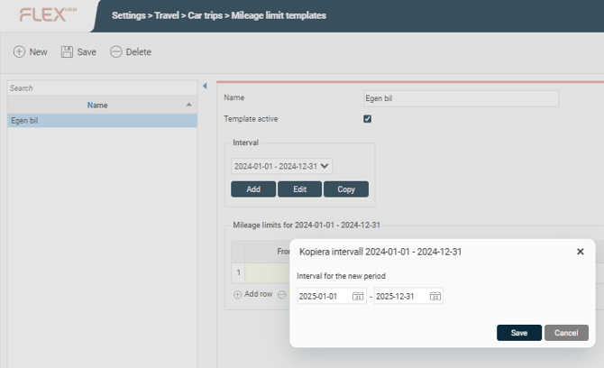
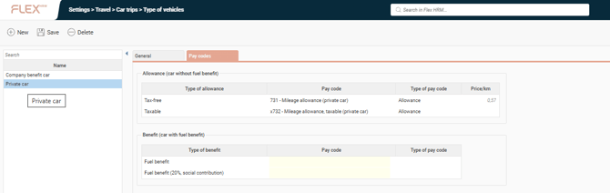
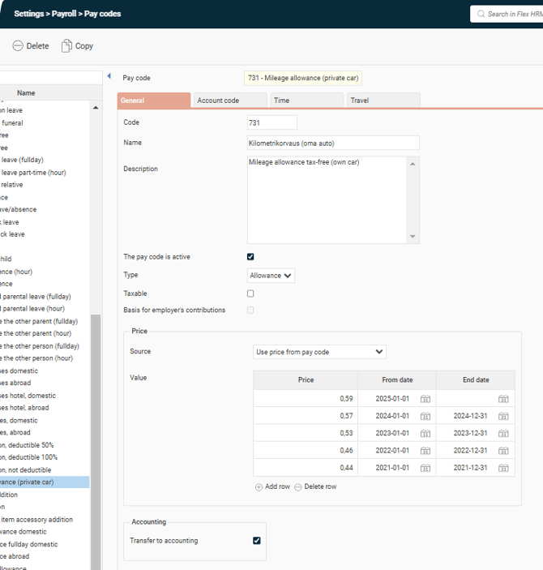
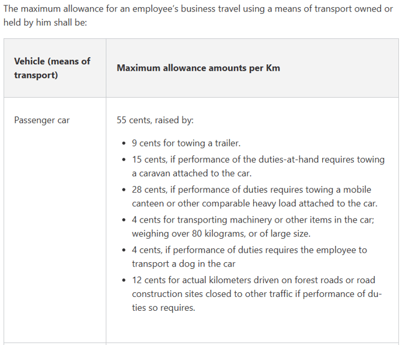

# ⚙️Everything you need to know for the year-end closing in HRM Travel (en)

**Datum:** den 12 januari 2026  
**Kategori:** Systemgemensamt  
**Underkategori:** Användare & Behörighet  
**Typ:** config  
**Svårighetsgrad:** intermediate  
**Tags:** roll  
**Bilder:** 6  
**URL:** https://knowledge.flexhrm.com/sv/new-year-hrm-travel-0

---

This article describes all the steps you need to get a smooth transition in to the new year. Remember to change the settings for the new year.
Before you can register travels for the new year, you need to check that there are subsistence allowances regulations for the new year. New rates are downloaded automatically.
If they are not downloaded, they can also be downloaded manually. To download new rates for the upcoming year, you need access to the System Register.

Subsistence allowance regulations
Under
Administration > Settings > Travel > Travel < Subsistence allowance
, check that intervals for the new year have been set. This needs to be controlled for all set of rules.
Below
Interval
you can see the time intervals where a set of rules has been added. If the rules for the new year are missing, you can normally select the interval for the current year and then click
copy
.
Flex HRM will then suggest  that the next year’s intervals will be copied. When you press
OK
, all rules in the rule layout will be copied to the new interval.

Mileage claim
Control the mileage limits
Administration > Settings > Travel > car trips> Mileage limit templates
. If you use Mileage allowance templates and rules for the new year are missing, you can select the interval for the current year and then press
Copy
.
Flex HRM will then suggest that the next year’s intervals be copied. When you press
OK
, all rules in the rule layout are copied to the new interval.

Norwegian mileage rates for 2026
(Only Norwegian companies)
New rates for mileage allowance for Norwegian companies has not been published yet. Read more at
Skatteetaten
.
NB!
The Norwegian Tax Administration’s website has not been updated, and the applicable rates are 5.3 and 1.8.
The government rate for mileage allowance, as stated in the
Norwegian Government Travel Regulations
, is NOK 5.30 per kilometer. The difference between the two rates means that, in practice, you are taxed on the last NOK 1.80 you receive per kilometer.
If the rate is retrieved from the pay code, there is no need to do anything, but feel free to double check and update the rate manually if you do not have the rate for 2026.
You do this by going to
Settings > Travel > Car trips > Mileage limit template
. Select
vehicle
and change taxable rate.
Finnish mileage rates for 2026
(Only Finnish companies)
Remember to check that the new rates have been added. The rates are based on the pay codes and must be adjusted manually. To see which pay codes that needs to be adjusted, the vehicle must first be selected. You can find this by going to
Administration > Settings > Travel > Type of vehicle
. Select a vehicle and check which pay codes are associated with it.

Then add the new rates on the
pay code
:

The new rates Finnish companies

Reminder!
From 1 January 2026, Finland will reduce the lower VAT rate from 14% to 13.5%. The change applies to areas such as food and restaurant services, transport and hotel accommodation, while the standard rate of 25.5% remains unchanged.
Initiation of travel expense claim
If you use a number series for travel expense claims to be initiated at the end of the year, do so under
Administration > Settings > Travel expense claims
. Note that this affects all new travel expense claims that are created in HRM and that are created in HRM and that it will only have an impact if the initial number is greater than the current travel bill number.
