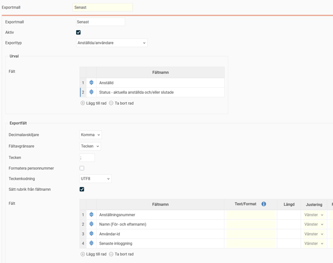
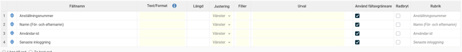
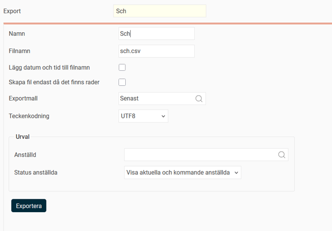

# ⚙️Exporter - Hur skapar och hanterar vi exportmallar för att få ut data från Flex HRM?

**Datum:** den 29 september 2025  
**Kategori:** Systemgemensamt  
**Underkategori:** Register  
**Typ:** howto  
**Svårighetsgrad:** advanced  
**Tags:** användare, behörighet  
**Bilder:** 4  
**URL:** https://knowledge.flexhrm.com/sv/exportmallar-hur-skapar-och-hanterar-du-exportmallar-f%C3%B6r-att-f%C3%A5-ut-data-fr%C3%A5n-flex-hrm

---

Exportmallar i Flex HRM är ett kraftfullt verktyg för att enkelt exportera rådata från olika källor, som tidrapporter och anställda, till filformat som Excel eller text. Du kan också schemalägga automatiska exporter och filtrera data baserat på specifika kriterier. Den här guiden visar hur du skapar, använder och schemalägger exportmallar.
Exporttyper
Skapa en exportmall
Exportera data
Schemalägga exporter
E
xpor
tmallar
Via exp
orter kan du enkelt och snabbt få ut data från olika datakällor.
Det fin
ns et
t antal olika exporttyper att använda för att exportera data från Flex HRM.
Alla användare som har behörighet till
Beabetningar > Servicerutiner > Export
kommer åt alla skapade rapporter och alla anställda.
Utdatan fås i form av rådata i Excel- eller textformat. Till skillnad från Statiskcentralen får man inga grafiska utskrifter eller jämförande urval.
Exporttyper
I Flex HRM finns det flera olika exporttyper som du kan använda för att hämta ut data.
Tidrapporter
: Hämtar data från tidrapportsposter. Här bör ditt urval innehålla status och datumintervall.
Fakturaunderlag
: Exporterar data som är frisläppt för fakturering. Detta kräver att data först har frisläppts.
Fakturaunderlag (SIE4)
: Skapar ett fakturaunderlag enligt standardformatet SIE4 med frisläppt data.
Anställda/Användare
: Hämtar data från anställda- och användarregistret. Här bör ditt urval innehålla status (aktuella och/eller slutade anställda), och även att endast inkludera nya eller uppdaterade sedan den senaste exporten (om du tänker schemalägga exporten).
Reseräkningar
: Exporterar transaktioner från reseräkningar.
Frånvaro (från Time)
: Hämtar ut frånvaro från frånvarofunktionen.
Anställda/Användare (Hogia HR IPA)
: En egen exporttyp anpassad för inläsning till Hogia.
Anställda Tabeller
: Hämtar data från tabeller som har skapats i anställdaregistret via egna fält.
Konteringar
: Exporterar register som projekt och kostnadsställe.
Bokföring av lönekostnader
: Här kan du anpassa din bokföringsfil för att passa ditt ekonomisystem, om du inte kan använda standardformatet SIE4.
Kontokortstransaktioner
: Exporttyp för dig som läser in kontokortstransaktioner.
Löneunderlag till COINS
: COINS är ett system som ägs av Försäkringsgirot och som hanterar försäkringsadministration så som pensionsförsäkringar. För att de ska kunna göra sina beräkningar behöver de underlag från lönesystem vilket överförs via en XML-fil enligt COINS-format.
Fackförbundsavgifter
: Skapar en fil som redovisar fackavgifter per person för de företag som betalar in avgiften åt sina anställda.
Skapa en exportmall
För
att sk
apa en ny exportmall, gå till
Inställningar > Import/Export> Exportmallar
.

Klicka på knappen
Ny,
ge exportmallen ett namn och v
älj
Exporttyp
, alltså vilken datakälla rapporten ska baseras på.
Urval
Varje
exportmall har möjlighet att tillhandahålla ett a
ntal olika urval som kan användas för att begränsa vilken data som exporteras. Du kan till exempel göra urval på anställd, datum eller hemkonteringar.
Exportfält
Här anger du fältavgränsare och hur filen ska hantera decimaler
. Om du till exempel väljer fält för anställningsnummer, förnamn, efternamn och ort, samt fältavgränsare semikolon (;) kommer utdata se ut så här:
1234;Anders;Karlsson;Karlstad
Decimalavskiljare
: Ange hur decimaler ska visas. Ett exempel är att använda en punkt som avgränsare,
10.10
.
Fältavgränsare och tecken
: Bestäm avgränsningen mellan fält.
Formatera personnummer
: Bocka i rutan om personnummer är med i exporten. Gör att personnummer formateras utifrån standard. För svenska personnummer med bindestreck.
Teckenkodning
: Ändra denna utifrån format som önskas av mottagande system: UTF-8, ANSI, IBM437, UTF8 w/BOM.
Sätt rubrik från fältnamn:
Markera för att kolumnen
Rubrik
nedan ska fyllas automatiskt från fältnamn. Den går att ändra om du vill ha en annan rubrik för något fält.
Fält
Ange de fält som du vill ska skrivas till filen och hur de ska skrivas. För vissa fält, som till exempel datum, kan du välja hur det ska formateras. Klicka på info-i vid
Text/Format
för instruktion.

När du är klar med inställningarna, klicka på
Spara
.
Exportera data
För att exportera data, gå till
Bearbetningar >
Servicerutiner > Export
.

Ge exporten ett namn.
Ange vad filen ska heta.
Välj den exportmall som du har skapat.
Välj
Teckenkodning
(UTF8, ANSI, IBM437 eller UTF8 w/BOM) beroende på vad det mottagande systemet kräver.
Gör eventuella urval för att begränsa exporten. Urvalsmöjligheterna ställde du in i exportmallen.
Klicka på
Exportera
för att skapa filen.
Du får en notis när exporten är klar. Där kan du ladda ner filen. Den kan också laddas ner från loggen i exportvyn.
Schemalägga exporter
Du har också möjlighet att schemalägga export av data. Om du har skapat och sparat en export med önskade urval, kan du schemalägga den genom att gå till
Inställningar >
Import/Export > Schemalagda körningar
.

Ge den schemalagda körningen ett namn.
Välj vilken export du vill schemalägga.
Ställ in hur ofta exporten ska köras samt ett klockslag.
Ställ in en fjärrmapp där exportfilen ska sparas.
Spara
.
Vid den tidpunkt du ställt in, till exempel dagligen kl. 08:00, kommer exporten att köras.
Bra att veta om servicekonto
Om du inte markerar inställningen
Använd servicekonto
kommer den användare som sparat körningen stå som export-användare. Det kan innebära problem om denne användare inaktiveras eller får ändrade behörigheter.
Använder du servicekonto är körningen inte beroende av en användare.
Du kan i vyn för Schemalagda körningar se vilken användare som skapat och som senast ändrat en schemalagd körning.
