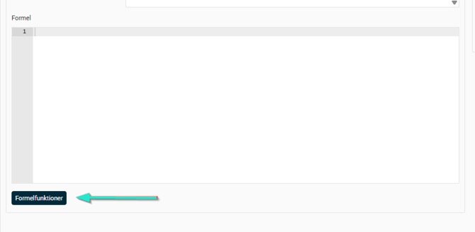

# ⚙️Formelspråk i Flex HRM

**Datum:** den 29 september 2025  
**Kategori:** Systemgemensamt  
**Underkategori:** Användare & Behörighet  
**Typ:** config  
**Svårighetsgrad:** advanced  
**Tags:** användare, roll  
**Bilder:** 1  
**URL:** https://knowledge.flexhrm.com/sv/formelspr%C3%A5k-i-flex-hrm

---

I Flex HRM finns det en rad funktioner som har stöd för att användaren skriver egna formler. Här beskrivs språket som används i Flex HRM för att skriva dessa formler.
Generellt
Formler skrivs i en formeleditor som ger förslag på funktioner och variabler som kan användas allt eftersom man skriver sin formel. Exempelvis via generella händelser som man hittar under
Inställningar > Tid och Bemanning > Generella händelseformler.
Tilldelning och beräkningar sker enligt matematiska regler och för att tilldela en ny variabel ett värde skriver man bara enligt följande:
Minvariabel
= 1 + 2
En variabel med namnet ”minvariabel” har då skapats och tilldelats värdet 3.
Decimaltal kan skrivas antingen med punkt (.) eller komma (,) som decimalavskiljare:
mittdecimaltal
= 3.14
mittandradecimaltal
= 2,72
Text skrivs inom par av dubbla citationstecken:
mintext
= ”test”
Man kan även definiera listor av heltal, decimaltal eller text. Dessa skrivs inom hakparenteser ([, ]):
heltalslista
= [1;2;3;5]
decimaltalslista
= [1.0;2.5;3.3]
textlista
= [”test”;”annat”;”ytterligare”]
Aritmetiska operatorer och prioritetsordning
Du kan använda följande aritmetiska operatorer i beräkningar:
+ Adderar två tal.
- Subtraherar två tal.
* Multiplicerar två tal.
/ Dividerar två tal.
Vid beräkningar med flera operatorer används denna prioritetsordning:
( ) paranteser
* / multiplikation och division
+ - addition och subtraktion
Exempel:
1 + 2 * 3 ger resultatet 7
(1 + 2) * 3 ger resultatet 9
Formelfunktioner
I systemet finns ett antal funktioner som kan användas för att hämta information eller utföra specifika uppgifter. Tillgängliga funktioner kan variera beroende på användningsområde.
För att se vilka funktioner som är tillgängliga för det aktuella området, klicka på knappen ”Formelfunktioner” bredvid editorn.
Funktioner används enligt följande struktur:
Funktionsnamn(argument1; argument2)

Jämförelseoperatorer
Det finns möjlighet att jämföra variabler i HRM enligt följande:
== Lika med
!= Skild från
<> Skild från
< Mindre än
<= Mindre än eller lika med
> Större än
>= Större än eller lika med
Villkorssatser
För att skapa villkorsstyrda tilldelningar eller styra flödet i en formel används villkorssatser. Syntaxen är följande:
if a > 5 AND b == 0
c = 5
end if
I exemplet ovan får variabeln c värdet 5 om a är större än 5
och
b är 0, annars sker ingen tilldelning. Villkorssatser används exempelvis för att kontrollera att vissa villkor är uppfyllda innan en åtgärd genomförs, såsom att kontrollera närvaro för att en viss händelse ska aktiveras.
if a > 5 OR b == 0
c = 5
end if
I exemplet ovan är
AND
utbytt mot
OR
vilket innebär att variabeln c får värdet 5 om a är större än 5
ELLER
b är 0, annars sker ingen tilldelning.
Kommentarer
Man kan även skriva kommentarer i sina formler. Kommentarer kommer inte med vid beräkning av formeln men kan användas för att tex skriva förklaringar i formeln. En kommentar sträcker sig från inledande kommentarssymbol och resten av aktuell rad. Kommentarer skrivs på följande sätt:
Med inledande // :
//Detta är en kommentar
Matematiska funktioner
Det finns även en uppsättning matematiska hjälpfunktioner att använda sig av. Dessa innefattar bland andra:
Min(double, double)
Tar två decimaltal och returnerar det minsta av dem.
Max(double, double)
Tar två decimaltal och returnerar det största av dem.
Ceiling(double)
Tar ett decimaltal och returnerar det minsta heltalet som är större än eller lika med angivet decimaltal.
Truncate(double)
Tar ett decimaltal och returnerar det största heltalet som är mindre än eller lika med angivet decimaltal.
Floor(double)
Tar ett decimaltal och returnerar det största heltalet som är mindre än eller lika med angivet decimaltal.
Tänk på att formler och händelser är komplexa - vid funderingar eller frågor, kontakta Flex för hjälp och eventuell bokning av konsult.
