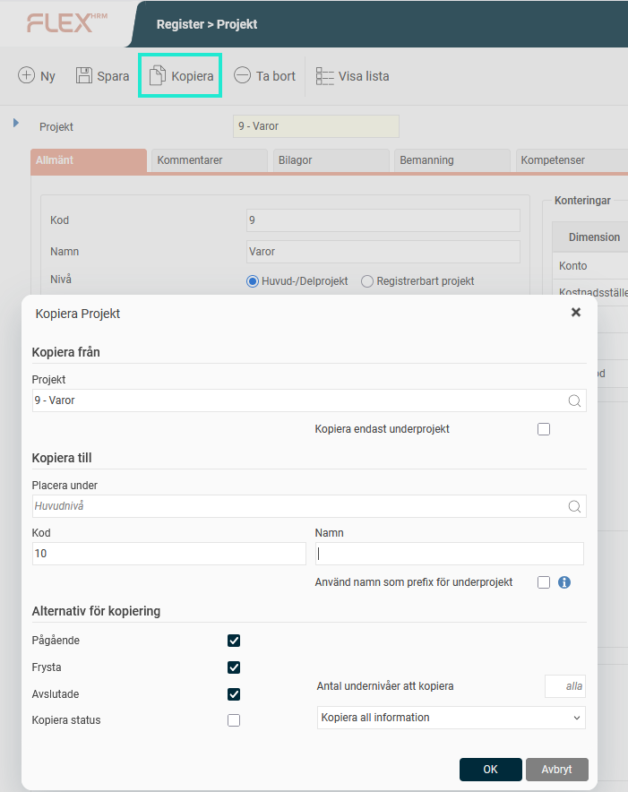
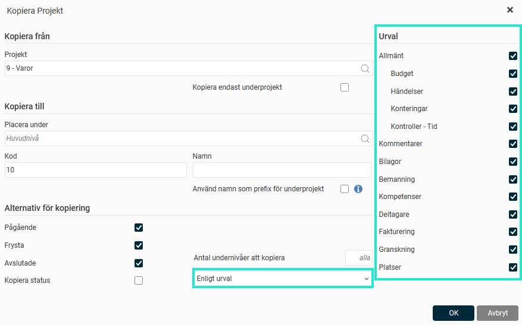

# ⚙️Går det att kopiera projekt?

**Datum:** den 29 september 2025  
**Kategori:** Systemgemensamt  
**Underkategori:** Inställningar  
**Typ:** config  
**Svårighetsgrad:** intermediate  
**Tags:** Ingen  
**Bilder:** 2  
**URL:** https://knowledge.flexhrm.com/sv/g%C3%A5r-det-att-kopiera-projekt

---

En beskrivning av kopieringsfunktionen i det utökade projektregistret.
Du kan
kopiera projekt
i det utökade projektregistret genom att använda knappen
Kopiera
. Det här är användbart om du har flera liknande projekt eller vill använda ett projekt som en mall för din projektstruktur.
När du klickar på knappen
Kopiera
öppnas en ruta där du får välja alternativen för kopieringen.

Observera
Vi använder här begreppet
Projekt
. Ni kan ha valt att benämna det utökade projektregistret på annat sätt i ert system.
Välj projekt att kopiera från
I fältet
Kopiera från
föreslås det projekt som är markerat i projektträdet. Om inget projekt är markerat är fältet tomt, och du får söka fram det projekt du vill kopiera.
Här väljer du också om du vill kopiera:
Hela projektet
Endast underprojekt
(Användbart om du till exempel vill kopiera in ett antal underprojekt till ett annat huvudprojekt.)
Välj var kopian ska placeras
I nästa steg,
Kopiera till
, väljer du var du vill att kopian ska hamna.
Som standard föreslår systemet att kopian läggs på samma nivå som du kopierar från.
Du kan ändra placeringen genom att söka efter ett annat huvud- eller delprojekt.
Om du endast kopierar underprojekt
måste
du välja ett nytt huvud- eller delprojekt att kopiera till.
Om du kopierar till samma huvud- eller delprojekt behöver du ange en ny
kod
för det kopierade projektet, eftersom alla projektkoder måste vara unika.
Du kan också:
Ange ett
namn
för det kopierade projektet.
Välja om du vill att namnet ska användas som
prefix
på underliggande projektnivå.
Välj alternativ för kopieringen
Här väljer du vilken information som ska följa med i kopian.
Du kan välja att:
Kopiera
pågående
,
frysta
och/eller
avslutade
projekt.
Kopiera projektets
status
. Om du väljer att
inte
kopiera status får alla kopierade projekt statusen
Pågående
.
Begränsa antalet
undernivåer
som kopieras (som standard kopieras samtliga).
Om du inte vill kopiera all information
kan du ändra standardinställningen och välja att:
Endast kopiera projektstrukturen
(det vill säga endast kod och namn på projekten).
Göra ett urval på
specifika flikar
i projektregistret som du vill kopiera. Välj då
Enligt urval
och markera det som ska kopieras.

